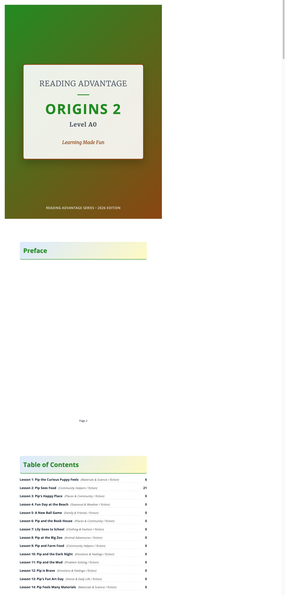

# Preface

## Welcome

This manual is for the current **primary** Reading Advantage workbook format used in projects such as `origins-2-a0` and `origins-3.1-a0`.

It is written to match the **actual primary workbook sequence** generated by the workbook system, not the older secondary teacher guide flow.

*A sample spread from the compiled primary workbook (`origins-2-a0`).*

---

## What This Guide Covers

The primary workbook is a **13-step lesson**:

1. Before You Read
2. Key Vocabulary
3. Read the Article
4. Collect Vocabulary
5. Deep Reading Notes
6. Collect Sentences
7. Comprehension Check
8. Guided Response
9. Vocabulary Practice
10. Sentence Practice
11. Guided Writing
12. Language Questions
13. Lesson Reflection

This guide uses those same step names so teachers can follow the workbook page by page.

---

## Who This Manual Is For

This manual is designed for:

* Primary classroom teachers using the Reading Advantage workbook with a whole class
* Coordinators and coaches supporting primary implementation
* New teachers who need a dependable routine that matches the printed workbook

---

## Key Principle

In the primary workbook, the teacher should **anchor instruction to the printed page** and use the app to support reading, audio, vocabulary review, sentence review, and later writing feedback.

The workbook is not a note sheet for a separate lesson. The workbook **is the lesson path**.

---

## How This Manual Is Organized

This manual contains four sections:

### 1. Quick Reference

A short live-teaching script for teachers who already know the flow.

### 2. Complete Teacher-Led Lesson Plan

A full walkthrough of one primary lesson from start to finish.

### 3. Step-by-Step Guide

Detailed notes for each of the 13 workbook steps.

### 4. Trainer's Guide

Implementation notes for coaches, heads of department, and mentors.

## Primary-Specific Differences From Older Guides

This primary version differs from the older secondary guide in several important ways:

* The workbook ends at **Step 13**, not Step 14 plus a separate final reflection
* Reflection and homework are built directly into the printed lesson ending
* Writing is **Step 11: Guided Writing**, not a later Step 13 writing block
* Language Questions is **Step 12**
* The student sees workbook labels such as **Deep Reading Notes**, **Guided Response**, and **Guided Writing**
* The printed workbook currently gives students:
  * 4 vocabulary collection boxes
  * 2 sentence collection boxes
  * 4 comprehension questions in the Origins primary series

Teachers should be trained to follow the printed workbook structure the student is holding.

---

## Core Teacher Rule

> Match your language to the workbook page.
> Model the task clearly.
> Use the app to support the workbook, not to replace it.
