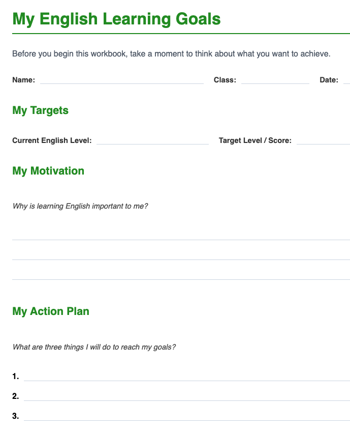

# Step 1: Before You Read

Use the title, image, and interest stars to start the lesson calmly.

Teacher actions:

* point to the title and image
* ask students to look before discussing
* direct students to mark their interest

Teacher language:

> "Look first."
>
> "How interested are you in this topic?"

What students do:

* mark the stars
* respond to the optional prompt if present

Watch for:

* students waiting instead of writing
* students trying to jump ahead

---

## Workbook Page Example

*The "Before You Read" page typically includes the lesson title, an image, interest stars, and learning goals.*
