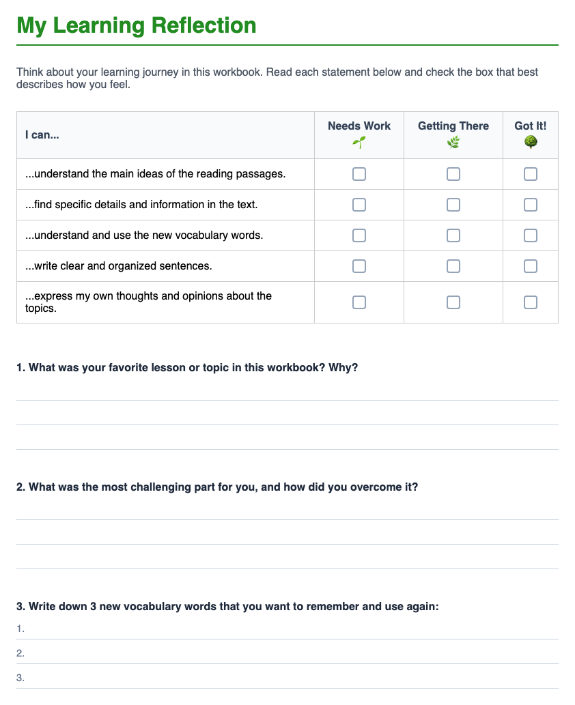

# Step 13: Lesson Reflection

This is the actual ending of the current primary workbook lesson.

Teacher actions:

* direct students to complete the reflection page
* use the printed understanding scale
* use the printed effort rating
* point out the homework box before dismissal

Teacher language:

> "Finish the reflection before you pack up."

Students do:

* complete the reflection prompts
* rate understanding
* rate effort
* note homework

Important note:

Do not teach this as a separate unnumbered ending. In the current primary workbook, reflection is **Step 13**.

---

## Workbook Page Example

*The reflection page includes understanding and effort ratings, reflection prompts, and the homework box.*
