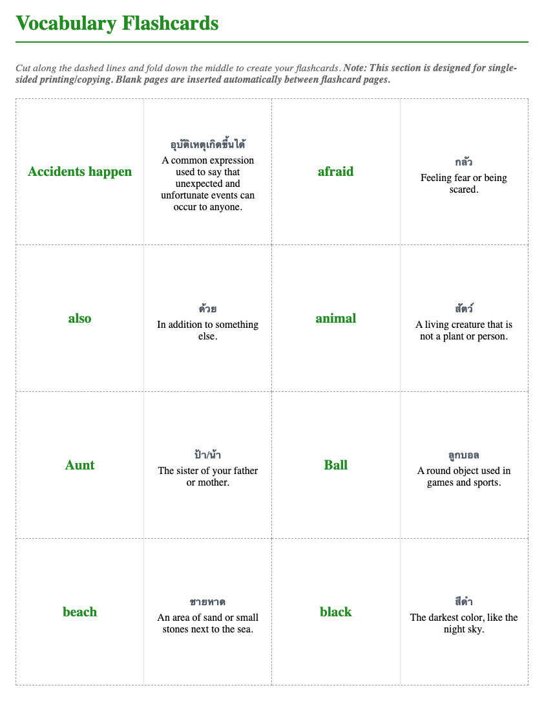

# Step 2: Key Vocabulary

This step should match the printed vocabulary table.

Teacher actions:

* pronounce each word clearly
* confirm meaning simply
* let students repeat
* direct students to use the second column

Teacher language:

> "Say it."
>
> "Now show the meaning in your notebook space."

Students may:

* write a translation
* draw a picture
* write a very short sentence

Do not:

* over-explain every word
* turn the step into a long oral quiz

---

## Workbook Page Example

*The "Key Vocabulary" page includes a word bank with space for students to write translations, drawings, or simple sentences. Some lessons also include flashcard-style review.*
