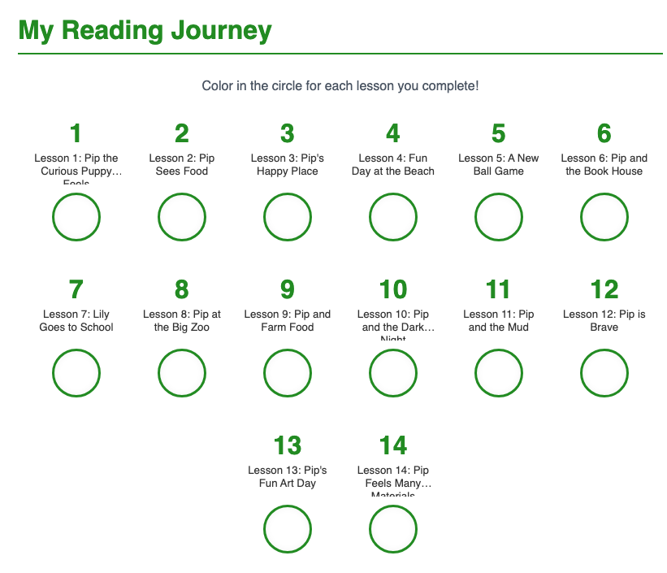

# Step 3: Read the Article

This is the entry point to the text and the app-supported reading experience.

Teacher actions:

* project the article
* use app audio if available
* keep the first pass smooth
* use the printed marking legend on the workbook page

Students should mark:

* new word
* confusing part
* interesting part
* save this sentence

Teacher language:

> "First, follow the article."
>
> "Later, we will use our marks."

Do not stop too often during the first pass.

---

## Workbook Page Example

*The article page includes a reading journey tracker and marking legend. Students use this to flag new words, confusing parts, interesting parts, and sentences worth saving.*
