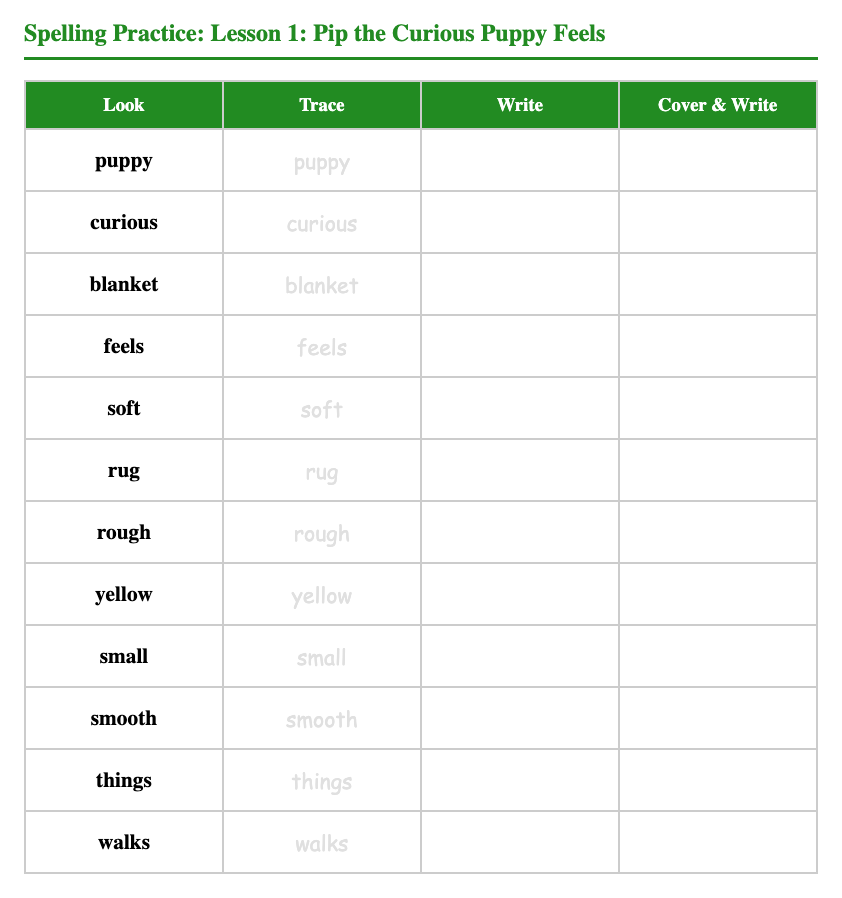

# Step 9: Vocabulary Practice

This step is workbook practice, not a new explanation block.

Students complete:

* A. Match the Words
* B. Fill in the Blanks

Teacher actions:

* model one item if needed
* keep the pace steady
* use the word bank

Teacher language:

> "Use the word bank carefully."

Avoid turning this into long vocabulary teaching. It is practice and review.

---

## Workbook Page Example

*The vocabulary practice section includes matching, fill-in-the-blank, and spelling activities with a word bank.*
