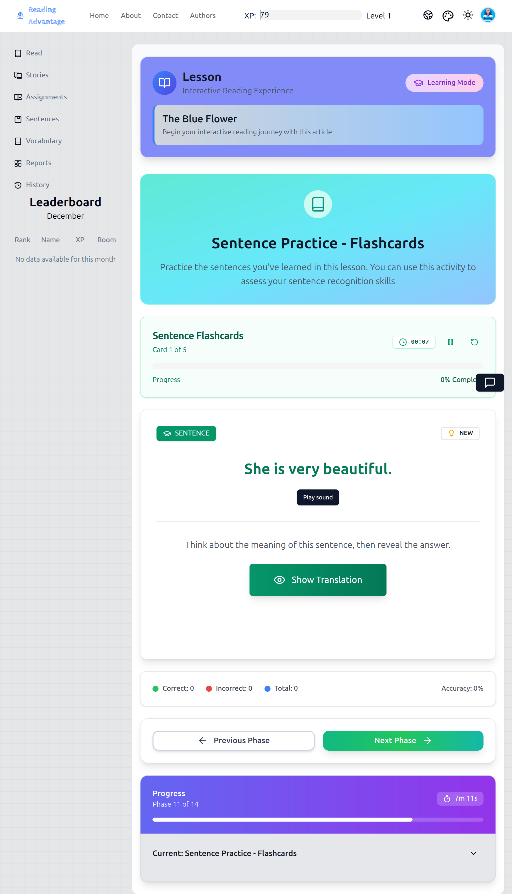
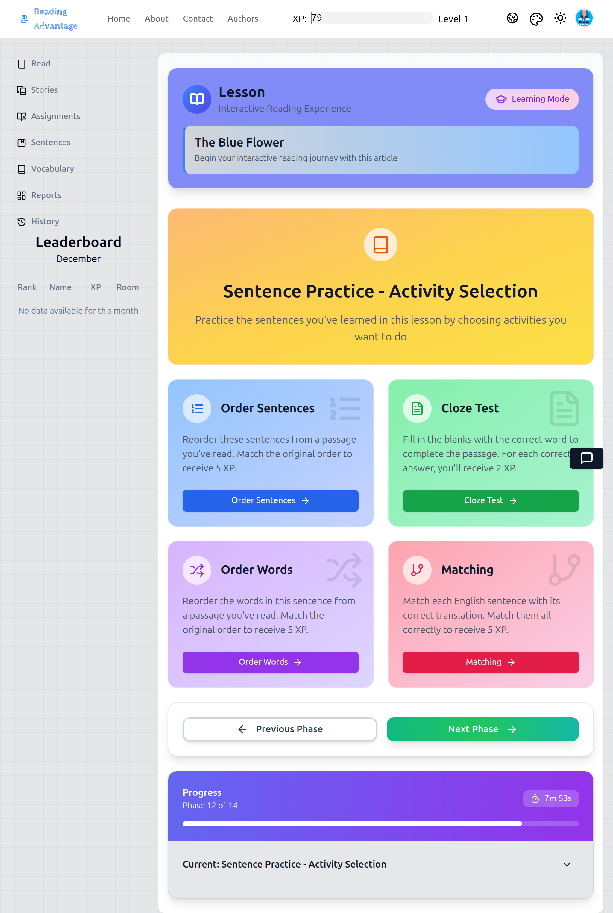
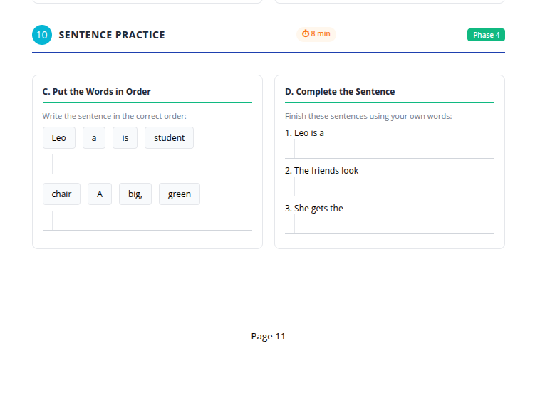

ต่อเนื่อง ต่อไปนี้คือ **ขั้นตอนที่ 11–12** เขียนตามมาตรฐานเดียวกันที่ **มีสคริปต์ครบถ้วน แบบทีละขั้นตอน** บล็อกนี้สะท้อนการฝึกคำศัพท์ แต่เปลี่ยนหน่วยความสนใจจาก *คำ* ไปเป็น *ประโยค* และการสาธิตของครูยังคงเป็นศูนย์กลาง

---

# ขั้นตอนที่ 11–12: การฝึกประโยค

*(ทบทวนและฝึกประโยคที่เลือก)*

> **คำแนะนำสำหรับครู:**
> เช่นเดียวกับคำศัพท์ นี่คือสองขั้นตอนในแอป แต่เป็น **บล็อกการสอนเดียว** นักเรียนกำลังเรียนรู้ *วิธีการฝึกประโยคด้วยตนเอง* ไม่ใช่แค่ทำกิจกรรมให้เสร็จ

---

## ขั้นตอนที่ 11 (แอป): บัตรคำประโยค

**สิ่งที่ครูฉายสำหรับขั้นตอนที่ 11:**

---

## 1. สิ่งที่ครูพูด

ก่อนเริ่ม ครูชี้แจงวัตถุประสงค์อย่างชัดเจน

> "Now we will practice sentences."
>
> *ตอนนี้เราจะฝึกประโยค*

> "These sentences come from the story."
>
> *ประโยคเหล่านี้มาจากเรื่อง*

> "You chose them because they are useful."
>
> *คุณเลือกประโยคเหล่านี้เพราะมีประโยชน์*

ครูเน้นย้ำการถ่ายโอน:

> "This is how you should practice sentences when you use the app alone."
>
> *นี่คือวิธีที่คุณควรฝึกประโยคเมื่อคุณใช้แอปคนเดียว*

ครูชี้ไปที่ประโยคบนหน้าจอ

> "First, listen."
>
> *ก่อนอื่น ฟัง*

> "Then, say the whole sentence."
>
> *จากนั้น พูดทั้งประโยค*

---

## 2. สิ่งที่ครูทำ

สำหรับ **บัตรคำประโยคแต่ละใบ** ครูทำตามขั้นตอนนี้อย่างเคร่งครัด:

1. คลิก **เล่นเสียง**
2. มองไปที่ชั้นเรียนและทำท่าทางเพื่อดึงความสนใจ
3. พูด:

> "Everyone."
>
> *ทุกคน*

4. รอให้มี **การพูดซ้ำพร้อมกันของประโยคทั้งหมด**
5. สุ่มเรียกนักเรียนคนหนึ่งโดยเรียกชื่อและพูด:

> "Again."
>
> *อีกครั้ง*

6. ฟังความชัดเจนโดยรวม (ไม่ใช่ความสมบูรณ์แบบ)
7. คลิกหรือแสดง **คำแปล** ถ้ามี โดยสั้นๆ
8. อ่านคำแปลเงียบๆ หรือชี้ไปที่คำแปลโดยไม่อธิบาย
9. ไปที่ประโยคถัดไปทันที

ครู **ไม่**:

* แบ่งประโยคออกเป็นส่วนๆ
* อธิบายไวยากรณ์
* ถามคำถามเพื่อความเข้าใจที่นี่

---

## 3. สิ่งที่นักเรียนทำ

* มองประโยคบนหน้าจอ
* ฟังเสียง
* พูดซ้ำ **ทั้งประโยค** พร้อมกัน
* พูดซ้ำเป็นรายบุคคลถ้าถูกเรียก
* สังเกตความหมายโดยใช้คำแปล
* มุ่งเน้นที่จังหวะและความชัดเจน

นักเรียน **ไม่**:

* ย่อประโยค
* ถอดความ
* วิเคราะห์ไวยากรณ์

---

## 4. สิ่งที่ครูตรวจสอบก่อนดำเนินการต่อ

ก่อนไปยังขั้นตอนที่ 12 ครูตรวจสอบว่า:

* ประโยคที่บันทึกไว้ทั้งหมดได้ถูกฟังและพูดซ้ำแล้ว
* นักเรียนสามารถพูดซ้ำประโยคเต็ม ไม่ใช่แค่ส่วนย่อย
* ความสนใจยังคงอยู่ตลอดการพูดซ้ำ

ถ้านักเรียนพึมพำหรือตัดทอนประโยค ครูพูดซ้ำประโยคตัวอย่างหนึ่งประโยคและพูด:

> "Full sentence."
>
> *ประโยคเต็ม*

---

## ขั้นตอนที่ 12 (แอป): กิจกรรมฝึกประโยค

**สิ่งที่ครูฉายสำหรับขั้นตอนที่ 12:**

---

## 1. สิ่งที่ครูพูด

ครูเปลี่ยนผ่านอย่างชัดเจน

> "Now we will practice sentences in different ways."
>
> *ตอนนี้เราจะฝึกประโยคในรูปแบบต่างๆ*

ครูชี้ไปที่ตัวเลือกกิจกรรม

> "You can see there are different games."
>
> *คุณจะเห็นว่ามีเกมต่างๆ*

> "When you work alone, you can choose."
>
> *เมื่อคุณทำงานคนเดียว คุณสามารถเลือกได้*

ครูกำหนดขอบเขต:

> "Today, we will do **one** together."
>
> *วันนี้ เราจะทำ **หนึ่ง** กิจกรรมด้วยกัน*

---

## 2. สิ่งที่ครูทำ

* ฉาย **หน้าจอเลือกกิจกรรม**
* เรียกชื่อกิจกรรมแต่ละอันโดยสั้นๆ พร้อมชี้:

  * "Put the words in order." (เรียงคำให้ถูกลำดับ)
  * "Complete the sentence." (เติมประโยคให้สมบูรณ์)
  * "Match sentences." (จับคู่ประโยค)
  * "Choose the correct sentence." (เลือกประโยคที่ถูกต้อง)
* เลือก **หนึ่งกิจกรรม** อย่างตั้งใจ

ระหว่างกิจกรรม ครู:

* อ่านโจทย์ประโยคออกเสียง
* พูด:

> "Do not guess."
>
> *อย่าเดา*

> "Think about the sentence we practiced."
>
> *คิดถึงประโยคที่เราฝึก*

* เชิญนักเรียนเสนอคำตอบด้วยวาจา
* คลิกคำตอบที่ชั้นเรียนตกลงกัน
* ถ้าไม่ถูกต้อง พูดอย่างสงบ:

> "That does not sound correct. Let's try again."
>
> *นั่นฟังดูไม่ถูกต้อง มาลองอีกครั้ง*

ครูยอมให้มีความผิดพลาดและสาธิตการแก้ไขผ่านการพูดซ้ำ

---

## 3. สิ่งที่นักเรียนทำ

* มองโจทย์ประโยคบนหน้าจอ
* นึกถึงโครงสร้างประโยคจากบัตรคำ
* เสนอคำตอบด้วยวาจา
* ปรับคำตอบตามความคิดเห็น
* สังเกตว่าประโยคถูกซ่อมแซมอย่างไร ไม่ใช่แค่ตอบ

---

## 4. การติดตามด้วยเวิร์กบุ๊ก (เวิร์กบุ๊กขั้นตอนที่ 10)

หลังจากกิจกรรมในแอป ครูให้คำแนะนำที่ชัดเจน

> "Now open your workbook to Step 10."
>
> *ตอนนี้เปิดเวิร์กบุ๊กของคุณไปที่ขั้นตอนที่ 10*

**สิ่งที่นักเรียนเห็นในเวิร์กบุ๊ก:**

### สิ่งที่ครูทำ

* ชี้ไปที่ **เรียงคำให้ถูกลำดับ** และพูด:

> "Do this first."
>
> *ทำอันนี้ก่อน*

* ชี้ไปที่ **เติมประโยคให้สมบูรณ์** และพูด:

> "Do this next."
>
> *ทำอันนี้ต่อไป*

* เดินไปรอบๆ ขณะที่นักเรียนทำงาน
* พานักเรียนที่รีบร้อนหรือลอกกลับสู่ทางที่ถูก

### สิ่งที่นักเรียนทำ

* ทำกิจกรรมเรียงลำดับประโยค
* ทำกิจกรรมเติมประโยค
* ทำงานอิสระหรืออย่างเงียบๆ กับคู่ ตามที่ได้รับคำสั่ง

---

## 5. สิ่งที่ครูตรวจสอบก่อนดำเนินการต่อ

ก่อนดำเนินการต่อ ครู:

* ขอให้นักเรียนตรวจคำตอบของตนเอง
* พูด:

> "Show me how many you got correct."
>
> *แสดงให้ฉันเห็นว่าคุณทำถูกกี่ข้อ*

* สังเกตการตอบด้วยนิ้ว
* จดจำปัญหารูปแบบประโยคทั่วไปในใจ

---

## 6. หมายเหตุการโค้ช (ตัวเลือก – สำหรับครูที่มีประสบการณ์)

**ทำไมการฝึกประโยคจึงตามหลังการฝึกคำศัพท์:**
นักเรียนมักรู้จักคำศัพท์ แต่ไม่สามารถ *ประกอบความหมาย* ได้ ขั้นตอนนี้บังคับให้ใส่ใจกับลำดับ โครงสร้าง และความสมบูรณ์

ครูขั้นสูงอาจ:

* ขอให้นักเรียนอ่านประโยคที่เสร็จสมบูรณ์ออกเสียง
* เปรียบเทียบตัวเลือกประโยคสองแบบโดยสั้นๆ

แต่หลีกเลี่ยงการเปลี่ยนให้เป็นการอธิบายไวยากรณ์
จุดแข็งที่นี่คือ **การได้รับแบบซ้ำๆ + การแก้ไข** ไม่ใช่กฎเกณฑ์

---

ถ้าคุณพร้อม ฉันจะดำเนินการต่อด้วย **ขั้นตอนที่ 13: การฝึกเขียน (เฉพาะเวิร์กบุ๊ก)** โดยคงระดับสคริปต์เดิมไว้
