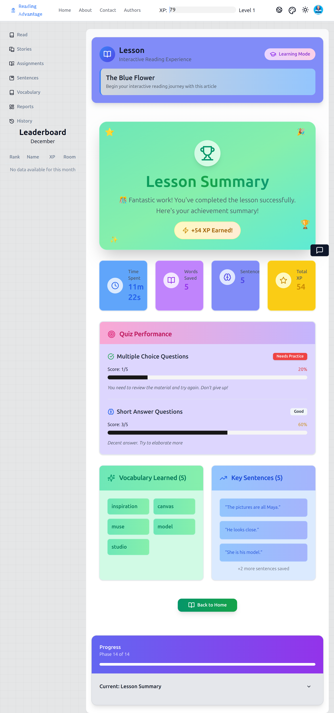
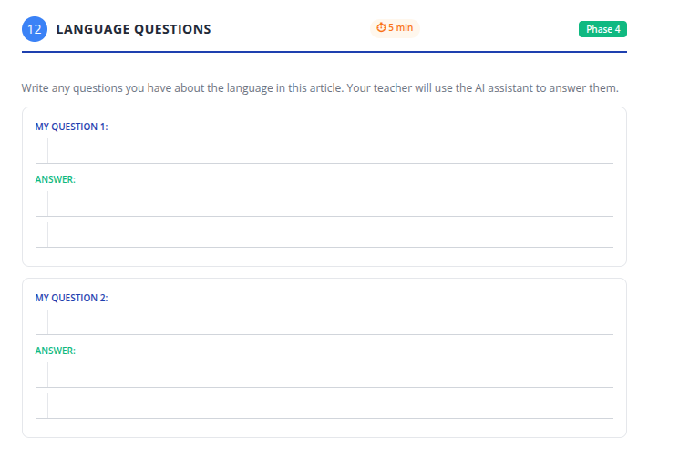

# Step 12: Language Questions (AI Chatbot – Workbook First)

> **Critical rule for this step:**
> Students **must write their questions first**.
> The AI is used **only after thinking and writing**.

> **Numbering note:** Step numbers in this manual follow the **student workbook**. Earlier editions numbered this step 14. The app screen for this activity is still labelled "Step 14" in the current app build.

---

## What teachers project:

*The AI chatbot interface that teachers use to answer student questions after they have written them in their workbooks.*

---

## 1. What the teacher says

The teacher addresses the class **before opening the chatbot**.

> “Now we will ask questions about language.”
>
> “These are questions about English, not opinions.”

The teacher gives examples aloud:

> “You can ask about vocabulary.”
>
> “You can ask about sentence meaning.”
>
> “You can ask about grammar.”
>
> “You can also ask cultural questions.”

The teacher gives a concrete example:

> “For example: ‘Why is the school day in America so short?’”

Then the teacher sets a firm boundary:

> “Do **not** talk to the AI yet.”
>
> “First, you must write your question.”

---

## 2. What the teacher does

* Directs students to open the workbook to **Step 12: Language Questions**.
* Points to the question lines on the page.

## What students see in their workbook:

*Students write their language and cultural questions here before the teacher uses the AI chatbot.*

---

* Says:

> "Write one good question."
>
> "If you finish quickly, write a second."

While students are writing, the teacher:

* Walks the room.
* Reads questions quietly.
* Helps students rephrase unclear questions by asking:

  > “What exactly do you want to know?”
* Does **not** correct answers yet.
* Does **not** open the AI interface.

---

## 3. What students do

* Review the article and their work.
* Write one or two language or cultural questions in the workbook.
* Check spelling and clarity.
* Wait quietly after finishing.

Students do **not**:

* Call out questions.
* Use the AI themselves.
* Copy classmates’ questions.

---

## 4. Using the AI (teacher-mediated)

### What the teacher says and does

* Selects a **small number of student questions** based on time and relevance.
* Says:

> “I will type your question exactly as written.”

* Types the first student question into the AI chatbot.
* Projects the AI response.
* Reads the response aloud slowly.
* Pauses and asks:

> “What does this answer mean?”

* Paraphrases or clarifies if necessary.
* Points back to the text or earlier examples when relevant.

The teacher repeats this process for a limited number of questions.

---

## 5. What students do during AI responses

* Listen to the AI response.
* Compare it to their own understanding.
* Write short notes or summaries in the workbook.
* Ask follow-up clarification questions **only if invited**.

---

## 6. What the teacher checks before moving on

Before ending this step, the teacher checks that:

* Students understand that AI is a **support tool**, not a shortcut.
* Students see that **good questions lead to good answers**.
* The class remains focused and not overly excited by the technology.

The teacher closes the step by saying:

> “This is how you use AI to learn language.”
>
> “You think first. Then you ask.”

---

## 7. Coaching note (optional – for experienced teachers)

**Why the workbook comes first:**
Without written questions, students treat AI as entertainment or answer-giving. Writing first slows thinking and improves question quality.

Advanced teachers may:

* group similar questions
* compare two AI answers
* revisit unanswered questions in a later lesson

But never allow:

* free AI chat
* unprepared questioning
