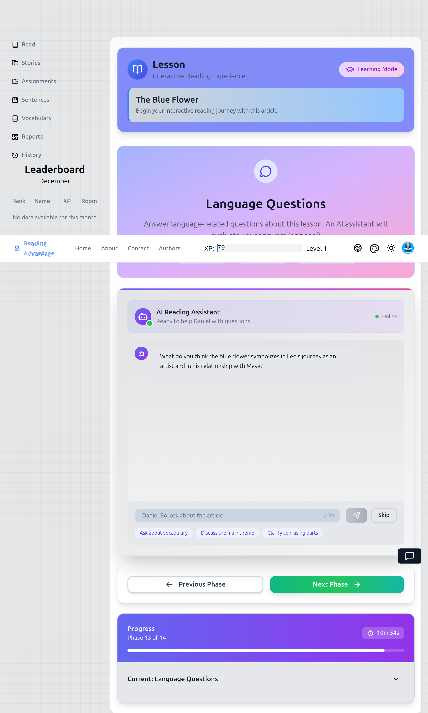
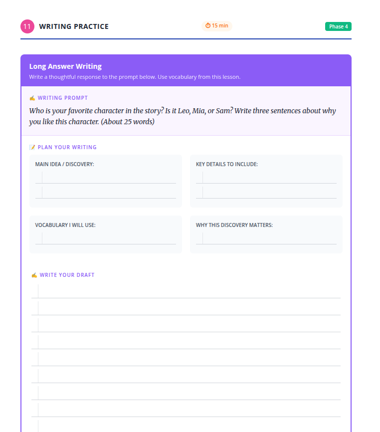

ต่อเนื่อง ด้านล่างนี้คือ **ขั้นตอนที่ 13** ที่เขียนในระดับ **สคริปต์แบบเต็มรูปแบบและปลอดภัยสำหรับครูมือใหม่** ขั้นตอนนี้มีลักษณะที่แตกต่างโดยเจตนา และสคริปต์ได้ระบุความแตกต่างนั้นอย่างชัดเจนเพื่อไม่ให้ครูพยายาม "ดำเนินการผ่านแอป"

---

# ขั้นตอนที่ 13: การฝึกเขียน (เฉพาะสมุดงาน – คำตอบแบบยาว)

> **การกำหนดกรอบที่สำคัญสำหรับครู:**
> ขั้นตอนนี้ **ไม่ได้ดำเนินการผ่านแอป** นี่คือ **งานเขียนแบบเงียบและต่อเนื่อง** ที่ออกแบบมาเพื่อเตรียมนักเรียนสำหรับการเขียนที่ได้รับการสนับสนุนจาก AI ที่บ้านหรือในเซสชันอื่นในภายหลัง

---

## สิ่งที่ครูฉายบนหน้าจอ:

*แอปแสดงขั้นตอนที่ 13 พร้อมหัวข้อ "Writing Practice" และคำแนะนำสำหรับกิจกรรมการเขียนนอกออนไลน์นี้*

---

## 1. สิ่งที่ครูพูด

ครูยืนอยู่ด้านหน้า ถือสมุดงานหรือชี้ไปที่รูปภาพที่ฉายของหน้าสมุด

> "Now we will write."
>
> *ตอนนี้เราจะเขียน*
>
> "This is your own writing."
>
> *นี่คือการเขียนของคุณเอง*

ครูชี้แจงความคาดหวังทันที:

> "This is not copying."
>
> *นี่ไม่ใช่การคัดลอก*
>
> "This is not a test."
>
> *นี่ไม่ใช่การสอบ*

ครูเพิ่มความมั่นใจ:

> "You will plan first."
>
> *คุณจะวางแผนก่อน*
>
> "Then you will write."
>
> *จากนั้นคุณจะเขียน*

จากนั้นครูอธิบายความคาดหวังตามระดับอย่างระมัดระวัง:

> "How much you write depends on your level."
>
> *จำนวนที่คุณเขียนขึ้นอยู่กับระดับของคุณ*
>
> "Follow the advice in the workbook."
>
> *ปฏิบัติตามคำแนะนำในสมุดงาน*

---

## 2. สิ่งที่ครูทำ

* สั่งให้นักเรียนเปิดสมุดงานไปที่ **ขั้นตอนที่ 11: การฝึกเขียน**

## สิ่งที่นักเรียนเห็นในสมุดงานของตน:

*หน้าสมุดงานแสดงกล่องการวางแผน (แนวคิดหลัก รายละเอียดสำคัญ คำศัพท์ที่จะใช้ เหตุผล/คำอธิบาย) พื้นที่เขียน และรายการตรวจสอบตนเองที่ด้านล่าง*

---

* ชี้ไปที่ **กล่องการวางแผน** และเรียกชื่อทีละกล่อง:

  * แนวคิดหลัก
  * รายละเอียดสำคัญ
  * คำศัพท์ที่จะใช้
  * เหตุผล / คำอธิบาย
* พูดว่า:

> "Do not start writing sentences yet."
>
> *อย่าเริ่มเขียนประโยคเดี๋ยวนี้*
>
> "Plan first."
>
> *วางแผนก่อน*

ครูสาธิตการวางแผนสั้นๆ โดย:

* เขียนตัวอย่างคำหรือวลีหนึ่งคำบนกระดาน (ไม่ใช่ประโยคเต็ม)
* พูดว่า:

> "This is planning, not writing."
>
> *นี่คือการวางแผน ไม่ใช่การเขียน*

จากนั้นครูกำหนดเงื่อนไขการเขียน:

> "You will write quietly."
>
> *คุณจะเขียนอย่างเงียบๆ*
>
> "I will not correct sentences now."
>
> *ฉันจะไม่แก้ไขประโยคตอนนี้*

ขณะที่นักเรียนกำลังเขียน ครู:

* เดินช้าๆ รอบห้อง
* มองหา:

  * นักเรียนที่วางแผนก่อนร่าง
  * นักเรียนที่กำลังเขียนจริงๆ
  * นักเรียนที่ติดและไม่เริ่มต้น
* ให้กำลังใจอย่างเงียบๆ:

  > "Start with your main idea."
  >
  > *เริ่มต้นด้วยแนวคิดหลักของคุณ*
  >
  > "Check your vocabulary list."
  >
  > *ตรวจสอบรายการคำศัพท์ของคุณ*

ครู **ไม่**:

* บอกประโยค
* แก้ไขไวยากรณ์ทีละบรรทัด
* อนุญาตให้นักเรียนคัดลอกจากหน้าจอ

---

## 3. สิ่งที่นักเรียนทำ

* เปิดสมุดงานไปที่หน้าการเขียน
* กรอกกล่องการวางแผนก่อน
* เขียน **ฉบับร่างแรก** ตามแผนของตน
* ใช้คำศัพท์จากบทเรียน (อย่างน้อย 3 คำ ตามที่ระบุ)
* จัดระเบียบความคิดเป็นประโยคหรือย่อหน้าที่ชัดเจน เหมาะสมกับระดับ
* กรอกการตรวจสอบตนเองที่ด้านล่างของหน้า:

  * การใช้คำศัพท์
  * การจัดระเบียบ
  * การตรวจสอบการสะกด
  * จำนวนคำ

นักเรียนทำงาน **เป็นรายบุคคลและอย่างเงียบๆ**

---

## 4. สิ่งที่ครูตรวจสอบก่อนดำเนินการต่อ

ก่อนสิ้นสุดขั้นตอนนี้ ครูตรวจสอบว่า:

* นักเรียนทุกคนได้เขียน **อะไรบางอย่าง** แม้จะสั้น
* กล่องการวางแผนได้รับการกรอกแล้ว ไม่ข้าม
* นักเรียนได้พยายามตรวจสอบตนเองอย่างซื่อสัตย์

หากนักเรียนเขียนน้อยมาก ครูพูดอย่างสงบ:

> "This is a first draft."
>
> *นี่คือฉบับร่างแรก*
>
> "It does not need to be perfect."
>
> *ไม่จำเป็นต้องสมบูรณ์แบบ*

---

## 5. การเชื่อมโยงกับแอป (อธิบาย ไม่ได้ดำเนินการ)

ก่อนย้ายไปขั้นตอนถัดไป ครูอธิบายอย่างชัดเจน:

> "Later, you will type this writing into the app."
>
> *ภายหลัง คุณจะพิมพ์งานเขียนนี้ลงในแอป*
>
> "The app will give you feedback."
>
> *แอปจะให้ข้อเสนอแนะแก่คุณ*
>
> "You will improve your writing and submit again."
>
> *คุณจะปรับปรุงงานเขียนของคุณและส่งอีกครั้ง*

ครูเน้นย้ำ:

> "That happens **after** class, not now."
>
> *นั่นเกิดขึ้น **หลัง** ชั้นเรียน ไม่ใช่ตอนนี้*

---

## 6. หมายเหตุการโค้ช (ทางเลือก – สำหรับครูที่มีประสบการณ์)

**เหตุผลที่ขั้นตอนนี้อยู่นอกออนไลน์ก่อน:**
คุณภาพการเขียนดีขึ้นเมื่อนักเรียน **คิดก่อนพิมพ์** สมุดงานบังคับให้มีการวางแผนและการไตร่ตรองที่นักเรียนจำนวนมากข้ามในพื้นที่ดิจิทัล

ครูที่มีความเชี่ยวชาญอาจ:

* อนุญาตให้มีการแบ่งปันระหว่างเพื่อนหลังจากร่าง
* ขยายความยาวของการเขียนในระดับที่สูงขึ้น

แต่อย่าลบ:

* ขั้นตอนการวางแผน
* รายการตรวจสอบตนเอง

สิ่งเหล่านั้นคือสิ่งที่ทำให้ข้อเสนอแนะจาก AI ในภายหลังมีความหมาย

---

หากคุณพร้อม ฉันจะดำเนินการต่อด้วย **ขั้นตอนที่ 14: คำถามเกี่ยวกับภาษา (แชทบอท AI)** โดยรักษามาตรฐานสคริปต์เดียวกัน
