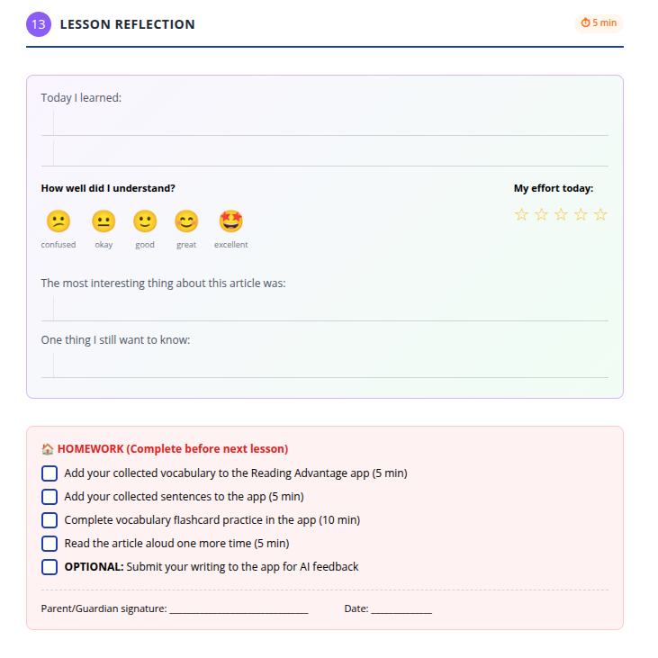

# Step 13: Lesson Summary & Reflection (Workbook Only)

> **Important framing for the teacher:**
> This is the last page of the workbook and the last step of the lesson. It is **not optional** and it is **not led through the app**. Protect the time for it.

> **Numbering note:** Step numbers in this manual follow the **student workbook**. Earlier editions of this manual treated reflection as an unnumbered "Final Step" appended to Step 14, and `complete-plan.md` numbered it Step 15. It is workbook **Step 13**.

---

## 1. What the teacher says

The teacher signals closure clearly.

> “We are finishing the lesson.”

The teacher adds:

> “Now you will think about your learning.”

---

## 2. What the teacher does

* Projects the **Lesson Summary** screen briefly.
* Points to indicators such as:

  * completed steps,
  * saved vocabulary,
  * saved sentences,
  * quiz results.
* Says:

> “These show what you practiced today.”

The teacher then directs attention back to the workbook.

> "Open to the last page: Lesson Reflection."

---

## What students see for lesson reflection:

*The reflection page where students record what they learned, rate their understanding and effort, and note questions.*

---

## 3. What students do

Students complete the reflection section in the workbook:

* Write one thing they learned.
* Rate their understanding.
* Rate their effort.
* Note something interesting.
* Write one remaining question (language or cultural).

Students work quietly and individually.

---

## 4. Homework explanation (optional)

If the teacher chooses to assign homework, they say explicitly:

> “Your homework is written here.”

The teacher points to the homework section and explains which items are required.

If the school uses guardian signatures, the teacher says:

> “Ask a guardian to sign here.”

If not, the teacher says:

> “You do not need a signature.”

---

## 5. What the teacher checks before dismissal

Before ending the lesson, the teacher checks that:

* Students have completed the reflection.
* Homework expectations are clear.
* Materials are packed away.

The teacher closes with:

> “Next time, you will use the app more independently.”

---

## Coaching note (optional – for experienced teachers)

**Why reflection matters:**
This step trains students to connect effort, strategy, and outcome. Over time, it builds learner independence.

Advanced teachers may:

* briefly discuss reflections
* track patterns across lessons

But avoid turning reflection into discussion every time.
Its power is in **routine and honesty**, not performance.
