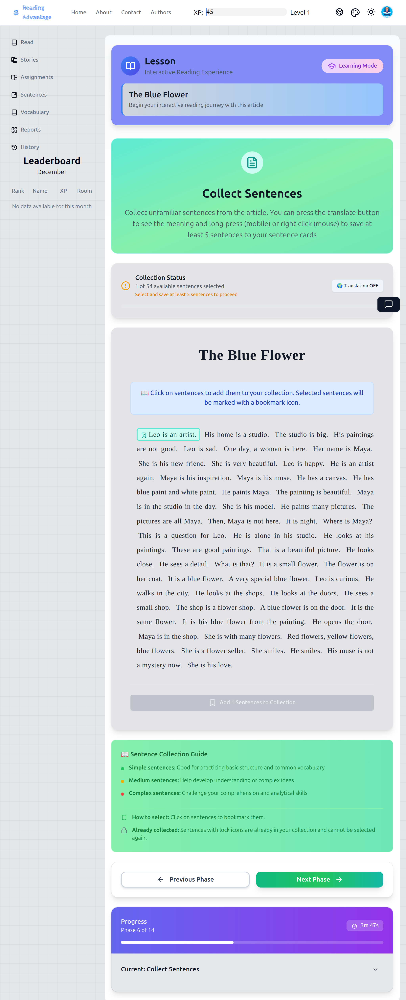
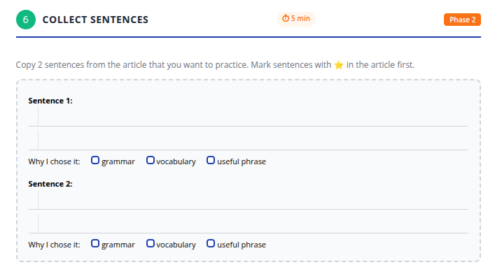

ดำเนินการต่อ ด้านล่างนี้คือ **ขั้นตอนที่ 6** ซึ่งเขียนตาม**มาตรฐานเดียวกันที่ชัดเจน เป็นบทสนทนาที่เตรียมไว้ และไม่มีการข้ามขั้นตอน** เช่นเดียวกับขั้นตอนที่ 1–5 ขั้นตอนนี้มีความสำคัญเป็นพิเศษในการเป็นแบบอย่างว่านักเรียนควรศึกษาภาษาอย่างไร ดังนั้นการคิดของครูจะต้องมองเห็นได้ชัดเจน

---

# ขั้นตอนที่ 6: รวบรวมประโยค (สังเกตภาษาที่มีประโยชน์ในบริบท)

---

## สิ่งที่ครูฉายบนหน้าจอ:

*หน้าจอรวบรวมประโยคแสดงข้อความบทความเต็มพร้อมประโยคแบบโต้ตอบที่นักเรียนสามารถเลือกและบันทึกไว้เพื่อศึกษาในภายหลัง*

---

## 1. สิ่งที่ครูพูด

ครูหยุดบทเรียนชั่วคราวและพูด**ก่อนที่จะโต้ตอบกับหน้าจอ**

> "Now we will choose sentences."
>
> "Not all sentences."
>
> "Only sentences that are good to study."

*ตอนนี้เราจะเลือกประโยค*

*ไม่ใช่ประโยคทั้งหมด*

*เฉพาะประโยคที่ดีสำหรับการศึกษา*

ครูอธิบายวัตถุประสงค์:

> "When you read English, you should learn *how sentences work*, not only words."
>
> "These sentences will help you later."

*เมื่อคุณอ่านภาษาอังกฤษ คุณควรเรียนรู้ว่าประโยคทำงานอย่างไร ไม่ใช่แค่คำศัพท์เท่านั้น*

*ประโยคเหล่านี้จะช่วยคุณในภายหลัง*

ครูเพิ่มคำมั่นใจที่สำคัญ:

> "You do not need to choose the same sentences as your classmates."

*คุณไม่จำเป็นต้องเลือกประโยคเดียวกันกับเพื่อนร่วมชั้น*

---

## 2. สิ่งที่ครูทำ

* ฉายหน้าจอ **รวบรวมประโยค** เพื่อให้เห็นข้อความเต็ม
* เลื่อนผ่านบทความอย่างช้าๆ
* หยุดที่ประโยคหนึ่งและชี้ไปที่ประโยคนั้น
* พูดออกเสียง:

> "I am choosing this sentence."

*ฉันกำลังเลือกประโยคนี้*

* สาธิตวิธีการ **คลิกขวา / คลิก** ที่ประโยคเพื่อแสดงคำแปล
* อ่านคำแปลโดยสังเขป
* อธิบายเหตุผลในการเลือกออกเสียง เช่น:

> "This sentence is useful because it shows how English explains a reason."
>
> "I can use this sentence pattern again."

*ประโยคนี้มีประโยชน์เพราะมันแสดงให้เห็นว่าภาษาอังกฤษอธิบายเหตุผลอย่างไร*

*ฉันสามารถใช้รูปแบบประโยคนี้อีกครั้ง*

* คลิกไอคอน **บันทึก / บุ๊คมาร์ก** สำหรับประโยคนั้น

จากนั้นครูเลื่อนไปยังประโยคอื่นและพูดว่า:

> "I will not choose this one."
>
> "It is easy, and I already know it."

*ฉันจะไม่เลือกประโยคนี้*

*มันง่าย และฉันรู้อยู่แล้ว*

ครู**ไม่**บันทึกประโยคนั้น

หลังจากสาธิตตัวอย่างสองหรือสามตัวอย่าง ครูระบุข้อกำหนดอย่างชัดเจน:

> "You must save **at least five sentences** to continue."

*คุณต้องบันทึกอย่างน้อยห้าประโยคเพื่อดำเนินการต่อ*

จากนั้นครูพูดว่า:

> "Now you choose your sentences."

*ตอนนี้คุณเลือกประโยคของคุณ*

ในขณะที่นักเรียนกำลังเลือก ครู:

* เดินไปรอบๆ ห้อง
* ตอบอย่างเงียบๆ หากนักเรียนขอความช่วยเหลือ
* ให้กำลังใจนักเรียนที่ลังเลโดยถาม:

  > "Why do you think this sentence is useful?"

  *ทำไมคุณคิดว่าประโยคนี้มีประโยชน์?*

* **ไม่**บอกนักเรียนว่าจะเลือกประโยคไหน
* อนุญาตให้นักเรียนเลือก**ประโยคที่แตกต่างกัน**

---

## 3. สิ่งที่นักเรียนทำ

* มองกลับไปที่ข้อความบทความ
* อ่านประโยคอย่างรอบคอบอีกครั้ง
* ใช้เครื่องมือแปลเมื่อจำเป็นเพื่อยืนยันความหมาย
* เลือก**อย่างน้อยห้าประโยค**ในแอป
* เปิดเวิร์กบุ๊กไปที่**ขั้นตอนที่ 6**
* เขียน**ประโยคที่เลือกสองประโยค**ในเวิร์กบุ๊ก
* ตรวจสอบเหตุผลสำหรับแต่ละประโยค (เช่น: คำศัพท์, รูปแบบไวยากรณ์, วลีที่มีประโยชน์)

### สิ่งที่นักเรียนเห็นในเวิร์กบุ๊ก:

*นักเรียนเขียนสองประโยคที่เลือกและระบุว่าทำไมแต่ละประโยคถึงมีประโยชน์สำหรับการเรียนรู้ (คำศัพท์, รูปแบบไวยากรณ์, หรือวลีที่มีประโยชน์)*

นักเรียน**ไม่**:

* คัดลอกทุกประโยค
* ขอคำอธิบายไวยากรณ์ในตอนนี้
* แปลทั้งย่อหน้า

---

## 4. สิ่งที่ครูตรวจสอบก่อนดำเนินการต่อ

ก่อนดำเนินการต่อ ครูตรวจสอบว่า:

* แอปแสดง**ห้าประโยคที่บันทึกไว้**
* นักเรียนสามารถอธิบายได้ หากถูกถาม ว่า*ทำไม*ถึงเลือกประโยคนั้น
* นักเรียนส่วนใหญ่ได้เขียนสองประโยคในเวิร์กบุ๊กแล้ว

หากนักเรียนดูเหมือนกำลังเลือกแบบสุ่ม ครูหยุดชั่วคราวและเตือนพวกเขา:

> "Choose sentences you want to use again in the future."

*เลือกประโยคที่คุณต้องการใช้อีกครั้งในอนาคต*

---

## 5. หมายเหตุการฝึกสอน (ทางเลือก – สำหรับครูที่มีประสบการณ์)

**ทำไมขั้นตอนนี้จึงสำคัญ:**
นักเรียนหลายคนเชื่อว่าการเรียนภาษาอังกฤษหมายถึงการท่องจำคำศัพท์แยกๆ ขั้นตอนนี้ฝึกความเชื่อนั้นใหม่

คุณกำลังสอนนักเรียนให้สังเกต:

* รูปแบบประโยค
* วิธีที่ความคิดเชื่อมโยงกัน
* วิธีสร้างความหมายผ่านคำศัพท์

ครูที่มีความเชี่ยวชาญอาจ:

* ติดป้ายกำกับรูปแบบโดยสังเขป (เหตุ-ผล, การบรรยาย, การเปรียบเทียบ)
* ขอให้นักเรียนคนหนึ่งอธิบายการเลือกของพวกเขาออกเสียง

แต่หลีกเลี่ยงการเปลี่ยนสิ่งนี้ให้เป็นการสอนไวยากรณ์
เป้าหมายคือ**การสังเกต**ไม่ใช่การวิเคราะห์

---

หากคุณพร้อมแล้ว ฉันจะดำเนินการต่อกับ **ขั้นตอนที่ 7: การตรวจสอบความเข้าใจแบบหลายตัวเลือก** ซึ่งเป็นหนึ่งในขั้นตอนที่ละเอียดอ่อนที่สุดทางการสอน

---
