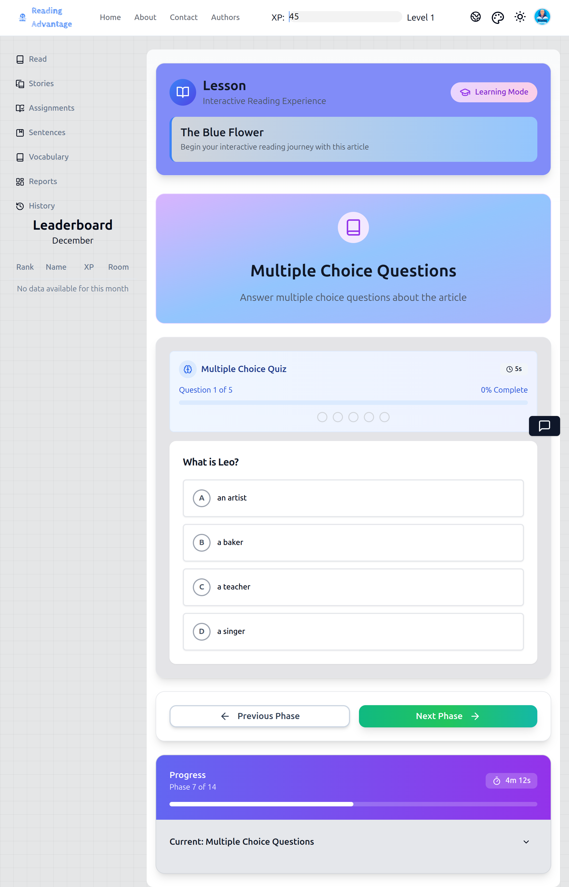
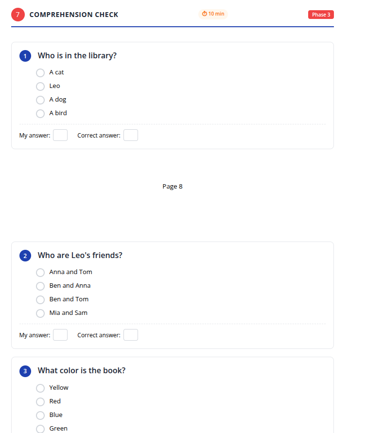

Continuing. Below is **Step 7**, written at the **same fully scripted, action-by-action level**. This is a step where novice teachers often rush or “give answers,” so the script is intentionally explicit and controlled.

---

# Step 7: Comprehension Check (Multiple Choice Questions)

---

## What teachers project:

*The app displays multiple-choice questions on the projected screen. Note that these questions may differ from the workbook questions, but they check the same reading comprehension.*

---

## What students see in their workbook:

*Students will answer similar comprehension questions in their workbooks after completing the class discussion.*

---

## 1. What the teacher says

Before showing the questions, the teacher addresses the class clearly.

> “Now we will check our understanding.”
>
> “This is not a test.”

The teacher adds an important clarification:

> “The questions on the screen may not be the same as the workbook.”
>
> “That is okay. They check the same reading.”

The teacher gives the routine **before** the first question appears:

> “For every question, we will do the same thing.”
>
> “First, you think alone.”
>
> “Then, you talk with your partner.”
>
> “Then, we answer together.”

---

## 2. What the teacher does

For **each multiple-choice question**, the teacher follows this exact sequence:

1. **Displays the question** on the screen.
2. Reads the question aloud once, slowly.
3. Says:

> “Read quietly.”

4. Waits silently while students read the question and choices.
5. Says:

> “Turn to your partner.”

6. Watches pairs talk briefly.
7. Raises a hand and says:

> “Stop. Look at me.”

8. Says:

> “Show me your answer.”

9. Students show **fingers** (1, 2, 3, or 4).
10. The teacher scans the room and notes the most common answer.
11. **Does not click yet.**
12. Asks:

> “Why did you choose this answer?”
>
> “Where do we see it in the text?”

13. Points back to the article on the screen.
14. Invites one or two students to indicate the sentence that supports the answer.
15. Only after discussion does the teacher click the **class’s agreed answer** in the app.

If the class is divided, the teacher says:

> “Let’s check the text again.”

and briefly rereads the relevant sentence aloud before selecting.

---

## 3. What students do

For each question, students:

* Read the question silently.
* Think about the answer independently.
* Discuss their choice with a partner.
* Show their chosen answer using fingers.
* Refer back to the text to justify their answer.
* Listen to classmates’ explanations.

Students do **not**:

* Shout answers.
* Ask the teacher for the correct answer.
* Guess without checking the text.

---

## 4. What the teacher checks before moving on

Before advancing to the next question, the teacher checks that:

* A clear class answer has been selected.
* At least one student has referred to **textual evidence**.
* Students understand *why* the chosen answer is correct (even if briefly).

After the final question, the teacher directs students to the workbook and says:

> “Now answer the questions in your workbook.”
>
> “Work quietly.”

When students finish, the teacher says:

> “Check your answers.”
>
> “Show me how many you got correct.”

Students respond using fingers.

---

## 5. Coaching note (optional – for experienced teachers)

**Why the teacher must not answer automatically:**
If the teacher clicks the correct answer immediately, students stop thinking and start waiting.

This routine trains three habits:

1. Think first
2. Justify with evidence
3. Accept correction through text, not authority

Advanced teachers may:

* reduce partner discussion once routines are strong
* increase text-reference demands (“Which paragraph?”)

But never remove the **evidence step**.
That is the core of this activity.

---

If you’re ready, I will continue with **Step 8: Short Answer Questions**, using the same fully scripted approach.

