\newpage

# คำนำ

## ยินดีต้อนรับสู่ Reading Advantage

ยินดีต้อนรับสู่คู่มือครูของ Reading Advantage คู่มือนี้ได้รับการออกแบบมาเพื่อสนับสนุนคุณในการสอนการอ่านภาษาอังกฤษที่มีคุณภาพสูงและเป็นขั้นเป็นตอนแก่นักเรียนมัธยมศึกษาของคุณ โดยใช้ระบบเวิร์กบุ๊กของ Reading Advantage

---

## Reading Advantage คืออะไร?

Reading Advantage เป็นโปรแกรมการเรียนรู้ภาษาอังกฤษที่ครอบคลุม ซึ่งผสมผสานการอ่านเพื่อความเข้าใจแบบดิจิทัลกับเวิร์กบุ๊กสิ่งพิมพ์ที่มีโครงสร้าง โปรแกรมนี้ให้บริการแก่นักเรียน EFL/ESL ระดับมัธยมศึกษาทั่วระดับ CEFR A1 ถึง C1 (Reading Advantage ระดับ 1–15) โดยมีเนื้อหาที่ออกแบบมาโดยเฉพาะสำหรับผู้เรียนชาวไทยในชั้นมัธยมศึกษาปีที่ 1–6

แก่นหลักของ Reading Advantage เชื่อว่า **ความสามารถในการอ่านพัฒนาขึ้นผ่านการฝึกฝนที่มีการแนะนำด้วยบทความที่เหมาะสม** ซึ่งได้รับการสนับสนุนด้วยการสอนอย่างชัดเจนในด้านคำศัพท์ กลยุทธ์การทำความเข้าใจ และการตระหนักรู้ภาษา

---

## บทบาทของเวิร์กบุ๊ก

เวิร์กบุ๊กของ Reading Advantage เป็นเครื่องมือหลักของนักเรียนสำหรับ:

* **การมีส่วนร่วมอย่างกระตือรือร้น** กับบทความผ่านการจดบันทึกและการไตร่ตรองที่มีโครงสร้าง
* **การพัฒนาคำศัพท์** ด้วยการคัดเลือกและฝึกฝนคำอย่างตั้งใจ
* **การฝึกความเข้าใจ** ผ่านคำถามที่อิงหลักฐาน
* **การพัฒนาการเขียน** ด้วยคำแนะนำที่เป็นขั้นเป็นตอนและการฝึกประโยค
* **การตระหนักรู้ในกระบวนการคิด** โดยการติดตามกระบวนการเรียนรู้ของตนเอง

เวิร์กบุ๊กแต่ละเล่มได้รับการออกแบบให้ทำงาน**ร่วมกับแพลตฟอร์มดิจิทัลของ Reading Advantage** ไม่ใช่เป็นตัวทดแทน นักเรียนโต้ตอบกับแอพ (สำหรับเสียง คำแปล การบันทึกคำศัพท์ และการสนับสนุนจาก AI) ในขณะที่บันทึกความคิดและคำตอบของพวกเขาในเวิร์กบุ๊ก

แนวทางแบบสองโหมดนี้ช่วยให้มั่นใจว่า:
- เครื่องมือดิจิทัลให้การสนับสนุน (เสียง คำนิยาม ผลตอบรับทันที)
- การเขียนด้วยกระดาษส่งเสริมการประมวลผลที่ลึกซึ้งยิ่งขึ้นและการจดจำ
- ครูสามารถติดตามความคิดของนักเรียนผ่านคำอธิบายประกอบในเวิร์กบุ๊ก

---

## คู่มือนี้เหมาะสำหรับใคร

คู่มือนี้ออกแบบมาสำหรับ:

* **ครูในชั้นเรียน** ที่สอนบทเรียน Reading Advantage ในห้องเรียนทั้งหมดที่นำโดยครู
* **ครูใหม่** ที่ต้องการคำแนะนำอย่างชัดเจนทีละขั้นตอนเกี่ยวกับการสอนการอ่านที่มีประสิทธิภาพ
* **ครูที่มีประสบการณ์** ที่ต้องการนำกิจวัตรการอ่านที่สม่ำเสมอและอิงงานวิจัยมาใช้
* **โค้ชและผู้ฝึกสอนทางวิชาการ** ที่เตรียมครูให้ใช้ Reading Advantage ได้อย่างถูกต้องตามแนวทาง

คุณไม่จำเป็นต้องมีประสบการณ์ก่อนหน้านี้กับ Reading Advantage โปรแกรมการอ่านเพื่อความเข้าใจ หรือทักษะเทคโนโลยีขั้นสูง ทุกสิ่งที่คุณต้องรู้จะอธิบายไว้ในคู่มือนี้

---

## คู่มือนี้จัดระเบียบอย่างไร

คู่มือนี้มีห้าส่วน ออกแบบมาให้ใช้ในขั้นตอนต่างๆ ของการเตรียมตัวและการสอนของคุณ:

### 1. คู่มืออ้างอิงฉบับย่อ (สคริปต์หน้าเดียว)
คู่มือฉบับย่อสำหรับ**การสอนจริง** ใช้สิ่งนี้เมื่อคุณคุ้นเคยกับโครงสร้างบทเรียนแล้วและต้องการการเตือนความจำอย่างรวดเร็วของกิจวัตร "พูด/ทำ/ตรวจ" สำหรับแต่ละขั้นตอน

### 2. แผนการสอนแบบครูนำที่สมบูรณ์
**คำแนะนำที่ครอบคลุม** ของบทเรียนเต็มรูปแบบ 60–90 นาที ส่วนนี้อธิบาย:
- ต้องทำอะไรในแต่ละขั้นตอน
- เหตุใดแต่ละขั้นตอนจึงสำคัญทางการสอน
- นักเรียนควรทำอะไร
- วิธีติดตามการมีส่วนร่วมของนักเรียน

**อ่านส่วนนี้อย่างละเอียดก่อนบทเรียนแรกของคุณ**

### 3. คำอธิบายโดยละเอียดทีละขั้นตอน
**คำแนะนำเชิงลึก** สำหรับแต่ละขั้นตอนใน 14 ขั้นตอนของบทเรียน ด้วย:
- สคริปต์และคำแนะนำของครูโดยละเอียด
- การตอบสนองและความเข้าใจผิดทั่วไปของนักเรียน
- เคล็ดลับการแก้ปัญหา
- การอ้างอิงภาพ (ภาพหน้าจอ)

ใช้ส่วนนี้เมื่อคุณต้องการ**ความชัดเจนเพิ่มเติม** เกี่ยวกับขั้นตอนเฉพาะหรือต้องการปรับปรุงการนำเสนอกิจวัตรเฉพาะ

### 4. คู่มือผู้ฝึกสอน
ออกแบบมาสำหรับ**โค้ช พี่เลี้ยง และครูหัวหน้า** ที่กำลังฝึกอบรมผู้อื่นให้สอนบทเรียน Reading Advantage ส่วนนี้ครอบคลุม:
- วิธีสาธิตบทเรียนสำหรับครู
- สิ่งที่ต้องเน้นในระหว่างการฝึกอบรม
- วิธีสังเกตและให้คำแนะนำเพื่อความถูกต้องตามแนวทาง
- ข้อผิดพลาดทั่วไปในการนำไปใช้และวิธีแก้ไข

หากคุณกำลังเรียนรู้ที่จะสอน Reading Advantage ด้วยตัวเอง คุณสามารถข้ามส่วนนี้ในตอนแรกและกลับมาดูในภายหลังหากคุณกลายเป็นพี่เลี้ยงให้กับผู้อื่น

---

## แนวทางการสอนของเรา

Reading Advantage สร้างขึ้นบนหลักการสอนหลักสามประการ:

### 1. **การสาธิตอย่างชัดเจน**
เราไม่คาดหวังให้นักเรียนรู้วิธีอ่านอย่างมีกลยุทธ์ เลือกคำศัพท์ หรือประเมินตนเอง ทุกทักษะจะ**ได้รับการสาธิตอย่างชัดเจน** ก่อนที่นักเรียนจะฝึกฝนด้วยตนเอง

### 2. **การปล่อยความรับผิดชอบแบบค่อยเป็นค่อยไป**
บทเรียนเคลื่อนจากการนำโดยครู (ขั้นตอน 1–3) ไปสู่การทำงานร่วมกัน (ขั้นตอน 4–8) ไปสู่การฝึกฝนอิสระ (ขั้นตอน 9–14) สิ่งนี้ช่วยให้มั่นใจว่านักเรียนพัฒนานิสัยที่จำเป็นสำหรับการอ่านอย่างอิสระ

### 3. **ความเข้าใจที่อิงหลักฐาน**
เราฝึกนักเรียนให้พิสูจน์คำตอบของพวกเขาโดยใช้หลักฐานจากข้อความ ไม่ใช่การเดาหรือพึ่งพาความรู้พื้นฐานเพียงอย่างเดียว สิ่งนี้สร้างทักษะการอ่านอย่างมีวิจารณญาณที่สำคัญสำหรับความสำเร็จทางวิชาการ

---

## อะไรทำให้แนวทางนี้แตกต่าง

หากคุณเคยสอนการอ่านมาก่อน คุณอาจสังเกตว่าบทเรียน Reading Advantage:

* **เคลื่อนช้ากว่า** ผ่านบทความ (การอ่านซ้ำเป็นเจตนา ไม่ใช่การแก้ไข)
* **ให้ความสำคัญกับการเลือกของนักเรียน** มากกว่าการแก้ไขของครู (คำศัพท์และตัวเลือกประโยคเป็นการตระหนักรู้ในกระบวนการคิด ไม่ใช่งานความถูกต้อง)
* **ใช้คำตอบของชั้นเรียน ไม่ใช่คำตอบของครู** ในกิจกรรมความเข้าใจ (เพื่อให้นักเรียนรับผิดชอบ)
* **จำกัดคำอธิบายของครู** เพื่อสนับสนุนการฝึกฝนที่มีโครงสร้างและการทำซ้ำ
* **รวมการสนับสนุน AI อย่างระมัดระวัง** (นักเรียนต้องคิดก่อน ถามทีหลัง)

เหล่านี้เป็นตัวเลือกการออกแบบที่มีเจตนาโดยอิงจากงานวิจัยในการพัฒนาการอ่านภาษาที่สอง เชื่อมั่นในกระบวนการ แม้ว่ามันจะรู้สึกช้ากว่าที่คุณเคยชิน

---

## วิธีใช้คู่มือนี้

### หากคุณกำลังสอนบทเรียน Reading Advantage ครั้งแรกของคุณ:
1. อ่าน**แผนการสอนแบบครูนำที่สมบูรณ์** (ส่วนที่ 2) ทั้งหมด
2. ทบทวน**คำอธิบายโดยละเอียดทีละขั้นตอน** (ส่วนที่ 3) สำหรับขั้นตอนใดๆ ที่รู้สึกไม่ชัดเจน
3. เตรียมเอกสารของคุณ (เวิร์กบุ๊ก โปรเจคเตอร์ ตรวจสอบเสียง)
4. เก็บ**คู่มืออ้างอิงฉบับย่อ** (ส่วนที่ 1) ไว้ใกล้ๆ ระหว่างการสอนจริง
5. หลังจากบทเรียนแรกของคุณ ไตร่ตรองสิ่งที่เป็นไปได้ดีและสิ่งที่ต้องปรับปรุง

### หากคุณเป็นครูสอน Reading Advantage ที่มีประสบการณ์:
1. ใช้**คู่มืออ้างอิงฉบับย่อ** ระหว่างบทเรียน
2. อ้างอิง**คำอธิบายทีละขั้นตอน** เมื่อคุณต้องการปรับปรุงกิจวัตรเฉพาะ
3. ทบทวน**คู่มือผู้ฝึกสอน** (ส่วนที่ 4) หากคุณสนับสนุนครูคนอื่น

### หากคุณกำลังฝึกอบรมครูคนอื่น:
1. เริ่มต้นด้วย**คู่มือผู้ฝึกสอน** (ส่วนที่ 4) เพื่อเข้าใจแนวทางการฝึกอบรม
2. สาธิตบทเรียนด้วยตัวคุณเองโดยใช้**แผนที่สมบูรณ์** (ส่วนที่ 2)
3. ใช้**คำอธิบายทีละขั้นตอน** (ส่วนที่ 3) ระหว่างการซ้อมและการหารือหลังการสอน

---

## สิ่งที่คุณจะต้องใช้

เพื่อสอนบทเรียน Reading Advantage อย่างมีประสิทธิภาพ ตรวจสอบให้แน่ใจว่าคุณมี:

* **โปรเจคเตอร์หรือหน้าจอขนาดใหญ่** ที่สามารถแสดงแอพ Reading Advantage ให้ทั้งชั้นเรียนเห็น
* **ความสามารถด้านเสียง** (ลำโพง) สำหรับเล่นเสียงบทความให้ชัดเจน
* **เวิร์กบุ๊กของนักเรียน** (หนึ่งเล่มต่อนักเรียน พิมพ์และพร้อมใช้งาน)
* **การเชื่อมต่ออินเทอร์เน็ตที่เชื่อถือได้** สำหรับการเข้าถึงแพลตฟอร์ม Reading Advantage
* **บัญชีนักเรียน** ที่ตั้งค่าล่วงหน้าพร้อมระดับการอ่านที่เหมาะสมที่กำหนดไว้

เป็นทางเลือกแต่เป็นประโยชน์:
* กล้องฉายเอกสารสำหรับแสดงงานของนักเรียน
* ตัวจับเวลาที่นักเรียนมองเห็นได้
* ตัวชี้หรือเลเซอร์สำหรับดึงดูดความสนใจไปที่ข้อความ

---

## หมายเหตุเกี่ยวกับจังหวะและความยืดหยุ่น

แผนการสอนในคู่มือนี้อธิบาย**บทเรียนเต็มรูปแบบ 60–90 นาที** นี่เหมาะสำหรับการเรียนรู้เชิงลึกและการสร้างนิสัย

อย่างไรก็ตาม เราเข้าใจว่าคาบเรียนมีความหลากหลาย หากคุณมีเวลาน้อยกว่า:
- **รุ่น 45 นาที:** ละเว้นหรือย่อขั้นตอน 9–12 (คำศัพท์และการฝึกประโยคสามารถกำหนดเป็นการบ้านหรือทำในบทเรียนในอนาคต)
- **รุ่น 30 นาที:** มุ่งเน้นที่ขั้นตอน 1–8 เท่านั้น (การปฐมนิเทศ การอ่าน และความเข้าใจ) และกำหนดขั้นตอนการฝึกฝนเป็นงานอิสระ

**สิ่งที่คุณไม่ควรข้ามเลย:**
- ขั้นตอน 3 (การอ่านครั้งแรกพร้อมเสียง) — นี่จำเป็นสำหรับการสร้างความคล่องและความมั่นใจ
- ขั้นตอน 7 (ความเข้าใจที่อิงหลักฐาน) — นี่เป็นหัวใจสำคัญของการสอนการอ่านอย่างมีวิจารณญาณ

ปรับขั้นตอนการฝึกฝนและการผลิตตามความจำเป็น แต่**ปกป้องประสบการณ์การอ่านหัวใจสำคัญ**

---

## ความคิดสุดท้าย

การสอนการอ่านให้ดีเป็นหนึ่งในสิ่งที่สำคัญที่สุดที่คุณจะทำเพื่อนักเรียนของคุณ ความสามารถในการอ่านเป็นรากฐานสำหรับการเรียนรู้ทางวิชาการทั้งหมด การคิดอย่างมีวิจารณญาณ และการเติบโตตลอดชีวิต

ระบบ Reading Advantage ได้รับการออกแบบมาเพื่อทำให้การสอนการอ่านที่มีประสิทธิภาพ**จัดการได้ สม่ำเสมอ และมีผลกระทบ**—แม้ว่าคุณจะเป็นมือใหม่ในการสอนหรือทำงานกับชั้นเรียนขนาดใหญ่

คู่มือนี้จะแนะนำคุณทีละขั้นตอน เชื่อมั่นในโครงสร้าง สาธิตกิจวัตร ให้เวลานักเรียนคิดและฝึกฝน คุณจะเห็นการเติบโต

ขอบคุณสำหรับความมุ่งมั่นของคุณต่อการเรียนรู้ของนักเรียน เรารู้สึกเป็นเกียรติที่ได้สนับสนุนงานของคุณ

---

**มาเริ่มกันเลย**

---

*คู่มือครู Reading Advantage*
*สำหรับใช้กับเวิร์กบุ๊ก Reading Advantage (CEFR A1–C1)*
*การสอน EFL/ESL ระดับมัธยมศึกษา*
# คู่มืออ้างอิงด่วน: สคริปต์การสอนแบบครูนำ (หนึ่งหน้า)

> **วัตถุประสงค์:** หน้านี้เป็น *เครื่องช่วยจำ* ไม่ใช่ตัวแทนของสคริปต์ฉบับเต็ม ใช้สนับสนุนครู **ระหว่างการสอนจริง** หลังจากที่พวกเขาได้อ่านบทเรียนฉบับเต็มแล้ว

---

## ระยะที่ 1: การปฐมนิเทศและการอ่านครั้งแรก

### ขั้นตอนที่ 1 – บทนำ

* Say: *"Look at the title and picture. Mark your interest."*
* พูด: *"ดูที่ชื่อเรื่องและรูปภาพ ทำเครื่องหมายระดับความสนใจของคุณ"*
* ทำ: ชี้ไปที่ชื่อเรื่อง → รูปภาพ → ดาว
* นักเรียน: ทำเครื่องหมายดาวในสมุดแบบฝึกหัด
* ตรวจสอบ: ทุกคนทำเครื่องหมายคะแนนแล้ว

### ขั้นตอนที่ 2 – ดูคำศัพท์ล่วงหน้า

* Say: *"Listen. Repeat. [Name], repeat."*
* พูด: *"ฟัง ทำซ้ำ [ชื่อ] ทำซ้ำ"*
* ทำ: เสียง → ทำซ้ำพร้อมกัน → เรียกแบบสุ่ม → ชี้ไปที่ความหมายภาษาไทย
* นักเรียน: ทำซ้ำ ทำเครื่องหมาย **รู้หรือไม่?**
* ตรวจสอบ: ได้ยินและทำซ้ำทุกคำแล้ว

### ขั้นตอนที่ 3 – การอ่านครั้งแรก (เสียง)

* Say: *"Just listen and follow. It's okay not to understand everything."*
* พูด: *"แค่ฟังและติดตาม ไม่เป็นไรถ้าไม่เข้าใจทุกอย่าง"*
* ทำ: เสียงความเร็ว 0.75×, เปิดการไฮไลต์, ไม่หยุด
* นักเรียน: ดู ฟังอย่างเงียบๆ
* ตรวจสอบ: เล่นบทความทั้งหมดโดยไม่หยุดชะงัก

---

## ระยะที่ 2: การอ่านแบบควบคุม

### ขั้นตอนที่ 4 – เก็บรวบรวมคำศัพท์

* Say: *"Choose words you want to study later. Not all words."*
* พูด: *"เลือกคำที่คุณต้องการศึกษาภายหลัง ไม่ใช่ทุกคำ"*
* ทำ: สาธิตการบันทึก 2–3 คำออกเสียง
* นักเรียน: บันทึก **5 คำ** เขียนในสมุดแบบฝึกหัด
* ตรวจสอบ: แอปแสดงคำที่บันทึกไว้ 5+ คำ

### ขั้นตอนที่ 5 – การอ่านเชิงลึก

* Say: *"Read again. This time more carefully."*
* พูด: *"อ่านอีกครั้ง ครั้งนี้ให้ระมัดระวังมากขึ้น"*
* ทำ: เสียง + ใช้นิ้วติดตาม **หรือ** อ่านผลัดกันเป็นวงกลม
* นักเรียน: อ่านอีกครั้ง เขียนใจความสำคัญของแต่ละย่อหน้า
* ตรวจสอบ: แต่ละย่อหน้ามีใจความสำคัญที่เขียนไว้

### ขั้นตอนที่ 6 – เก็บรวบรวมประโยค

* Say: *"Choose sentences that help you learn English."*
* พูด: *"เลือกประโยคที่ช่วยให้คุณเรียนรู้ภาษาอังกฤษ"*
* ทำ: สาธิตการแปล + บันทึกประโยค
* นักเรียน: บันทึก **5 ประโยค** เขียน 2 ประโยคในสมุดแบบฝึกหัด
* ตรวจสอบ: นักเรียนสามารถอธิบายได้ว่าทำไมเลือกประโยคนี้

---

## ระยะที่ 3: ความเข้าใจและการตอบสนอง

### ขั้นตอนที่ 7 – คำถามแบบปรนัย

* วิธีการ: คิด → จับคู่ → ยกนิ้ว → หลักฐาน → คลิก
* ทำ: ใส่ **คำตอบของชั้นเรียน** ไม่ใช่คำตอบของครู
* นักเรียน: อ้างอิงด้วยข้อความ
* ตรวจสอบ: อภิปรายหลักฐานสำหรับแต่ละคำถาม

### ขั้นตอนที่ 8 – คำถามแบบอัตนัย

* Say: *"We answer together first."*
* พูด: *"เราตอบด้วยกันก่อน"*
* ทำ: สร้างคำตอบของชั้นเรียน → ส่ง → เปรียบเทียบกับตัวอย่าง → ให้คะแนนดาว
* นักเรียน: เขียนคำตอบของตัวเอง + ตรวจสอบด้วยตนเอง
* ตรวจสอบ: นักเรียนใช้เกณฑ์การให้คะแนน ไม่ใช่คัดลอก

---

## ระยะที่ 4: การฝึกปฏิบัติ

### ขั้นตอนที่ 9–10 – การฝึกคำศัพท์

* บัตรคำ: เสียง → ทำซ้ำพร้อมกัน → เรียกแบบสุ่ม
* การจับคู่: ทั้งชั้นเรียนหรือนักเรียนที่กระดาน
* สมุดแบบฝึกหัด: การจับคู่ + กรอกคำ
* ตรวจสอบ: นักเรียนแสดงจำนวนที่ถูกต้อง

### ขั้นตอนที่ 11–12 – การฝึกประโยค

* บัตรคำ: ประโยคเต็มทำซ้ำพร้อมกันและเป็นรายบุคคล
* สาธิตกิจกรรมในแอปหนึ่งอย่าง
* สมุดแบบฝึกหัด: เรียงลำดับ + เติมประโยคให้สมบูรณ์
* ตรวจสอบ: ประโยคเต็ม ไม่ใช่ส่วนย่อย

---

## ระยะที่ 5: การสร้างสรรค์และการสะท้อนคิด

### ขั้นตอนที่ 13 – การเขียน (สมุดแบบฝึกหัดเท่านั้น)

* Say: *"Plan first. Then write."*
* พูด: *"วางแผนก่อน แล้วค่อยเขียน"*
* ทำ: สาธิตเฉพาะช่องวางแผน
* นักเรียน: ร่าง + ตรวจสอบด้วยตนเอง
* ตรวจสอบ: ทุกคนเขียนอะไรบางอย่าง

### ขั้นตอนที่ 14 – คำถามเกี่ยวกับภาษา (AI)

* กฎ: **เขียนก่อน AI ทีหลัง**
* ทำ: เลือกคำถาม พิมพ์ อธิบายคำตอบ
* นักเรียน: บันทึกคำตอบ
* ตรวจสอบ: คำถามมุ่งเน้นที่ภาษา

### สุดท้าย – การสะท้อนคิด

* แอป: สรุปสั้นๆ
* สมุดแบบฝึกหัด: การสะท้อนคิด + การบ้านเลือกทำ
* ตรวจสอบ: ทำการสะท้อนคิดเสร็จแล้ว

---

> **กฎหลักสำหรับครู:**
> *สาธิตการใช้แอป อย่าแทนที่มัน อย่ารีบร้อน*

**จบคู่มืออ้างอิงด่วน**
# Reading Advantage

## แผนการสอนแบบครูเป็นผู้นำที่สมบูรณ์ (มีนั่งร้านสูง)

**ประเภทบทเรียน:** ครูเป็นผู้นำ ฉายภาพ บูรณาการกับสมุดแบบฝึกหัด

**กลุ่มเป้าหมาย:** นักเรียนมัธยมศึกษา EFL/ESL (CEFR A1–C1; ปรับจังหวะและผลลัพธ์ตามระดับ)

**ระยะเวลาที่แนะนำ:** 60–90 นาที (สามารถลดเหลือ ~45 นาทีได้โดยการละหรือบีบอัดขั้นตอนการฝึกฝน)

---

## เป้าหมายหลักของการสอน

บทเรียนนี้ออกแบบมาเพื่อ **สอนนักเรียนอย่างชัดเจนว่าจะใช้แอพ Reading Advantage ด้วยตนเองอย่างมีประสิทธิภาพได้อย่างไร** โดย **สาธิตทุกการกระทำ** ในสภาพแวดล้อมทั้งชั้นเรียนที่ครูเป็นผู้นำ ครูไม่คาดหวังความรู้เดิมเกี่ยวกับแอพ กลยุทธ์ หรือขั้นตอน

ในทุกขั้นตอน ครู:

* อธิบาย *นักเรียนกำลังทำอะไร*
* อธิบาย *ทำไมถึงทำสิ่งนั้น*
* สาธิต *วิธีทำให้ดี*

---

## ก่อนเข้าชั้นเรียน: การเตรียมตัวของครู

### ครูต้องทำก่อนนักเรียนมาถึง

1. เปิด Reading Advantage และโหลดบทความเป้าหมาย
2. ยืนยัน:

   * เสียงเล่นผ่านลำโพงได้ชัดเจน
   * การไฮไลต์ประโยคทำงานได้
   * อินเทอร์เฟซภาษาไทยและคำแปลเปิดใช้งานหากเหมาะสม
3. เตรียมสมุดแบบฝึกหัดและปากกา/ดินสอของนักเรียน
4. ตัดสินใจล่วงหน้า:

   * ขั้นตอนใดอาจลดเวลาหากเวลาไม่พอ
   * จะมีการมอบหมายการบ้านหรือไม่

---

# ระยะที่ 1: การปฐมนิเทศและการสัมผัสข้อความครั้งแรก

## ขั้นตอนที่ 1: การแนะนำ (ความสนใจและการปฐมนิเทศ)

### การกระทำของครู (ชัดเจน)

1. ฉายหน้าจอเริ่มบทเรียนเพื่อให้ **นักเรียนทุกคนเห็นหัวเรื่อง รูปภาพ และรูปแบบ**
2. ชี้ไปที่หัวเรื่องและอ่านออกเสียงช้าๆ
3. พูดอย่างชัดเจน:

   > "Before we read, we always think about our interest. This helps our brain prepare."
   > *"ก่อนที่เราจะอ่าน เราคิดถึงความสนใจของเราเสมอ นี่ช่วยให้สมองของเราเตรียมพร้อม"*
4. ชี้ไปที่ดาวความสนใจบนหน้าจอ
5. สั่งนักเรียนไปที่สมุดแบบฝึกหัดและพูด:

   > "In your workbook, find Step 1. Circle how interested you are. There is no correct answer."
   > *"ในสมุดแบบฝึกหัดของคุณ หาขั้นตอนที่ 1 วงกลมว่าคุณสนใจมากแค่ไหน ไม่มีคำตอบที่ถูกต้อง"*
6. เดินรอบห้องเพื่อให้แน่ใจว่า **นักเรียนทุกคนทำเครื่องหมายคำตอบ**

### การกระทำของนักเรียน

* มองที่หน้าจอ
* วงกลมระดับความสนใจหนึ่งระดับในสมุดแบบฝึกหัด

### วัตถุประสงค์ทางการสอน

* กระตุ้นความรู้พื้นฐาน
* สร้างความคาดหวังว่านักเรียนตอบสนองในทุกขั้นตอน

---

## ขั้นตอนที่ 2: ดูคำศัพท์ล่วงหน้า (การออกเสียงและความหมาย)

### การกระทำของครู (ชัดเจน)

1. ฉายหน้าจอดูคำศัพท์ล่วงหน้า
2. อธิบาย:

   > "These words will appear in the story. If we know them now, reading is easier."
   > *"คำเหล่านี้จะปรากฏในเรื่อง ถ้าเรารู้จักตอนนี้ การอ่านจะง่ายขึ้น"*
3. สำหรับ **แต่ละคำ** ให้ปฏิบัติตามขั้นตอนนี้ทุกครั้ง:

   * คลิก **เล่นเสียง**
   * ทำท่าทางให้ชั้นเรียนพูดตามด้วยกัน
   * พูด: "ทุกคน" (พูดตามเป็นกลุ่ม)
   * จากนั้นพูดชื่อนักเรียนหนึ่งคน: "อีกครั้ง" (เรียกโดยไม่แจ้งล่วงหน้า)
4. ยืนยันความหมายโดยย่อโดยใช้คำแปลภาษาไทยบนหน้าจอ
5. ชี้ไปที่ตารางในสมุดแบบฝึกหัดและพูด:

   > "If you already know this word, check 'Know it'. If not, leave it empty or write Thai."
   > *"ถ้าคุณรู้จักคำนี้แล้ว ให้เช็ค 'รู้จัก' ถ้าไม่รู้จัก ให้เว้นว่างหรือเขียนภาษาไทย"*

### การกระทำของนักเรียน

* ฟัง
* พูดตามเป็นกลุ่ม
* พูดตามเป็นรายบุคคลหากถูกเรียก
* ทำเครื่องหมายความรู้ในสมุดแบบฝึกหัด

### วัตถุประสงค์ทางการสอน

* ลดภาระในการถอดรหัส
* สาธิตการฝึกการออกเสียง
* ทำให้ความรู้บางส่วนเป็นเรื่องปกติ

---

## ขั้นตอนที่ 3: การอ่านครั้งแรกพร้อมเสียง (ความเข้าใจโดยรวม)

### การกระทำของครู (ชัดเจน)

1. พูดอย่างชัดเจน:

   > "This time, do NOT stop me. Just listen and follow."
   > *"ครั้งนี้ อย่าหยุดครู แค่ฟังและติดตาม"*
2. ตั้งความเร็วเสียงเป็น **0.75×** (แนะนำสำหรับชั้นเรียนส่วนใหญ่)
3. เปิด **Highlight**
4. เริ่มเสียงและปล่อยให้เล่น **ตั้งแต่ต้นจนจบ**
5. อย่าอธิบายคำศัพท์หรือไวยากรณ์ในขั้นตอนนี้

### การกระทำของนักเรียน

* มองที่หน้าจอ
* ติดตามประโยคที่ไฮไลต์
* ฟังเท่านั้น

### วัตถุประสงค์ทางการสอน

* สร้างความเข้าใจโดยรวม
* สาธิตการอ่านอย่างคล่องแคล่ว
* ป้องกันการแปลมากเกินไป

---

# ระยะที่ 2: การมีส่วนร่วมกับข้อความอีกครั้งแบบควบคุม

## ขั้นตอนที่ 4: รวบรวมคำศัพท์ (การเลือกเชิงเมตาคอกนิทีฟ)

### การกระทำของครู (ชัดเจน)

1. พูด:

   > "Now we choose words we want to study again later."
   > *"ตอนนี้เราเลือกคำที่เราต้องการศึกษาอีกครั้งในภายหลัง"*
2. สาธิตการคิดออกเสียง:

   > "I will save this word because I see it many times."
   > *"ครูจะบันทึกคำนี้เพราะเห็นหลายครั้ง"*
3. สาธิตการคลิกไอคอนบันทึก
4. อธิบายข้อกำหนด:

   > "For this lesson, we must save **at least 5 words**."
   > *"สำหรับบทเรียนนี้ เราต้องบันทึก **อย่างน้อย 5 คำ***
5. เดินไปมาและสนับสนุนนักเรียนที่ลังเล

### การกระทำของนักเรียน

* เลือกอย่างน้อย 5 คำในแอพ
* เขียนคำที่เลือกและหมายเลขย่อหน้าในสมุดแบบฝึกหัด

### วัตถุประสงค์ทางการสอน

* สอนการศึกษาคำศัพท์อย่างมีเจตนา
* เตรียมการทบทวน SRS

---

## ขั้นตอนที่ 5: การอ่านเชิงลึก (ความถูกต้องและความคล่องแคล่ว)

### การกระทำของครู (ชัดเจน)

เลือกโครงสร้างหนึ่งตามความต้องการของชั้นเรียน:

**ตัวเลือก A: เสียงนำโดยครู + การติดตามด้วยนิ้ว**

* เล่นเสียงทีละประโยค
* พูด: "นิ้วที่หน้าจอ"

**ตัวเลือก B: การอ่านแบบผลัดกันเป็นวงกลม**

* กำหนดหนึ่งประโยคต่อนักเรียน
* เปลี่ยนผู้อ่านแบบสุ่ม

**ตัวเลือก C: การอ่านกลุ่มเล็ก**

* แบ่งกลุ่ม 3–4 คน
* เดินไปมาและติดตาม

### การกระทำของนักเรียน

* อ่านออกเสียงหรืออ่านในใจ
* ติดตามข้อความ
* เขียน **ใจความสำคัญของแต่ละย่อหน้า** ในสมุดแบบฝึกหัด

### วัตถุประสงค์ทางการสอน

* เสริมสร้างการถอดรหัส
* บังคับให้ให้ความสนใจกับความหมาย

---

## ขั้นตอนที่ 6: รวบรวมประโยค (การตระหนักถึงโครงสร้าง)

### การกระทำของครู (ชัดเจน)

1. พูด:

   > "We now choose sentences to practice English structure."
   > *"ตอนนี้เราเลือกประโยคเพื่อฝึกโครงสร้างภาษาอังกฤษ"*
2. สาธิตการคลิกขวาเพื่อแปล
3. อธิบายหมวดหมู่ (ง่าย / กลาง / ซับซ้อน)
4. กำหนดให้ **บันทึก 5 ประโยค**

### การกระทำของนักเรียน

* เลือกประโยคในแอพ
* คัดลอก 2 ประโยคลงในสมุดแบบฝึกหัด
* เช็คกล่องเหตุผล (ไวยากรณ์ / คำศัพท์ / วลี)

### วัตถุประสงค์ทางการสอน

* สร้างการตระหนักในระดับประโยค
* เตรียมการฝึกประโยค

---

# ระยะที่ 3: ความเข้าใจและการตอบสนอง

## ขั้นตอนที่ 7: การตรวจสอบความเข้าใจแบบหลายตัวเลือก

### การกระทำของครู (ชัดเจน)

สำหรับ **แต่ละคำถาม**:

1. อ่านคำถามออกเสียง
2. พูด: "อ่านเงียบๆ" (รอ)
3. พูด: "หันหาคู่ของคุณ" (อภิปราย)
4. นับ: "ยกนิ้วให้ครูดู"
5. สำรวจห้อง
6. ใส่ **คำตอบของชั้นเรียน** ไม่ใช่คำตอบของครู
7. ถาม:

   > "Which sentence proves this?"
   > *"ประโยคไหนพิสูจน์สิ่งนี้?"*

### การกระทำของนักเรียน

* อ่าน
* อภิปราย
* ให้เหตุผลโดยใช้ข้อความ

### วัตถุประสงค์ทางการสอน

* ฝึกการอ่านที่อิงหลักฐาน
* ป้องกันการเดา

---

## ขั้นตอนที่ 8: คำถามคำตอบสั้น

### การกระทำของครู (ชัดเจน)

1. แสดงเกณฑ์การให้คะแนน
2. สร้างคำตอบหนึ่งข้อร่วมกันด้วยวาจา
3. ส่งคำตอบของชั้นเรียนในแอพ
4. เปิดเผยคำตอบตัวอย่าง
5. มอบดาวอย่างเปิดเผย

### การกระทำของนักเรียน

* มีส่วนร่วมด้วยวาจา
* เขียนคำตอบเป็นรายบุคคลในสมุดแบบฝึกหัด
* ตรวจสอบเกณฑ์ด้วยตนเอง

### วัตถุประสงค์ทางการสอน

* เชื่อมต่อความเข้าใจและการเขียน
* สาธิตการประเมินตนเอง

---

# ระยะที่ 4: การฝึกฝน การผลิต และการสะท้อนคิด

## ขั้นตอนที่ 9–10: การฝึกคำศัพท์

### การกระทำของครู

* นำการพูดตามเป็นกลุ่มในบัตรคำ
* เรียกนักเรียนโดยไม่แจ้งล่วงหน้า
* เชิญนักเรียนให้จับคู่บนหน้าจอ

### การกระทำของนักเรียน

* มีส่วนร่วมด้วยวาจา
* ทำการจับคู่และกรอกคำในสมุดแบบฝึกหัด

---

## ขั้นตอนที่ 11–12: การฝึกประโยค

### การกระทำของครู

* สาธิตกิจกรรมแอพหนึ่งอย่าง
* อธิบายรูปแบบประโยค

### การกระทำของนักเรียน

* ฝึกประโยคในแอพ
* ทำการเรียงลำดับและกรอกคำในสมุดแบบฝึกหัด

---

## ขั้นตอนที่ 13: การฝึกเขียน (สมุดแบบฝึกหัดก่อน)

### การกระทำของครู

1. อ่านหัวข้อออกเสียง
2. สาธิตกล่องวางแผน
3. ตั้งตัวจับเวลา 15 นาที

### การกระทำของนักเรียน

* วางแผน
* เขียนร่าง
* ตรวจสอบด้วยตนเอง

---

## ขั้นตอนที่ 14: คำถามด้านภาษา (AI Chatbot)

### การกระทำของครู

* รวบรวมคำถามที่เขียนของนักเรียน
* เลือกบางข้อเพื่อพิมพ์ลงใน AI
* อธิบายคำตอบ

### การกระทำของนักเรียน

* เขียนคำถาม
* บันทึกคำตอบ

---

## ขั้นตอนที่ 15: สรุปบทเรียนและการสะท้อนคิด

### การกระทำของครู

* ทบทวนสรุปในแอพ
* สั่งให้ทำการสะท้อนคิดในสมุดแบบฝึกหัด

### การกระทำของนักเรียน

* สะท้อนคิดอย่างตรงไปตรงมา
* บันทึกขั้นตอนต่อไป

---

## ข้อความสุดท้ายของครู

> "This is exactly how you should use Reading Advantage by yourself."
> *"นี่คือวิธีที่คุณควรใช้ Reading Advantage ด้วยตัวเองทุกประการ"*

---

**จบบทเรียน**
ดีมาก การเริ่มต้นด้วย **ขั้นตอนที่ 1** เป็นสิ่งที่ถูกต้องอย่างยิ่ง
ด้านล่างนี้คือ **ขั้นตอนที่ 1 ที่เขียนใหม่อย่างถูกต้อง** เป็น **ส่วนบทเรียนแบบมีสคริปต์** พร้อมทั้ง **ภาษาและการกระทำของครูที่ชัดเจน** และ **หมายเหตุสำหรับการโค้ชที่แยกออกมาอย่างชัดเจน**

ฉันจงใจ**ไม่**บีบอัดสิ่งใดเลย นี่คือระดับที่ฉันจะรักษาไว้หากคุณอนุมัติ

---

# ขั้นตอนที่ 1: บทนำ (ความสนใจและการปรับทิศทาง)

---

## สิ่งที่ครูฉายบนหน้าจอ:

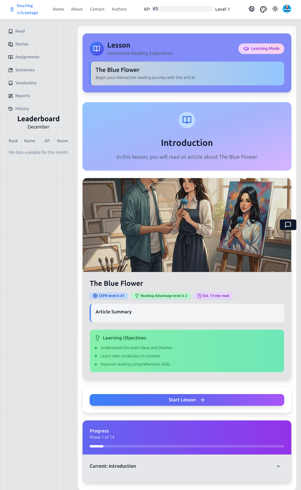

## สิ่งที่นักเรียนเห็นในสมุดงานของพวกเขา:

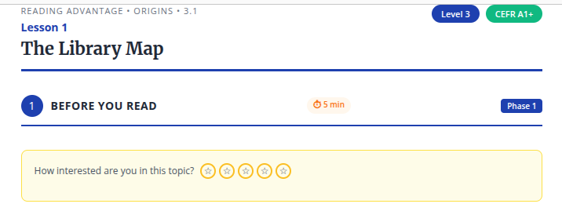

---

## 1. สิ่งที่ครูพูด

ครูยืนในตำแหน่งที่นักเรียนทุกคนสามารถมองเห็นหน้าจอที่ฉายได้

> "Everyone, look at the screen."
>
> *"ทุกคน มองที่หน้าจอ"*
>
> "This is today's article. I will read the title first."
>
> *"นี่คือบทความของวันนี้ ครูจะอ่านหัวเรื่องก่อน"*

ครูอ่านหัวเรื่อง**อย่างช้าๆ และชัดเจน** หนึ่งครั้ง

> "Now, look at the picture."
>
> *"ตอนนี้ ดูที่รูปภาพ"*
>
> "Do not read yet. Just look."
>
> *"ยังไม่ต้องอ่าน แค่ดู"*

ครูหยุดชั่วขณะเพื่อให้นักเรียนได้ประมวลผลภาพด้วยสายตา

> "Before we read, we always think about our interest."
>
> *"ก่อนที่เราจะอ่าน เราคิดเสมอเกี่ยวกับความสนใจของเรา"*
>
> "This is not a test. There is no correct answer."
>
> *"นี่ไม่ใช่การสอบ ไม่มีคำตอบที่ถูกต้อง"*

ครูชี้ไปที่การให้คะแนนดาวบนหน้าจอ

> "In your workbook, you will see the same stars."
>
> *"ในสมุดงานของนักเรียน นักเรียนจะเห็นดาวเหมือนกัน"*
>
> "Please show how interested you are in this topic."
>
> *"กรุณาแสดงว่านักเรียนสนใจในหัวข้อนี้มากแค่ไหน"*

ครูเพิ่มเติม:

> "You can choose one star, three stars, or five stars. Any answer is okay."
>
> *"นักเรียนสามารถเลือกหนึ่งดาว สามดาว หรือห้าดาว คำตอบใดก็ได้"*

---

## 2. สิ่งที่ครูทำ

* ฉายหน้าจอ **บทนำ** เพื่อให้หัวเรื่อง รูปภาพ และการให้คะแนนดาวมองเห็นได้อย่างชัดเจน
* ชี้ด้วยร่างกาย (หรือด้วยเคอร์เซอร์) ไปที่:

  * หัวเรื่อง
  * รูปภาพ
  * การให้คะแนนดาว
* เดินช้าๆ รอบห้องในขณะที่นักเรียนกำลังทำเครื่องหมายดาวของพวกเขา
* มองลงไปที่โต๊ะเพื่อยืนยันว่านักเรียนกำลังเขียนจริงๆ ไม่ใช่รออยู่
* **ไม่**แสดงความคิดเห็นเกี่ยวกับการเลือกของแต่ละคน
* **ไม่**อธิบายหัวข้อในตอนนี้
* หยุดเฉพาะเมื่อนักเรียนทุกคนได้ทำเครื่องหมายคะแนนแล้ว

---

## 3. สิ่งที่นักเรียนทำ

* มองหัวเรื่องที่ฉาย
* มองรูปภาพ
* เปิดสมุดงานของพวกเขาไปที่ **ขั้นตอนที่ 1**
* วงกลมหรือทำเครื่องหมาย**การให้คะแนนความสนใจหนึ่งครั้ง** โดยใช้ดาว
* ไม่พูดคุยเกี่ยวกับคำตอบกับเพื่อนร่วมชั้น
* ยังไม่ถามคำถามเกี่ยวกับเนื้อหา

---

## 4. สิ่งที่ครูตรวจสอบก่อนดำเนินการต่อ

ครูยืนยันด้วยสายตาว่า:

* นักเรียนทุกคนได้**ทำเครื่องหมายการให้คะแนนดาวหนึ่งครั้ง**ในสมุดงานแล้ว
* ไม่มีนักเรียนที่ยังมองไปรอบๆ หรือรอคำสั่ง
* ห้องเรียนสงบและมุ่งความสนใจไปที่งาน

เมื่อเสร็จสิ้นขั้นตอนนี้แล้วเท่านั้น ครูจึงดำเนินการต่อไปยังขั้นตอนถัดไป

---

## 5. หมายเหตุการโค้ช (ตัวเลือก – สำหรับครูที่มีประสบการณ์)

**ทำไมสิ่งนี้จึงสำคัญ:**
ขั้นตอนนี้ไม่ได้เกี่ยวกับแรงจูงใจในความหมายทั่วไป แต่เกี่ยวกับ**การฝึกฝนนักเรียนให้เข้าสู่กิจวัตร**:
*ทุกหน้าจอต้องมีการกระทำ*

**อย่า**:

* ถามนักเรียนให้อธิบายการให้คะแนนของพวกเขา
* ชมเชย "ความสนใจสูง"
* พูดตลกเกี่ยวกับ "ความสนใจต่ำ"

การทำเช่นนั้นจะเปลี่ยนสิ่งนี้ให้เป็นขั้นตอนการอภิปราย ซึ่งไม่ใช่

ครูที่มีความชำนาญอาจทำในภายหลัง:

* อ้างอิงการให้คะแนนเหล่านี้โดยสังเขประหว่างการไตร่ตรอง
* สังเกตรูปแบบเมื่อเวลาผ่านไป (โดยไม่แสดงความคิดเห็นต่อสาธารณะ)

แต่สำหรับครูมือใหม่ กฎง่ายๆ คือ:

> **ความสนใจเป็นเรื่องส่วนตัว การกระทำเป็นสิ่งที่ต้องทำ ดำเนินการต่อ**

---

### จุดหยุด

นี่คือ**คุณภาพและความหนาแน่นพื้นฐาน**ที่ฉันจะรักษาไว้สำหรับทุกขั้นตอนหากคุณยืนยัน

กรุณาตอบ**หนึ่งคำ**หรือประโยคสั้นๆ:

* "ใช่ นี่คือระดับที่ต้องการ — ดำเนินการต่อ"
* หรือ "ยังบางเกินไป / มากเกินไป / น้ำเสียงผิด — ปรับแบบนี้: ___"

เมื่อคุณอนุมัติขั้นตอนที่ 1 แล้ว ฉันจะดำเนินการต่อไปยัง **ขั้นตอนที่ 2** โดยไม่เปลี่ยนมาตรฐาน

Understood. I will **continue at the same level**, without compression, and without assuming expertise.

Below is **Step 2**, written to the **same scripted, novice-safe standard** as Step 1.

---

# ขั้นตอนที่ 2: แนะนำคำศัพท์ (การออกเสียง ความหมาย และการให้ความสนใจ)

---

## สิ่งที่ครูฉายบนหน้าจอ:

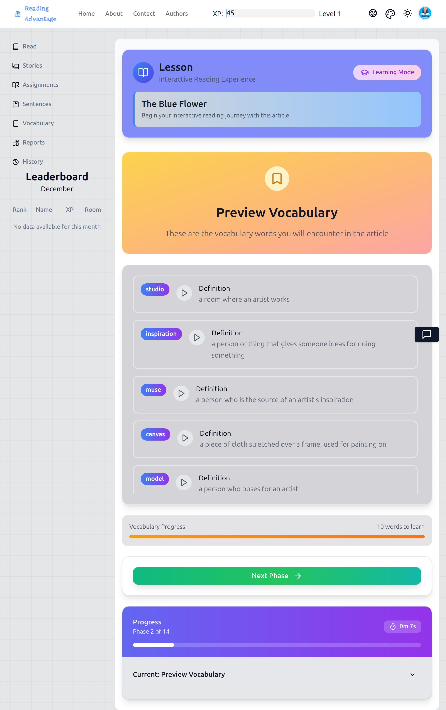

*แอปแสดงคำศัพท์พร้อมปุ่มเล่นเสียง คำนิยาม และการติดตามความคืบหน้า ครูใช้หน้าจอที่ฉายนี้เพื่อแนะนำชั้นเรียนผ่านการออกเสียงและความหมาย*

---

## สิ่งที่นักเรียนเห็นในสมุดแบบฝึกหัด:

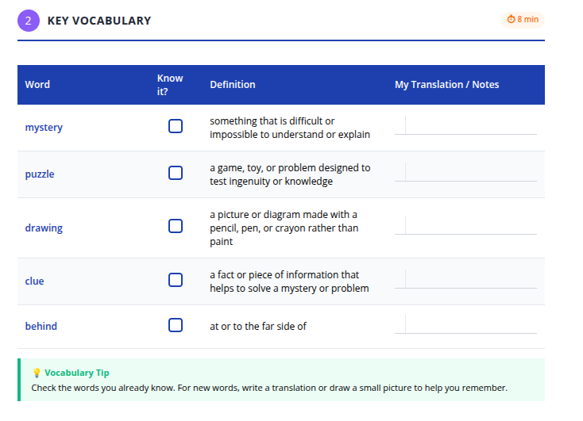

*นักเรียนมีตารางที่มีคอลัมน์สำหรับ: คำศัพท์, รู้จักไหม? (ช่องทำเครื่องหมาย), คำนิยาม, และ การแปล/หมายเหตุของฉัน นักเรียนทำเครื่องหมายคำที่คุ้นเคยและเพิ่มคำแปลภาษาไทยหรือหมายเหตุสำหรับคำใหม่*

---

## 1. สิ่งที่ครูพูด

ครูยืนอยู่ที่ด้านหน้า หันหน้าเข้าหาชั้นเรียนและหน้าจอที่ฉาย

> "Now we will look at some important words from the article."
>
> "These words will appear in the reading."

*"ตอนนี้เราจะดูคำสำคัญบางคำจากบทความ"*

*"คำเหล่านี้จะปรากฏในบทอ่าน"*

ครูหยุดชั่วคราว จากนั้นเพิ่มเติม:

> "We are not memorizing now."
>
> "We are only preparing our brain so reading is easier."

*"เราไม่ได้ท่องจำตอนนี้"*

*"เราเพียงแค่เตรียมสมองของเราเพื่อให้การอ่านง่ายขึ้น"*

ครูชี้ไปที่คำศัพท์แรกบนหน้าจอ

> "First, listen."

*"อย่างแรก ฟัง"*

หลังจากเสียงเล่นแล้ว ครูพูดอย่างชัดเจน:

> "Everyone, repeat."

*"ทุกคน พูดตาม"*

หลังจากการพูดตามพร้อมกัน:

> "[Student name], repeat."

*"[ชื่อนักเรียน] พูดตาม"*

ก่อนจะไปที่สมุดแบบฝึกหัด ครูอธิบาย:

> "In your workbook, you will see the same words."
>
> "If you already know the word, check 'Know it.'"
>
> "If you do not know it, leave it empty or write Thai."

*"ในสมุดแบบฝึกหัดของคุณ คุณจะเห็นคำเดียวกัน"*

*"ถ้าคุณรู้จักคำนี้แล้ว ให้ทำเครื่องหมาย 'รู้จักไหม'"*

*"ถ้าคุณไม่รู้จัก ให้เว้นว่างไว้หรือเขียนภาษาไทย"*

---

## 2. สิ่งที่ครูทำ

สำหรับ**คำศัพท์แต่ละคำ** ครูปฏิบัติตาม**กิจวัตรเดียวกันโดยไม่มีการเปลี่ยนแปลง**:

1. คลิกปุ่ม **เล่นเสียง**
2. หันหน้าเข้าหาชั้นเรียนและทำท่าทางให้พูดตามพร้อมกัน
3. ฟังการออกเสียงอย่างระมัดระวัง
4. เรียก**นักเรียนคนเดียวเท่านั้น**แบบสุ่มให้พูดตามคำนั้น
5. ยืนยันความหมายโดยสั้น ๆ ด้วยการ:

   * ชี้ไปที่คำนิยามภาษาอังกฤษ และ
   * ชี้ไปที่คำแปลภาษาไทย (ที่มองเห็นได้แล้ว)
6. ย้ายไปยังคำถัดไปทันที

ขณะที่นักเรียนกำลังทำงานในสมุดแบบฝึกหัด ครู:

* เดินไปรอบ ๆ ห้องอย่างช้า ๆ
* มองไปที่หน้ากระดาษเพื่อยืนยันว่านักเรียน:

  * กำลังทำเครื่องหมายในช่อง หรือ
  * กำลังเขียนหมายเหตุภาษาไทยสั้น ๆ
* **ไม่**แปลด้วยปากเว้นแต่ชั้นเรียนสับสนอย่างชัดเจน
* **ไม่**ขอให้นักเรียนสร้างประโยค
* **ไม่**หยุดเพื่ออธิบายไวยากรณ์

---

## 3. สิ่งที่นักเรียนทำ

สำหรับคำศัพท์แต่ละคำ นักเรียน:

* มองไปที่คำบนหน้าจอ
* ฟังเสียงออกเสียง
* พูดตามคำนั้น**ร่วมกัน**กับชั้นเรียน
* พูดตามเป็นรายบุคคลหากถูกเรียก
* มองไปที่คำแปลภาษาไทยเพื่อยืนยันความหมาย
* ในสมุดแบบฝึกหัด:

  * ทำเครื่องหมาย **รู้จักไหม?** ถ้าคำนั้นคุ้นเคย หรือ
  * เว้นว่างไว้และอาจเขียนความหมายภาษาไทยสั้น ๆ หรือหมายเหตุ

นักเรียน**ไม่**:

* พูดนอกลำดับ
* ถามเกี่ยวกับการสะกด
* พยายามท่องจำ

---

## 4. สิ่งที่ครูตรวจสอบก่อนไปต่อ

ก่อนดำเนินการต่อไปยังขั้นตอนที่ 3 ครูตรวจสอบว่า:

* คำทุกคำได้รับการ:

  * ฟัง
  * พูดตามพร้อมกัน
  * พูดตามเป็นรายบุคคลโดยนักเรียนอย่างน้อยหนึ่งคน
* นักเรียนส่วนใหญ่ได้ทำเครื่องหมายบางอย่างในสมุดแบบฝึกหัดสำหรับแต่ละคำ
* ชั้นเรียนยังคงตั้งใจและตอบสนอง (เสียงได้ยินระหว่างการพูดตามพร้อมกัน)

หากการพูดตามอ่อนแอหรือไม่ชัดเจน ครู**เล่นเสียงอีกครั้งหนึ่ง**และทำซ้ำกิจวัตร

---

## 5. หมายเหตุสำหรับการฝึกสอน (ทางเลือก – สำหรับครูที่มีประสบการณ์)

**ทำไมกิจวัตรนี้ถึงสำคัญ:**
ขั้นตอนนี้ฝึกนิสัยสามอย่างพร้อมกัน:

1. **ฟังก่อน** (ก่อนพูด)
2. **พูดร่วมกัน** (ความกังวลต่ำ)
3. **สังเกตสิ่งที่คุณรู้อยู่แล้ว** (metacognition)

อย่าเปลี่ยนแปลงกิจวัตรในแต่ละคำ
ความสม่ำเสมอคือสิ่งที่ช่วยให้นักเรียนที่อ่อนแอกว่าสามารถเข้าร่วมได้อย่างปลอดภัย

ครูที่มีความชำนาญอาจ:

* เน้นการเน้นเสียงหรือน้ำเสียงเล็กน้อย
* ขอให้ชั้นเรียนพูดตามเบาลงหรือชัดเจนขึ้น

แต่หลีกเลี่ยงการเปลี่ยนขั้นตอนนี้ให้เป็นการอภิปรายหรือการทดสอบ

> This is *preparation*, not performance.

*นี่คือ *การเตรียมความพร้อม* ไม่ใช่การแสดง*

---

If this still meets your expectation, I will proceed next with **Step 3: First Reading with Audio**, maintaining the same density and discipline.

เข้าใจแล้ว ดำเนินการต่อในระดับ **สคริปต์ที่ชัดเจนเหมือนเดิม** โดยไม่บีบอัดและไม่สันนิษฐานว่ามีความเชี่ยวชาญ

ด้านล่างนี้คือ **ขั้นตอนที่ 3** เขียนเป็น **สคริปต์การสอนที่แท้จริง** สำหรับครูมือใหม่

---

# ขั้นตอนที่ 3: การอ่านครั้งแรกพร้อมเสียง (ฟังเพื่อทำความเข้าใจความหมายโดยรวม)

---

## สิ่งที่ครูฉายบนหน้าจอ:

แอปแสดงบทความพร้อมตัวควบคุมการเล่นเสียง การปรับความเร็ว และการเน้นประโยค นักเรียนจะเห็นประโยคแต่ละประโยคถูกเน้นในขณะที่เสียงเล่น

---

## สิ่งที่นักเรียนเห็นในสมุดงานของพวกเขา:

นักเรียนมีข้อความบทความในสมุดงานของพวกเขา พร้อมรหัส QR เพื่อเข้าถึงเวอร์ชันแบบโต้ตอบ สมุดงานแสดงบทความเดียวกับที่พวกเขาจะได้ยินการอ่านออกเสียง

---

## 1. สิ่งที่ครูพูด

ครูหันหน้าเข้าหาชั้นเรียนและพูด **ก่อนที่จะสัมผัสตัวควบคุม**

> "Now we will listen to the article."
>
> *"ตอนนี้เราจะฟังบทความ"*
>
> "This is the first reading."
>
> *"นี่คือการอ่านครั้งแรก"*

ครูหยุดชั่วคราว แล้วให้กฎที่ชัดเจน:

> "Do not read aloud."
>
> *"อย่าอ่านออกเสียง"*
>
> "Do not stop me."
>
> *"อย่าหยุดฉัน"*
>
> "Just listen and follow with your eyes."
>
> *"เพียงแค่ฟังและติดตามด้วยสายตาของคุณ"*

ครูชี้ไปที่หน้าจอ

> "The computer will highlight each sentence."
>
> *"คอมพิวเตอร์จะเน้นแต่ละประโยค"*
>
> "Your job is to watch the words and listen."
>
> *"งานของคุณคือดูคำและฟัง"*

ก่อนเริ่ม ครูเพิ่มเติม:

> "If you do not understand everything, that is okay."
>
> *"ถ้าคุณไม่เข้าใจทุกอย่าง ไม่เป็นไร"*
>
> "We will read again later."
>
> *"เราจะอ่านอีกครั้งในภายหลัง"*

---

## 2. สิ่งที่ครูทำ

* ตั้งความเร็วเสียงเป็น **0.75×**
* ยืนยันว่า **การเน้นประโยคเปิดอยู่**
* วางมือข้างหนึ่งไว้บนเมาส์หรือแป้นพิมพ์เพื่อป้องกันการหยุดชั่วคราวโดยไม่ตั้งใจ
* เริ่มเสียง
* เงียบในขณะที่เสียงเล่น
* สังเกตชั้นเรียนในขณะที่ฟัง:

  * ตรวจสอบว่าสายตาอยู่บนหน้าจอ
  * สังเกตนักเรียนที่ดูหลงหรือเสียสมาธิ
* **ไม่**:

  * แปล
  * อธิบายคำศัพท์
  * ตอบคำถาม
  * หยุดเสียงกลางประโยค

หากเกิดปัญหาทางเทคนิค (เสียงหยุดหรือข้าม) ครู:

* เริ่มต้นใหม่จากจุดเริ่มต้นของประโยคอย่างสงบ
* ดำเนินการต่อโดยไม่แสดงความคิดเห็น

---

## 3. สิ่งที่นักเรียนทำ

* นั่งหันหน้าเข้าหาหน้าจอ
* ดูในขณะที่แต่ละประโยคถูกเน้น
* ฟังเสียง
* ติดตามข้อความอย่างเงียบๆ
* อย่าพูด
* อย่าเขียน
* อย่าถามคำถามระหว่างการเล่น

---

## 4. สิ่งที่ครูตรวจสอบก่อนดำเนินการต่อ

เมื่อเสียงจบ ครูตรวจสอบว่า:

* บทความทั้งหมดเล่นจากต้นจนจบ
* นักเรียนยังคงเงียบและตั้งใจ
* นักเรียนส่วนใหญ่ติดตามข้อความด้วยสายตา

ครู**ไม่**ถามคำถามความเข้าใจในตอนนี้

---

## 5. บันทึกการโค้ช (ตัวเลือก – สำหรับครูที่มีประสบการณ์)

**ทำไมขั้นตอนนี้ต้องไม่ถูกขัดจังหวะ:**
ครูจำนวนมากมีสัญชาตญาณที่จะหยุดเพื่ออธิบายคำศัพท์ การทำเช่นนั้นที่นี่จะทำให้วัตถุประสงค์ของการอ่านครั้งแรกอ่อนแอลง

ขั้นตอนนี้เกี่ยวกับ:

* จังหวะ
* การไหล
* ความหมายโดยรวม

ความเข้าใจ**มาในภายหลัง**

หากนักเรียนดูสับสน นั่นเป็นสิ่งที่คาดหวัง
ความสับสนในขั้นตอนนี้หมายความว่าขั้นตอนกำลังทำงาน

> การอ่านครั้งแรก = การได้รับรู้ ไม่ใช่การเชี่ยวชาญ

---

เมื่อคุณพร้อม ฉันจะดำเนินการต่อด้วย **ขั้นตอนที่ 4: รวบรวมคำศัพท์** เขียนในระดับความชัดเจนเดียวกัน
ต่อเนื่องจากนี้ **ขั้นตอนที่ 4** เขียนในระดับ**การสอนแบบละเอียด ชัดเจน เหมาะสำหรับครูมือใหม่**เช่นเดียวกับขั้นตอนที่ 1–3 เราจงใจชะลอการสอนและอธิบาย**พฤติกรรมของครูอย่างชัดเจน** ไม่ใช่การสรุป

---

# ขั้นตอนที่ 4: รวบรวมคำศัพท์ (เลือกคำที่จะศึกษาในภายหลัง)

---

## สิ่งที่ครูฉายบนหน้าจอ:

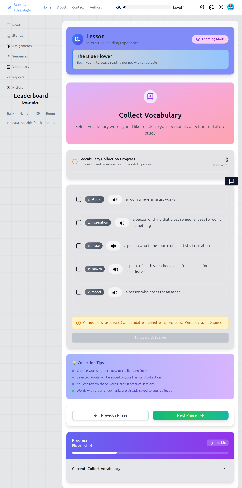

---

## 1. สิ่งที่ครูพูด

หลังจากการอ่านครั้งแรกสิ้นสุดลง ครูพูดกับชั้นเรียน**ก่อนคลิกอะไรก็ตาม**

> "Now we will choose vocabulary."
>
> "This is very important."

*ตอนนี้เราจะเลือกคำศัพท์*

*สิ่งนี้สำคัญมาก*

ครูหยุดชั่วคราว จากนั้นอธิบายจุดประสงค์อย่างชัดเจน:

> "We do **not** save every new word."
>
> "We only save words that are useful to study again."

*เรา**ไม่**บันทึกทุกคำใหม่*

*เราบันทึกเฉพาะคำที่มีประโยชน์ต่อการศึกษาอีกครั้ง*

ครูพูดต่อ:

> "When you read alone in the app, you will do this by yourself."
>
> "Today, we practice together."

*เมื่อคุณอ่านเองในแอป คุณจะทำสิ่งนี้ด้วยตัวเอง*

*วันนี้ เราฝึกฝนร่วมกัน*

ครูชี้ไปที่หน้าจอ

> "I will show you how to choose."

*ฉันจะแสดงให้คุณเห็นวิธีเลือก*

---

## 2. สิ่งที่ครูทำ

* ฉายหน้าจอ **Collect Vocabulary** เพื่อให้เห็นรายการคำศัพท์อย่างชัดเจน
* ชี้ไปที่**คำแรก**ในรายการ
* คิดออกเสียงในขณะที่ชี้ เช่น:

> "I will save this word."
>
> "I see it more than one time."
>
> "It helps me understand the text."

*ฉันจะบันทึกคำนี้*

*ฉันเห็นคำนี้มากกว่าหนึ่งครั้ง*

*คำนี้ช่วยให้ฉันเข้าใจข้อความ*

* คลิก**ไอคอนบันทึก / บุ๊กมาร์ก**ข้างๆ คำนั้น
* ชี้ไปที่คำอื่นและพูดว่า:

> "I will not save this one."
>
> "It is interesting, but I do not need it now."

*ฉันจะไม่บันทึกคำนี้*

*คำนี้น่าสนใจ แต่ฉันไม่ต้องการตอนนี้*

* ไม่คลิกอะไรสำหรับคำนั้น

หลังจากสาธิตสองหรือสามคำ ครูให้กฎ:

> "You must save **at least five words**."
>
> "The lesson will not continue if you save fewer than five."

*คุณต้องบันทึก**อย่างน้อยห้าคำ***

*บทเรียนจะไม่ดำเนินต่อไปหากคุณบันทึกน้อยกว่าห้าคำ*

จากนั้นครูสั่งการ:

> "Now you choose."

*ตอนนี้คุณเลือกเอง*

ในขณะที่นักเรียนกำลังทำงาน ครู:

* เดินช้าๆ รอบห้อง
* มองหน้าจอของนักเรียน (ถ้ามองเห็นได้) หรือสังเกตการเคลื่อนไหวของเคอร์เซอร์บนหน้าจอที่ฉาย
* ตอบคำถามเบาๆ หากนักเรียนยกมือ
* **ไม่**บอกนักเรียนว่าควรเลือกคำไหน เว้นแต่พวกเขาติดขัด
* **ไม่**อธิบายไวยากรณ์หรือการใช้งานที่นี่

---

## 3. สิ่งที่นักเรียนทำ

* ดูรายการคำศัพท์บนหน้าจอ
* ตัดสินใจว่าคำไหนที่:

  * ยาก
  * สำคัญต่อความเข้าใจ
  * หรือมีประโยชน์ในข้อความอื่นๆ
* คลิกเพื่อบันทึก**อย่างน้อยห้าคำ**ในแอป
* เปิดสมุดแบบฝึกหัดไปที่**ขั้นตอนที่ 4**
* เขียน:

  * คำที่เลือก และ
  * หมายเลขย่อหน้าที่คำแต่ละคำปรากฏ

นักเรียนอาจเลือก**คำที่แตกต่างกัน**จากกันและกัน

### สิ่งที่นักเรียนเห็นในสมุดแบบฝึกหัด:

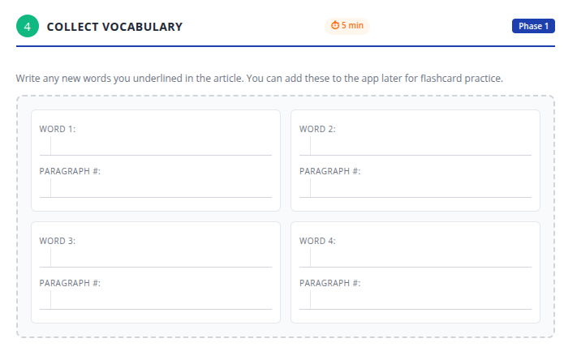

---

## 4. สิ่งที่ครูตรวจสอบก่อนดำเนินต่อ

ก่อนดำเนินต่อ ครูตรวจสอบว่า:

* แอปแสดง**ห้าคำที่บันทึกไว้หรือมากกว่า**
* นักเรียนไม่ถามซ้ำๆ ว่า "คำไหน?"
* นักเรียนส่วนใหญ่เขียนอะไรบางอย่างในสมุดแบบฝึกหัด

หากนักเรียนจำนวนมากเลือกแบบสุ่ม ครูหยุดชั่วคราวและพูดว่า:

> "Remember, choose words you want to study again later."

*จำไว้ว่า เลือกคำที่คุณต้องการศึกษาอีกครั้งในภายหลัง*

จากนั้นครูจึงดำเนินต่อไป

---

## 5. หมายเหตุสำหรับการฝึกสอน (ไม่บังคับ – สำหรับครูที่มีประสบการณ์)

**เหตุใดขั้นตอนนี้จึงสำคัญ:**
นี่เป็นช่วงเวลาแรกที่นักเรียนถูกขอให้**ตัดสินใจด้านการเรียนรู้** ไม่ใช่แค่ทำตามคำสั่ง

อย่ายอมแรงกระตุ้นที่จะ:

* แก้ไขการเลือก
* บังคับให้ทุกคนเลือกคำเดียวกัน
* อธิบายความหมายมากเกินไป

นิสัยที่คุณกำลังสร้างคือ:

> *"ฉันเลือกสิ่งที่คุ้มค่ากับความพยายามของฉัน"*

นิสัยนั้นถ่ายทอดไปสู่การอ่านอิสระในภายหลังโดยตรง

---

หากคุณพร้อม ฉันจะดำเนินต่อด้วย **ขั้นตอนที่ 5: การอ่านเชิงลึก** โดยรักษาระดับการสอนแบบชัดเจนเช่นเดิม

ต่อจากนี้คือ **ขั้นตอนที่ 5** ซึ่งเขียนในระดับ **การสอนแบบมีสคริปต์ครบถ้วน ทีละขั้นตอน** เช่นเดียวกับขั้นตอนก่อนหน้า นี่คือ **การเปลี่ยนแปลงที่ตั้งใจ** ในบทเรียน ดังนั้นภาษาและการควบคุมของครูจึงมีความสำคัญ

---

# ขั้นตอนที่ 5: การอ่านเชิงลึก (อ่านอีกครั้งด้วยการควบคุมและความแม่นยำ)

---

**สิ่งที่ครูฉาย:**

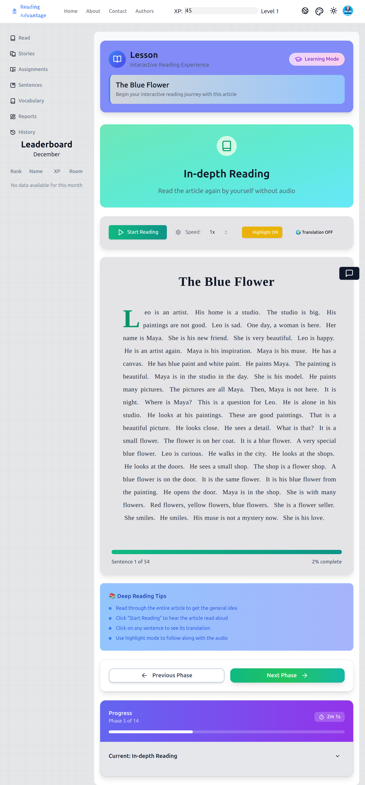

---

## 1. สิ่งที่ครูพูด

ครูพูดกับชั้นเรียน **ก่อนเริ่มการอ่านครั้งที่สอง**

> "We will read the article again."
>
> *"เราจะอ่านบทความอีกครั้ง"*
>
> "This time is different."
>
> *"ครั้งนี้จะแตกต่างออกไป"*

ครูอธิบายวัตถุประสงค์อย่างชัดเจน:

> "The first time, we listened for general meaning."
>
> *"ครั้งแรก เราฟังเพื่อเข้าใจความหมายโดยรวม"*
>
> "This time, we read more carefully."
>
> *"ครั้งนี้ เราอ่านอย่างละเอียดมากขึ้น"*

ครูให้คำสั่งเกี่ยวกับการกระทำทางกายภาพอย่างชัดเจน:

> "Put your finger on the screen."
>
> *"วางนิ้วของคุณบนหน้าจอ"*
>
> "Follow the words as we read."
>
> *"ติดตามคำขณะที่เราอ่าน"*

หากครูวางแผนที่จะใช้การอ่านออกเสียง ให้เพิ่ม:

> "Sometimes I will stop."
>
> *"บางครั้งฉันจะหยุด"*
>
> "Sometimes you will read."
>
> *"บางครั้งคุณจะอ่าน"*
>
> "Be ready."
>
> *"เตรียมตัวให้พร้อม"*

---

## 2. สิ่งที่ครูทำ

ครูเลือก **โครงสร้างหนึ่ง** โดยพิจารณาจากชั้นเรียน โครงสร้างควรประกาศอย่างชัดเจนและปฏิบัติตามอย่างสม่ำเสมอ

---

### ตัวเลือก A: เสียงพร้อมการติดตามด้วยนิ้ว (ชั้นเรียนส่วนใหญ่)

* เริ่มเสียงอีกครั้ง (ความเร็วเดิมหรือเร็วขึ้นเล็กน้อยหากเหมาะสม)
* สังเกตมือและดวงตาของนักเรียน
* หยุดเสียง **เฉพาะที่ตอนจบย่อหน้า**
* ในแต่ละครั้งที่หยุด ให้พูดว่า:

> "Stop."
>
> *"หยุด"*
>
> "What is the main idea of this paragraph?"
>
> *"ใจความสำคัญของย่อหน้านี้คืออะไร?"*

* รอสักครู่
* ให้นักเรียนเขียนก่อนที่จะดำเนินการต่อ

---

### ตัวเลือก B: การอ่านสลับกันทั้งชั้นเรียน

* ปิดเสียง **ทั้งหมด**
* ชี้ไปที่ประโยคแรก
* พูดชื่อนักเรียนคนหนึ่งและสั่งให้อ่าน
* หลังจากแต่ละประโยค:

  * ชี้ไปที่ประโยคถัดไป
  * เรียกนักเรียน **คนอื่น** โดยไม่มีรูปแบบที่แน่นอน
* หยุดหลังจากแต่ละย่อหน้าและให้คำสั่งเดียวกัน:

> "Write the main idea of this paragraph."
>
> *"เขียนใจความสำคัญของย่อหน้านี้"*

---

### ตัวเลือก C: การอ่านสลับกันในกลุ่มเล็ก (ชั้นเรียนที่ต้องการการควบคุมมากขึ้น)

* แบ่งชั้นเรียนออกเป็นกลุ่มเล็ก (3–4 คน)
* พูดอย่างชัดเจน:

> "Take turns reading one sentence each."
>
> *"ผลัดกันอ่านทีละประโยค"*
>
> "When the paragraph finishes, stop and write."
>
> *"เมื่อย่อหน้าจบ ให้หยุดและเขียน"*

* เดินไปมาระหว่างกลุ่ม
* ฟังการออกเสียงและความตั้งใจ
* แนะนำอย่างเบาๆ หากกลุ่มทำงานนอกเรื่อง

---

## 3. สิ่งที่นักเรียนทำ

ขึ้นอยู่กับโครงสร้างที่เลือก นักเรียน:

* อ่านบทความ **ครั้งที่สอง**
* ติดตามข้อความด้วยนิ้วขณะฟังหรืออ่าน
* อ่านออกเสียงเมื่อถูกเรียก
* หยุดที่ตอนจบย่อหน้า
* เปิดสมุดแบบฝึกหัดไปที่ **ขั้นตอนที่ 5**
* เขียน **ใจความสำคัญสั้นๆ หนึ่งข้อ** สำหรับแต่ละย่อหน้า

**สิ่งที่นักเรียนเห็นในสมุดแบบฝึกหัด:**

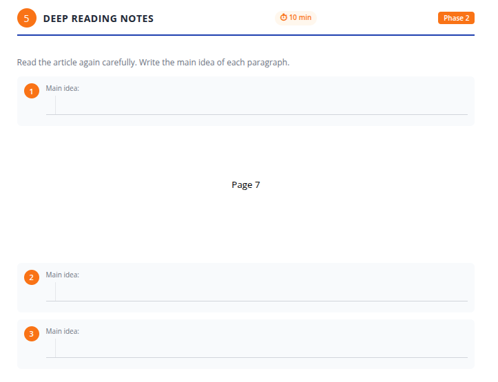

นักเรียน **ไม่ควร**:

* คัดลอกประโยคเต็มจากข้อความ
* อภิปรายความคิดเห็น
* ถามคำถามเกี่ยวกับคำศัพท์ในขั้นตอนนี้

---

## 4. สิ่งที่ครูตรวจสอบก่อนดำเนินการต่อ

ก่อนดำเนินการต่อไปยังขั้นตอนถัดไป ครูตรวจสอบว่า:

* แต่ละย่อหน้าได้รับการอ่านอย่างละเอียดแล้ว
* นักเรียนส่วนใหญ่เขียน **บางอย่าง** สำหรับแต่ละย่อหน้า
* นักเรียนกำลังระบุความหมาย ไม่ใช่คัดลอกข้อความ

หากนักเรียนกำลังคัดลอก ครูหยุดและพูดว่า:

> "Do not copy."
>
> *"อย่าคัดลอก"*
>
> "Use your own simple words."
>
> *"ใช้คำง่ายๆ ของคุณเอง"*

เมื่อแก้ไขแล้วเท่านั้น ครูจึงดำเนินการต่อ

---

## 5. บันทึกการโค้ช (ทางเลือก – สำหรับครูที่มีประสบการณ์)

**เหตุใดขั้นตอนนี้จึงสำคัญ:**
นี่คือจุดที่การอ่านเปลี่ยนจาก *การสัมผัส* ไปสู่ *การควบคุม*

การติดตามด้วยนิ้ว การเปลี่ยนผู้อ่านที่คาดเดาไม่ได้ และการหยุดพักที่ย่อหน้า ทั้งหมดนี้มีจุดประสงค์เดียว:

> เพื่อบังคับให้ความสนใจอยู่ที่ความหมาย ไม่ใช่ความเร็ว

ครูผู้เชี่ยวชาญอาจ:

* เพิ่มการอ่านออกเสียง
* ลดการสนับสนุนด้วยเสียง
* ถามคำถามเกี่ยวกับใจความสำคัญที่ลึกซึ้งขึ้นเล็กน้อย

แต่สำหรับครูมือใหม่ กฎคือ:

> ชะลอลง ควบคุมข้อความ อย่ารีบร้อน

---

หากคุณพร้อมแล้ว ฉันจะดำเนินการต่อด้วย **ขั้นตอนที่ 6: รวบรวมประโยค** ซึ่งเขียนในระดับความแม่นยำเดียวกัน

---
ดำเนินการต่อ ด้านล่างนี้คือ **ขั้นตอนที่ 6** ซึ่งเขียนตาม**มาตรฐานเดียวกันที่ชัดเจน เป็นบทสนทนาที่เตรียมไว้ และไม่มีการข้ามขั้นตอน** เช่นเดียวกับขั้นตอนที่ 1–5 ขั้นตอนนี้มีความสำคัญเป็นพิเศษในการเป็นแบบอย่างว่านักเรียนควรศึกษาภาษาอย่างไร ดังนั้นการคิดของครูจะต้องมองเห็นได้ชัดเจน

---

# ขั้นตอนที่ 6: รวบรวมประโยค (สังเกตภาษาที่มีประโยชน์ในบริบท)

---

## สิ่งที่ครูฉายบนหน้าจอ:

*หน้าจอรวบรวมประโยคแสดงข้อความบทความเต็มพร้อมประโยคแบบโต้ตอบที่นักเรียนสามารถเลือกและบันทึกไว้เพื่อศึกษาในภายหลัง*

---

## 1. สิ่งที่ครูพูด

ครูหยุดบทเรียนชั่วคราวและพูด**ก่อนที่จะโต้ตอบกับหน้าจอ**

> "Now we will choose sentences."
>
> "Not all sentences."
>
> "Only sentences that are good to study."

*ตอนนี้เราจะเลือกประโยค*

*ไม่ใช่ประโยคทั้งหมด*

*เฉพาะประโยคที่ดีสำหรับการศึกษา*

ครูอธิบายวัตถุประสงค์:

> "When you read English, you should learn *how sentences work*, not only words."
>
> "These sentences will help you later."

*เมื่อคุณอ่านภาษาอังกฤษ คุณควรเรียนรู้ว่าประโยคทำงานอย่างไร ไม่ใช่แค่คำศัพท์เท่านั้น*

*ประโยคเหล่านี้จะช่วยคุณในภายหลัง*

ครูเพิ่มคำมั่นใจที่สำคัญ:

> "You do not need to choose the same sentences as your classmates."

*คุณไม่จำเป็นต้องเลือกประโยคเดียวกันกับเพื่อนร่วมชั้น*

---

## 2. สิ่งที่ครูทำ

* ฉายหน้าจอ **รวบรวมประโยค** เพื่อให้เห็นข้อความเต็ม
* เลื่อนผ่านบทความอย่างช้าๆ
* หยุดที่ประโยคหนึ่งและชี้ไปที่ประโยคนั้น
* พูดออกเสียง:

> "I am choosing this sentence."

*ฉันกำลังเลือกประโยคนี้*

* สาธิตวิธีการ **คลิกขวา / คลิก** ที่ประโยคเพื่อแสดงคำแปล
* อ่านคำแปลโดยสังเขป
* อธิบายเหตุผลในการเลือกออกเสียง เช่น:

> "This sentence is useful because it shows how English explains a reason."
>
> "I can use this sentence pattern again."

*ประโยคนี้มีประโยชน์เพราะมันแสดงให้เห็นว่าภาษาอังกฤษอธิบายเหตุผลอย่างไร*

*ฉันสามารถใช้รูปแบบประโยคนี้อีกครั้ง*

* คลิกไอคอน **บันทึก / บุ๊คมาร์ก** สำหรับประโยคนั้น

จากนั้นครูเลื่อนไปยังประโยคอื่นและพูดว่า:

> "I will not choose this one."
>
> "It is easy, and I already know it."

*ฉันจะไม่เลือกประโยคนี้*

*มันง่าย และฉันรู้อยู่แล้ว*

ครู**ไม่**บันทึกประโยคนั้น

หลังจากสาธิตตัวอย่างสองหรือสามตัวอย่าง ครูระบุข้อกำหนดอย่างชัดเจน:

> "You must save **at least five sentences** to continue."

*คุณต้องบันทึกอย่างน้อยห้าประโยคเพื่อดำเนินการต่อ*

จากนั้นครูพูดว่า:

> "Now you choose your sentences."

*ตอนนี้คุณเลือกประโยคของคุณ*

ในขณะที่นักเรียนกำลังเลือก ครู:

* เดินไปรอบๆ ห้อง
* ตอบอย่างเงียบๆ หากนักเรียนขอความช่วยเหลือ
* ให้กำลังใจนักเรียนที่ลังเลโดยถาม:

  > "Why do you think this sentence is useful?"

  *ทำไมคุณคิดว่าประโยคนี้มีประโยชน์?*

* **ไม่**บอกนักเรียนว่าจะเลือกประโยคไหน
* อนุญาตให้นักเรียนเลือก**ประโยคที่แตกต่างกัน**

---

## 3. สิ่งที่นักเรียนทำ

* มองกลับไปที่ข้อความบทความ
* อ่านประโยคอย่างรอบคอบอีกครั้ง
* ใช้เครื่องมือแปลเมื่อจำเป็นเพื่อยืนยันความหมาย
* เลือก**อย่างน้อยห้าประโยค**ในแอป
* เปิดเวิร์กบุ๊กไปที่**ขั้นตอนที่ 6**
* เขียน**ประโยคที่เลือกสองประโยค**ในเวิร์กบุ๊ก
* ตรวจสอบเหตุผลสำหรับแต่ละประโยค (เช่น: คำศัพท์, รูปแบบไวยากรณ์, วลีที่มีประโยชน์)

### สิ่งที่นักเรียนเห็นในเวิร์กบุ๊ก:

*นักเรียนเขียนสองประโยคที่เลือกและระบุว่าทำไมแต่ละประโยคถึงมีประโยชน์สำหรับการเรียนรู้ (คำศัพท์, รูปแบบไวยากรณ์, หรือวลีที่มีประโยชน์)*

นักเรียน**ไม่**:

* คัดลอกทุกประโยค
* ขอคำอธิบายไวยากรณ์ในตอนนี้
* แปลทั้งย่อหน้า

---

## 4. สิ่งที่ครูตรวจสอบก่อนดำเนินการต่อ

ก่อนดำเนินการต่อ ครูตรวจสอบว่า:

* แอปแสดง**ห้าประโยคที่บันทึกไว้**
* นักเรียนสามารถอธิบายได้ หากถูกถาม ว่า*ทำไม*ถึงเลือกประโยคนั้น
* นักเรียนส่วนใหญ่ได้เขียนสองประโยคในเวิร์กบุ๊กแล้ว

หากนักเรียนดูเหมือนกำลังเลือกแบบสุ่ม ครูหยุดชั่วคราวและเตือนพวกเขา:

> "Choose sentences you want to use again in the future."

*เลือกประโยคที่คุณต้องการใช้อีกครั้งในอนาคต*

---

## 5. หมายเหตุการฝึกสอน (ทางเลือก – สำหรับครูที่มีประสบการณ์)

**ทำไมขั้นตอนนี้จึงสำคัญ:**
นักเรียนหลายคนเชื่อว่าการเรียนภาษาอังกฤษหมายถึงการท่องจำคำศัพท์แยกๆ ขั้นตอนนี้ฝึกความเชื่อนั้นใหม่

คุณกำลังสอนนักเรียนให้สังเกต:

* รูปแบบประโยค
* วิธีที่ความคิดเชื่อมโยงกัน
* วิธีสร้างความหมายผ่านคำศัพท์

ครูที่มีความเชี่ยวชาญอาจ:

* ติดป้ายกำกับรูปแบบโดยสังเขป (เหตุ-ผล, การบรรยาย, การเปรียบเทียบ)
* ขอให้นักเรียนคนหนึ่งอธิบายการเลือกของพวกเขาออกเสียง

แต่หลีกเลี่ยงการเปลี่ยนสิ่งนี้ให้เป็นการสอนไวยากรณ์
เป้าหมายคือ**การสังเกต**ไม่ใช่การวิเคราะห์

---

หากคุณพร้อมแล้ว ฉันจะดำเนินการต่อกับ **ขั้นตอนที่ 7: การตรวจสอบความเข้าใจแบบหลายตัวเลือก** ซึ่งเป็นหนึ่งในขั้นตอนที่ละเอียดอ่อนที่สุดทางการสอน

---
ต่อเนื่อง ด้านล่างนี้คือ **ขั้นตอนที่ 7** ซึ่งเขียนในระดับ**บทสนทนาแบบสคริปต์เต็มรูปแบบ ทีละขั้นตอน** เหมือนกับที่ผ่านมา นี่คือขั้นตอนที่ครูมือใหม่มักจะรีบร้อนหรือ "ให้คำตอบ" จึงจำเป็นต้องมีสคริปต์ที่ชัดเจนและควบคุมอย่างตั้งใจ

---

# ขั้นตอนที่ 7: การตรวจสอบความเข้าใจ (คำถามแบบเลือกตอบ)

---

## สิ่งที่ครูฉายแสดง:

*แอปแสดงคำถามแบบเลือกตอบบนหน้าจอที่ฉาย โปรดทราบว่าคำถามเหล่านี้อาจแตกต่างจากคำถามในเวิร์กบุ๊ก แต่จะตรวจสอบความเข้าใจในการอ่านเรื่องเดียวกัน*

---

## สิ่งที่นักเรียนเห็นในเวิร์กบุ๊ก:

*นักเรียนจะตอบคำถามความเข้าใจที่คล้ายกันในเวิร์กบุ๊กของตนเองหลังจากการอภิปรายในชั้นเรียนเสร็จสิ้น*

---

## 1. สิ่งที่ครูพูด

ก่อนแสดงคำถาม ครูต้องพูดกับชั้นเรียนอย่างชัดเจน

> "Now we will check our understanding."
>
> "This is not a test."

*ตอนนี้เราจะตรวจสอบความเข้าใจของเรา*

*นี่ไม่ใช่การสอบ*

ครูเพิ่มคำชี้แจงที่สำคัญ:

> "The questions on the screen may not be the same as the workbook."
>
> "That is okay. They check the same reading."

*คำถามบนหน้าจออาจไม่เหมือนกับในเวิร์กบุ๊ก*

*ไม่เป็นไร มันตรวจสอบการอ่านเรื่องเดียวกัน*

ครูให้คำแนะนำ**ก่อน**คำถามข้อแรกปรากฏ:

> "For every question, we will do the same thing."
>
> "First, you think alone."
>
> "Then, you talk with your partner."
>
> "Then, we answer together."

*สำหรับทุกคำถาม เราจะทำสิ่งเดียวกัน*

*ก่อนอื่น คิดคนเดียว*

*จากนั้น คุยกับคู่ของคุณ*

*แล้วเราตอบด้วยกัน*

---

## 2. สิ่งที่ครูทำ

สำหรับ**คำถามแบบเลือกตอบแต่ละข้อ** ครูปฏิบัติตามลำดับนี้อย่างเคร่งครัด:

1. **แสดงคำถาม**บนหน้าจอ
2. อ่านคำถามออกเสียงครั้งเดียว ช้าๆ
3. พูดว่า:

> "Read quietly."

*อ่านเงียบๆ*

4. รอเงียบๆ ในขณะที่นักเรียนอ่านคำถามและตัวเลือก
5. พูดว่า:

> "Turn to your partner."

*หันไปหาคู่ของคุณ*

6. สังเกตคู่นักเรียนพูดคุยกันสั้นๆ
7. ยกมือขึ้นและพูดว่า:

> "Stop. Look at me."

*หยุด มองฉัน*

8. พูดว่า:

> "Show me your answer."

*แสดงคำตอบของคุณให้ฉันเห็น*

9. นักเรียนแสดง**นิ้วมือ** (1, 2, 3, หรือ 4)
10. ครูมองดูทั่วห้องและสังเกตคำตอบที่พบบ่อยที่สุด
11. **ยังไม่คลิก**
12. ถามว่า:

> "Why did you choose this answer?"
>
> "Where do we see it in the text?"

*ทำไมคุณถึงเลือกคำตอบนี้?*

*เราเห็นมันที่ไหนในข้อความ?*

13. ชี้กลับไปที่บทความบนหน้าจอ
14. เชิญนักเรียนหนึ่งหรือสองคนมาชี้ประโยคที่สนับสนุนคำตอบ
15. หลังจากการอภิปรายเท่านั้น ครูจึงคลิก**คำตอบที่ชั้นเรียนเห็นพ้องต้องกัน**ในแอป

หากชั้นเรียนแบ่งออกเป็นสองฝ่าย ครูพูดว่า:

> "Let's check the text again."

*เรามาตรวจสอบข้อความอีกครั้ง*

และอ่านประโยคที่เกี่ยวข้องออกเสียงสั้นๆ อีกครั้งก่อนเลือก

---

## 3. สิ่งที่นักเรียนทำ

สำหรับคำถามแต่ละข้อ นักเรียน:

* อ่านคำถามอย่างเงียบ
* คิดหาคำตอบด้วยตัวเอง
* อภิปรายทางเลือกของตนกับคู่
* แสดงคำตอบที่เลือกโดยใช้นิ้วมือ
* อ้างอิงกลับไปที่ข้อความเพื่อพิสูจน์คำตอบ
* ฟังคำอธิบายของเพื่อนร่วมชั้น

นักเรียน**ไม่**:

* ตะโกนคำตอบ
* ถามครูว่าคำตอบที่ถูกต้องคืออะไร
* เดาโดยไม่ตรวจสอบข้อความ

---

## 4. สิ่งที่ครูตรวจสอบก่อนไปต่อ

ก่อนไปยังคำถามข้อถัดไป ครูตรวจสอบว่า:

* คำตอบที่ชั้นเรียนชัดเจนได้รับการเลือกแล้ว
* นักเรียนอย่างน้อยหนึ่งคนได้อ้างอิง**หลักฐานจากข้อความ**
* นักเรียนเข้าใจ*ว่าทำไม*คำตอบที่เลือกจึงถูกต้อง (แม้จะสั้นๆ)

หลังจากคำถามข้อสุดท้าย ครูสั่งนักเรียนไปที่เวิร์กบุ๊กและพูดว่า:

> "Now answer the questions in your workbook."
>
> "Work quietly."

*ตอนนี้ตอบคำถามในเวิร์กบุ๊กของคุณ*

*ทำงานเงียบๆ*

เมื่อนักเรียนทำเสร็จ ครูพูดว่า:

> "Check your answers."
>
> "Show me how many you got correct."

*ตรวจคำตอบของคุณ*

*แสดงให้ฉันเห็นว่าคุณทำถูกกี่ข้อ*

นักเรียนตอบโดยใช้นิ้วมือ

---

## 5. บันทึกการโค้ช (ไม่บังคับ – สำหรับครูที่มีประสบการณ์)

**ทำไมครูต้องไม่ตอบโดยอัตโนมัติ:**
หากครูคลิกคำตอบที่ถูกต้องทันที นักเรียนจะหลายคิดและเริ่มรอคอย

กิจวัตรนี้ฝึกนิสัยสามอย่าง:

1. คิดก่อน
2. พิสูจน์ด้วยหลักฐาน
3. ยอมรับการแก้ไขผ่านข้อความ ไม่ใช่ผ่านอำนาจ

ครูระดับสูงอาจจะ:

* ลดการอภิปรายกับคู่เมื่อกิจวัตรแข็งแรงแล้ว
* เพิ่มความต้องการในการอ้างอิงข้อความ ("ย่อหน้าไหน?")

แต่อย่าเอา**ขั้นตอนหลักฐาน**ออก
นั่นคือแก่นของกิจกรรมนี้

---

หากคุณพร้อมแล้ว ฉันจะดำเนินการต่อด้วย **ขั้นตอนที่ 8: คำถามตอบสั้น** โดยใช้แนวทางสคริปต์เต็มรูปแบบเหมือนเดิม
ต่อเนื่อง ด้านล่างนี้คือ **ขั้นตอนที่ 8** เขียนในระดับ **ละเอียด ชัดเจน และเหมาะสำหรับครูมือใหม่** เช่นเดียวกับขั้นตอนก่อนหน้านี้ ขั้นตอนนี้ช้าและพิถีพิถันโดยเจตนา เพราะเป็นการ **สาธิตวิธีการตอบและประเมินคำตอบสั้นๆ ในแอปพลิเคชันในภายหลัง**

---

# ขั้นตอนที่ 8: คำถามคำตอบสั้น (สาธิตวิธีการตอบและประเมินตนเอง)

---

## 1. สิ่งที่ครูพูด

ก่อนแสดงคำถาม ครูพูดกับชั้นเรียน

> "Now we will answer a short question."
>
> "This answer is longer than multiple choice."

*ตอนนี้เราจะตอบคำถามแบบสั้นๆ*

*คำตอบนี้ยาวกว่าแบบปรนัย*

ครูเพิ่มคำชี้แจงที่สำคัญ:

> "The question on the screen may be different from the workbook."
>
> "That is okay. They check the same reading skill."

*คำถามบนหน้าจอ อาจแตกต่างจากในสมุดทำงาน*

*ไม่เป็นไร พวกเขาตรวจสอบทักษะการอ่านเดียวกัน*

จากนั้นครูอธิบายกระบวนการอย่างชัดเจน:

> "First, we will answer **together**."
>
> "I will type the class answer."
>
> "Later, you will write your own answer in the workbook."

*ก่อนอื่น เราจะตอบ **ด้วยกัน***

*ฉันจะพิมพ์คำตอบของห้องเรียน*

*ภายหลัง คุณจะเขียนคำตอบของคุณเองในสมุดทำงาน*

---

### สิ่งที่ครูฉายบนหน้าจอ:

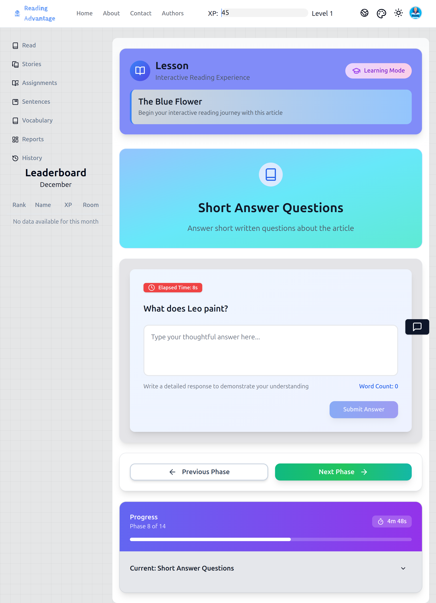

---

## 2. สิ่งที่ครูทำ

* ฉาย **หน้าจอคำถามคำตอบสั้น**
* ชี้ไปที่คำถามและอ่านออกเสียงหนึ่งครั้ง
* พูดว่า:

> "Read the question again quietly."

*อ่านคำถามอีกครั้งอย่างเงียบๆ*

* รอในขณะที่นักเรียนอ่านซ้ำ

จากนั้นครูแนะนำเกณฑ์การประเมิน **ก่อนตอบ**:

* ชี้ไปที่เกณฑ์ทั้งสี่บนหน้าจอและพูดทีละข้อ:

  * "Answer the question." *ตอบคำถาม*
  * "Use information from the article." *ใช้ข้อมูลจากบทความ*
  * "Give a reason or explanation." *ให้เหตุผลหรือคำอธิบาย*
  * "Write in complete sentences." *เขียนเป็นประโยคที่สมบูรณ์*

ครูพูดว่า:

> "We will try to do all four."

*เราจะพยายามทำทั้งสี่ข้อ*

---

## 3. คำตอบของห้องเรียนแบบร่วมมือกัน (ขั้นตอนการสาธิต)

### สิ่งที่ครูพูดและทำ

1. พูดว่า:

> "Think about your answer."

*คิดเกี่ยวกับคำตอบของคุณ*

2. รอสักครู่
3. พูดว่า:

> "Turn to your partner and talk."

*หันไปหาคู่ของคุณและพูดคุย*

4. เดินไปรอบๆ และฟัง
5. ยกมือขึ้นและพูดว่า:

> "Stop. Look at me."

*หยุด มองมาที่ฉัน*

6. ถามว่า:

> "What should we say first?"

*เราควรพูดอะไรก่อน?*

7. ดึงคำตอบสั้นๆ จากนักเรียน
8. พิมพ์ความคิดนั้นลงในแอป
9. ถามว่า:

> "What detail from the article supports this?"

*รายละเอียดใดจากบทความที่สนับสนุนสิ่งนี้?*

10. เพิ่มประโยคสนับสนุน
11. ถามว่า:

> "Do we have a reason or explanation?"

*เรามีเหตุผลหรือคำอธิบายหรือไม่?*

12. เพิ่มเหตุผลง่ายๆ
13. อ่านคำตอบทั้งหมดออกเสียงตามที่พิมพ์ไว้

---

## 4. การส่งและประเมินคำตอบของห้องเรียน

### สิ่งที่ครูทำ

* คลิก **Submit**
* แสดง **คำตอบตัวอย่าง** ที่แอปให้มา
* ชี้ไปมาระหว่าง:

  * คำตอบของห้องเรียน และ
  * คำตอบตัวอย่าง

ครูถามห้องเรียน:

> "Did we answer the question?"
> "Did we use the article?"
> "Did we give a reason?"
> "Are these complete sentences?"

*เราตอบคำถามหรือไม่?*
*เราใช้บทความหรือไม่?*
*เราให้เหตุผลหรือไม่?*
*ประโยคเหล่านี้สมบูรณ์หรือไม่?*

สำหรับคำตอบ "ใช่" แต่ละข้อ ครูแสดงท่าทางและนับออกเสียง

จากนั้นครูพูดว่า:

> "Now we give ourselves stars."

*ตอนนี้เราให้ดาวตัวเราเอง*

* เลือก **1–5 ดาว** ในแอปตามการอภิปราย
* อธิบายสั้นๆ ว่าทำไมถึงเลือกคะแนนนั้น

---

## 5. การเขียนในสมุดทำงานแบบรายบุคคล

### สิ่งที่ครูพูด

> "Now you will write your own answer."

*ตอนนี้คุณจะเขียนคำตอบของคุณเอง*

ครูให้คำแนะนำที่ชัดเจน:

> "Open your workbook to Step 8."
>
> "Write your own short answer."
>
> "Use the rubric to check yourself."

*เปิดสมุดทำงานของคุณไปที่ขั้นตอนที่ 8*

*เขียนคำตอบสั้นๆ ของคุณเอง*

*ใช้เกณฑ์การประเมินเพื่อตรวจสอบตัวเอง*

### สิ่งที่นักเรียนเห็นในสมุดทำงานของพวกเขา:

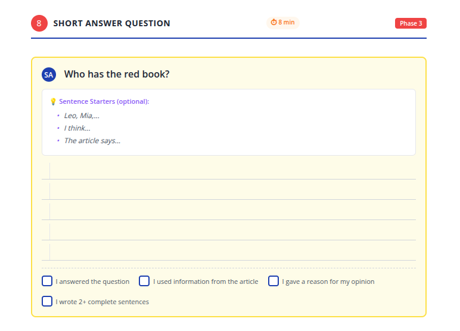

---

## 6. สิ่งที่นักเรียนทำ

* มีส่วนร่วมในการอภิปรายกับคู่
* ดูว่าครูสร้างคำตอบของห้องเรียนอย่างไร
* สังเกตว่าเกณฑ์การประเมินถูกนำไปใช้อย่างไร
* เขียน **คำตอบสั้นของตนเอง** ในสมุดทำงาน
* ทำเครื่องหมายในช่องเกณฑ์การประเมินอย่างซื่อสัตย์
* ไม่คัดลอกคำตอบของห้องเรียนทุกคำ

---

## 7. สิ่งที่ครูตรวจสอบก่อนดำเนินการต่อ

ก่อนออกจากขั้นตอนนี้ ครูตรวจสอบว่า:

* นักเรียนกำลังเขียน ไม่ใช่รออยู่
* คำตอบส่วนใหญ่รวมถึง:

  * คำตอบที่ชัดเจน และ
  * ความคิดสนับสนุนอย่างน้อยหนึ่งข้อ
* นักเรียนได้มีส่วนร่วมกับเกณฑ์การประเมิน

หากนักเรียนหลายคนกำลังคัดลอก ครูพูดว่า:

> "Your answer can be different."
>
> "That is okay."

*คำตอบของคุณสามารถแตกต่างได้*

*ไม่เป็นไร*

---

## 8. หมายเหตุการให้คำแนะนำ (ทางเลือก – สำหรับครูที่มีประสบการณ์)

**ทำไมขั้นตอนนี้ต้องทำร่วมกันก่อน:**
นักเรียนมักล้มเหลวในคำตอบสั้นๆ เพราะพวกเขาไม่เข้าใจว่า *คำตอบที่ดีเป็นอย่างไร*

ด้วยการสร้างคำตอบหนึ่งข้อร่วมกัน คุณกำลังทำให้ความคาดหวังมองเห็นได้

ครูที่มีประสบการณ์สูงอาจ:

* ลดความยาวของคำตอบที่สาธิต
* ให้นักเรียนเสนอคะแนนเกณฑ์การประเมินด้วยตนเอง

แต่อย่าข้าม:

* การแสดงคำตอบตัวอย่าง หรือ
* การอภิปรายเกณฑ์การประเมิน

นั่นคือสิ่งที่ทำให้ขั้นตอนนี้สามารถถ่ายทอดไปยังการใช้แอปแบบอิสระได้

---

หากคุณพร้อม ฉันจะดำเนินการต่อด้วย **ขั้นตอนที่ 9–10: การฝึกคำศัพท์** เขียนในระดับการเขียนสคริปต์เดียวกัน

---
ดำเนินการต่อ ด้านล่างคือ **ขั้นตอนที่ 9–10** เขียนเป็น**บล็อกการสอนแบบมีสคริปต์เดียวแบบรวมกัน** ในระดับ**ที่ชัดเจนและเหมาะสำหรับผู้เริ่มต้น**เช่นเดียวกับขั้นตอนก่อนหน้า ผู้เขียนตั้งใจอธิบายพฤติกรรมของครูอย่างละเอียดเนื่องจากนี่คือจุดที่ครูหลายคนมักจะรีบเร่งหรือ "มอบแอปให้ดำเนินการเอง"

---

# ขั้นตอนที่ 9–10: ฝึกคำศัพท์

*(ทบทวนและเสริมสร้างคำศัพท์ที่บันทึกไว้)*

> **การปฐมนิเทศสำคัญสำหรับครู:**
> ในแอปเหล่านี้เป็นสองขั้นตอน แต่ในการสอนจะทำงานเป็น**รอบการฝึกอย่างต่อเนื่องเดียว** ไม่ควรปฏิบัติต่อเป็นบทเรียนแยกกัน

---

## ขั้นตอนที่ 9 (แอป): บัตรคำศัพท์

**สิ่งที่ครูฉายสำหรับขั้นตอนที่ 9:**

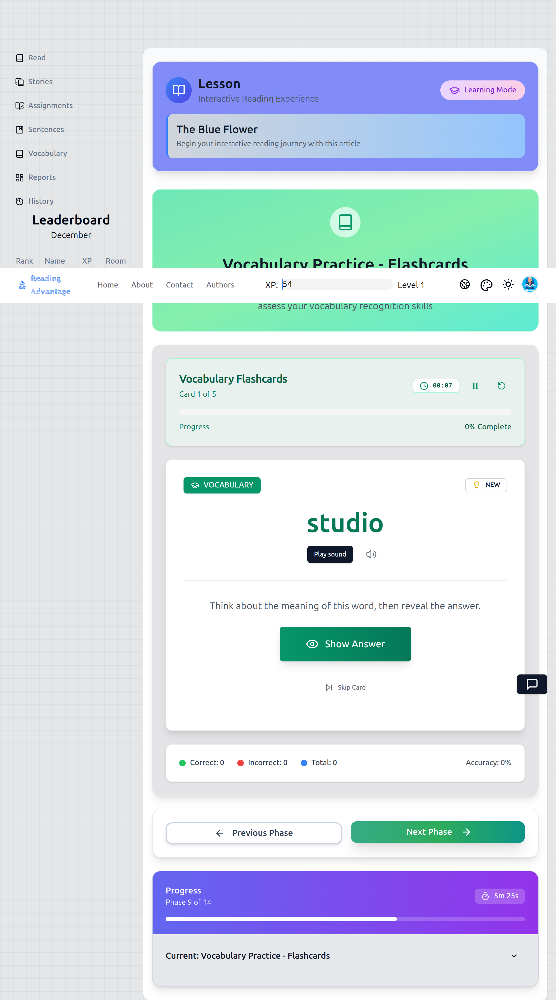

---

## 1. สิ่งที่ครูพูด

ครูหยุดชั่วคราวก่อนเริ่มกิจกรรมและพูดกับชั้นเรียน

> "Now we will practice the vocabulary you chose."
>
> *ตอนนี้เราจะฝึกคำศัพท์ที่คุณเลือก*
>
> "These are **your words**, not my words."
>
> *เหล่านี้คือ**คำของคุณ** ไม่ใช่คำของครู*

ครูเพิ่มข้อความสำคัญเกี่ยวกับการสร้างแบบอย่าง:

> "This is exactly how you should practice vocabulary when you use the app by yourself."
>
> *นี่คือวิธีที่คุณควรฝึกคำศัพท์เมื่อคุณใช้แอปด้วยตัวเอง*

ครูชี้ไปที่อินเทอร์เฟซบัตรคำ

> "First, listen."
>
> *ก่อนอื่น ฟัง*
>
> "Then, say the word."
>
> *จากนั้น พูดคำนั้น*

---

## 2. สิ่งที่ครูทำ

สำหรับ**บัตรคำแต่ละใบ** ครูทำตามขั้นตอนเดียวกัน:

1. คลิก **เล่นเสียง**
2. หันหน้าไปทางชั้นเรียนและแสดงท่าทางอย่างชัดเจน
3. พูดว่า:

> "Everyone."
>
> *ทุกคน*

4. ฟังชั้นเรียนพูดซ้ำพร้อมกัน
5. พูดชื่อนักเรียนคนหนึ่งทันที:

> "[Student name], again."
>
> *[ชื่อนักเรียน] อีกครั้ง*

6. คลิก **แสดงคำตอบ**
7. ชี้ไปที่ความหมาย (อังกฤษและไทย) อย่างสั้น ๆ
8. ไปยังบัตรถัดไปโดยตรง

ขณะทำสิ่งนี้ ครู:

* รักษาจังหวะให้คงที่
* ไม่หยุดเพื่ออธิบายการใช้งาน
* ไม่ทดสอบนักเรียนรายบุคคล
* ไม่แก้ไขข้อผิดพลาดในการออกเสียงเล็กน้อย เว้นแต่จะขัดขวางความเข้าใจ

---

## 3. สิ่งที่นักเรียนทำ

* มองบัตรคำบนหน้าจอ
* ฟังเสียง
* พูดคำซ้ำด้วยกัน
* พูดซ้ำเป็นรายบุคคลถ้าถูกเรียก
* ตรวจสอบในใจว่าพวกเขาจำความหมายได้หรือไม่ก่อนที่มันจะปรากฏ

นักเรียน**ไม่**:

* เขียนระหว่างขั้นตอนนี้
* ถามการสะกด
* เปลี่ยนสิ่งนี้ให้เป็นการอภิปราย

---

## 4. สิ่งที่ครูตรวจสอบก่อนดำเนินการต่อ

ก่อนไปยังกิจกรรมถัดไป ครูตรวจสอบว่า:

* คำที่บันทึกไว้ทั้งหมดได้รับการทบทวนครั้งหนึ่งแล้ว
* การพูดซ้ำพร้อมกันชัดเจนและมีส่วนร่วม
* นักเรียนแต่ละคนสามารถพูดซ้ำได้เมื่อถูกเรียก

หากการพูดซ้ำอย่อน ครูทำซ้ำ**หนึ่งหรือสองบัตรเท่านั้น** จากนั้นดำเนินการต่อ

---

## ขั้นตอนที่ 10 (แอป): เกมจับคู่คำศัพท์

**สิ่งที่ครูฉายสำหรับขั้นตอนที่ 10:**

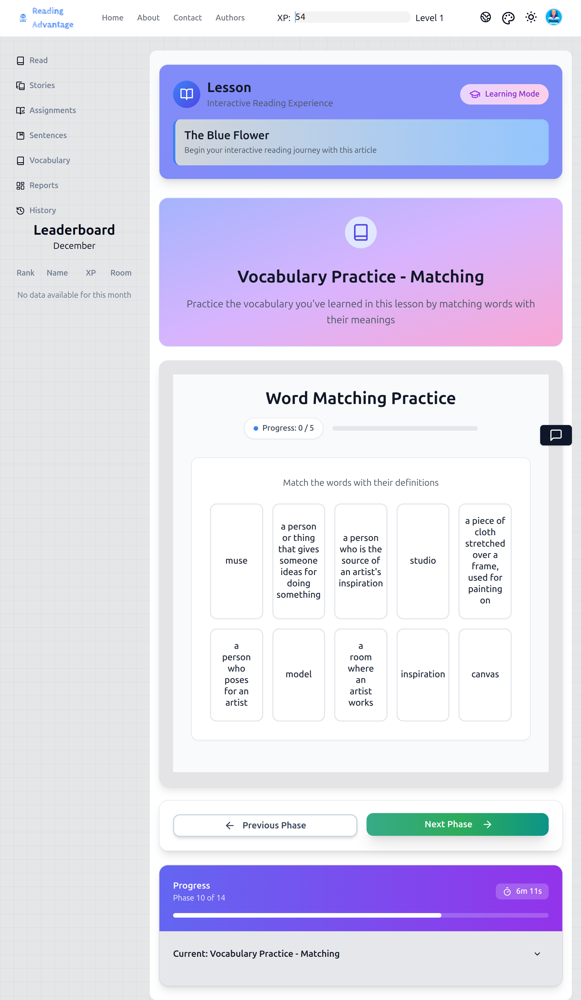

---

## 1. สิ่งที่ครูพูด

ครูเปลี่ยนผ่านอย่างชัดเจน

> "Now we will play a matching game."
>
> *ตอนนี้เราจะเล่นเกมจับคู่*
>
> "This is still vocabulary practice."
>
> *นี่ยังคงเป็นการฝึกคำศัพท์*

ครูอธิบายความคาดหวัง:

> "Before we match, we say the word."
>
> *ก่อนที่เราจะจับคู่ เราพูดคำนั้น*
>
> "We do not guess."
>
> *เราไม่เดา*

---

## 2. สิ่งที่ครูทำ

ครูเลือก**โหมดหนึ่ง**และระบุอย่างชัดเจน

### ตัวเลือก A: โหมดชั้นเรียนทั้งหมด

* ควบคุมเมาส์ไว้
* ชี้ไปที่คำและถาม:

> "Which meaning matches?"
>
> *ความหมายใดตรงกัน?*

* ฟังคำตอบ
* คลิกคำตอบที่ชั้นเรียนตกลงกัน
* หากไม่ถูกต้อง พูดอย่างสงบ:

> "That one does not match. Let's try again."
>
> *อันนั้นไม่ตรงกัน ลองอีกครั้ง*

### ตัวเลือก B: โหมดนักเรียนที่กระดาน

* เชิญนักเรียนคนหนึ่งมาที่คอมพิวเตอร์
* พูดว่า:

> "Say the word first."
>
> *พูดคำก่อน*

* อนุญาตให้นักเรียนจับคู่
* ยืนยันหรือนำทางใหม่อย่างนุ่มนวล
* สลับนักเรียนหากเวลาและการจัดการอนุญาต

ครูรักษาน้ำเสียงให้**ไม่กดดันและมุ่งเน้น** ไม่แข่งขัน

---

## 3. สิ่งที่นักเรียนทำ

* มองคำและความหมาย
* พูดคำออกเสียงก่อนจับคู่
* แนะนำคำตอบด้วยวาจา
* ดูการแก้ไขและปรับความเข้าใจ

นักเรียน**ไม่**:

* ตะโกนคำตอบ
* ปฏิบัติต่อความผิดพลาดเป็นความล้มเหลว
* รีบร้อนกับกิจกรรม

---

## 4. กิจกรรมติดตามในเวิร์กบุ๊ก (เวิร์กบุ๊กขั้นตอนที่ 9)

หลังจากกิจกรรมแอปทั้งสอง ครูสั่งการนักเรียนอย่างชัดเจน

> "Now open your workbook to Step 9."
>
> *ตอนนี้เปิดเวิร์กบุ๊กของคุณไปที่ขั้นตอนที่ 9*

**สิ่งที่นักเรียนเห็นในเวิร์กบุ๊กของพวกเขา:**

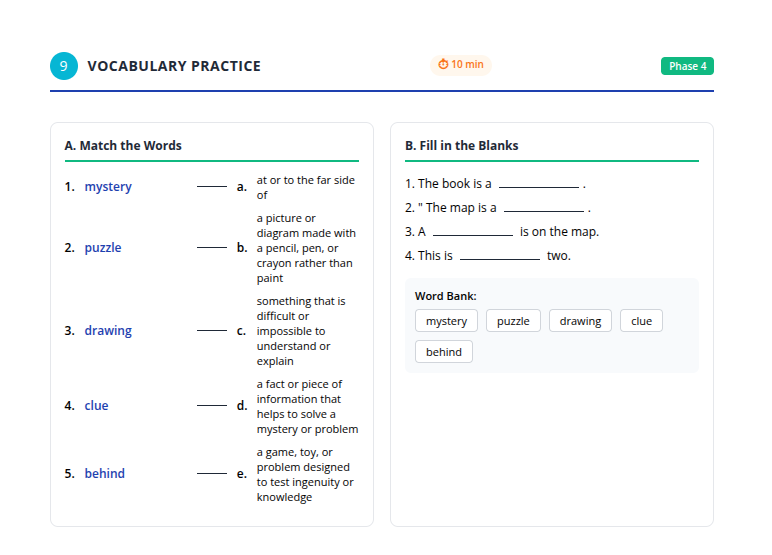

### สิ่งที่ครูทำ

* ชี้ไปที่กิจกรรมจับคู่
* พูดว่า:

> "Do this first."
>
> *ทำอันนี้ก่อน*

* จากนั้นชี้ไปที่กิจกรรมกรอกคำ
* พูดว่า:

> "Do this next."
>
> *ทำอันนี้ต่อไป*

* เดินไปรอบ ๆ อย่างเงียบ ๆ ขณะที่นักเรียนทำงาน
* ไม่ให้คำตอบทันที

### สิ่งที่นักเรียนทำ

* ทำแบบฝึกหัดจับคู่ให้เสร็จ
* ทำแบบฝึกหัดกรอกคำ (เติมคำในช่องว่าง) ให้เสร็จ
* ทำงานอิสระหรือเงียบ ๆ กับคู่ ตามที่ได้รับคำสั่ง

---

## 5. สิ่งที่ครูตรวจสอบก่อนดำเนินการต่อ

ก่อนออกจากบล็อกนี้ ครู:

* ขอให้นักเรียน**ตรวจคำตอบของพวกเขา**
* พูดว่า:

> "Show me how many you got correct."
>
> *แสดงให้ครูเห็นว่าคุณทำถูกกี่ข้อ*

* สังเกตการตอบด้วยนิ้ว
* จดจำปัญหาทั่วไปแต่ไม่สอนใหม่อย่างกว้างขวาง

---

## 6. หมายเหตุการฝึกสอน (ตัวเลือก – สำหรับครูที่มีประสบการณ์)

**เหตุผลที่ขั้นตอนนี้สำคัญ:**
นี่คือจุดที่คำศัพท์เปลี่ยนจาก *การจดจำ* เป็น *การดึงข้อมูล*

ลำดับนี้ตั้งใจไว้:

1. ฟัง → พูด → เห็นความหมาย
2. เลือก → ยืนยัน → ปรับ
3. ประยุกต์ใช้อย่างอิสระในรูปแบบพิมพ์

ครูขั้นสูงอาจ:

* ย่อบัตรคำเมื่อขั้นตอนแข็งแรง
* อนุญาตให้การจับคู่ที่นักเรียนเป็นผู้นำเร็วขึ้น

แต่อย่าลบ:

* การพูดซ้ำพร้อมกัน
* การพูดคำก่อนจับคู่

สิ่งเหล่านั้นคือหลักยึดสำหรับผู้อ่านที่อ่อนแอกว่า

---

หากคุณพร้อม ผู้เขียนจะดำเนินการต่อด้วย **ขั้นตอนที่ 11–12: ฝึกประโยค** เขียนในระดับการเขียนสคริปต์และการควบคุมเดียวกัน

ต่อเนื่อง ต่อไปนี้คือ **ขั้นตอนที่ 11–12** เขียนตามมาตรฐานเดียวกันที่ **มีสคริปต์ครบถ้วน แบบทีละขั้นตอน** บล็อกนี้สะท้อนการฝึกคำศัพท์ แต่เปลี่ยนหน่วยความสนใจจาก *คำ* ไปเป็น *ประโยค* และการสาธิตของครูยังคงเป็นศูนย์กลาง

---

# ขั้นตอนที่ 11–12: การฝึกประโยค

*(ทบทวนและฝึกประโยคที่เลือก)*

> **คำแนะนำสำหรับครู:**
> เช่นเดียวกับคำศัพท์ นี่คือสองขั้นตอนในแอป แต่เป็น **บล็อกการสอนเดียว** นักเรียนกำลังเรียนรู้ *วิธีการฝึกประโยคด้วยตนเอง* ไม่ใช่แค่ทำกิจกรรมให้เสร็จ

---

## ขั้นตอนที่ 11 (แอป): บัตรคำประโยค

**สิ่งที่ครูฉายสำหรับขั้นตอนที่ 11:**

---

## 1. สิ่งที่ครูพูด

ก่อนเริ่ม ครูชี้แจงวัตถุประสงค์อย่างชัดเจน

> "Now we will practice sentences."
>
> *ตอนนี้เราจะฝึกประโยค*

> "These sentences come from the story."
>
> *ประโยคเหล่านี้มาจากเรื่อง*

> "You chose them because they are useful."
>
> *คุณเลือกประโยคเหล่านี้เพราะมีประโยชน์*

ครูเน้นย้ำการถ่ายโอน:

> "This is how you should practice sentences when you use the app alone."
>
> *นี่คือวิธีที่คุณควรฝึกประโยคเมื่อคุณใช้แอปคนเดียว*

ครูชี้ไปที่ประโยคบนหน้าจอ

> "First, listen."
>
> *ก่อนอื่น ฟัง*

> "Then, say the whole sentence."
>
> *จากนั้น พูดทั้งประโยค*

---

## 2. สิ่งที่ครูทำ

สำหรับ **บัตรคำประโยคแต่ละใบ** ครูทำตามขั้นตอนนี้อย่างเคร่งครัด:

1. คลิก **เล่นเสียง**
2. มองไปที่ชั้นเรียนและทำท่าทางเพื่อดึงความสนใจ
3. พูด:

> "Everyone."
>
> *ทุกคน*

4. รอให้มี **การพูดซ้ำพร้อมกันของประโยคทั้งหมด**
5. สุ่มเรียกนักเรียนคนหนึ่งโดยเรียกชื่อและพูด:

> "Again."
>
> *อีกครั้ง*

6. ฟังความชัดเจนโดยรวม (ไม่ใช่ความสมบูรณ์แบบ)
7. คลิกหรือแสดง **คำแปล** ถ้ามี โดยสั้นๆ
8. อ่านคำแปลเงียบๆ หรือชี้ไปที่คำแปลโดยไม่อธิบาย
9. ไปที่ประโยคถัดไปทันที

ครู **ไม่**:

* แบ่งประโยคออกเป็นส่วนๆ
* อธิบายไวยากรณ์
* ถามคำถามเพื่อความเข้าใจที่นี่

---

## 3. สิ่งที่นักเรียนทำ

* มองประโยคบนหน้าจอ
* ฟังเสียง
* พูดซ้ำ **ทั้งประโยค** พร้อมกัน
* พูดซ้ำเป็นรายบุคคลถ้าถูกเรียก
* สังเกตความหมายโดยใช้คำแปล
* มุ่งเน้นที่จังหวะและความชัดเจน

นักเรียน **ไม่**:

* ย่อประโยค
* ถอดความ
* วิเคราะห์ไวยากรณ์

---

## 4. สิ่งที่ครูตรวจสอบก่อนดำเนินการต่อ

ก่อนไปยังขั้นตอนที่ 12 ครูตรวจสอบว่า:

* ประโยคที่บันทึกไว้ทั้งหมดได้ถูกฟังและพูดซ้ำแล้ว
* นักเรียนสามารถพูดซ้ำประโยคเต็ม ไม่ใช่แค่ส่วนย่อย
* ความสนใจยังคงอยู่ตลอดการพูดซ้ำ

ถ้านักเรียนพึมพำหรือตัดทอนประโยค ครูพูดซ้ำประโยคตัวอย่างหนึ่งประโยคและพูด:

> "Full sentence."
>
> *ประโยคเต็ม*

---

## ขั้นตอนที่ 12 (แอป): กิจกรรมฝึกประโยค

**สิ่งที่ครูฉายสำหรับขั้นตอนที่ 12:**

---

## 1. สิ่งที่ครูพูด

ครูเปลี่ยนผ่านอย่างชัดเจน

> "Now we will practice sentences in different ways."
>
> *ตอนนี้เราจะฝึกประโยคในรูปแบบต่างๆ*

ครูชี้ไปที่ตัวเลือกกิจกรรม

> "You can see there are different games."
>
> *คุณจะเห็นว่ามีเกมต่างๆ*

> "When you work alone, you can choose."
>
> *เมื่อคุณทำงานคนเดียว คุณสามารถเลือกได้*

ครูกำหนดขอบเขต:

> "Today, we will do **one** together."
>
> *วันนี้ เราจะทำ **หนึ่ง** กิจกรรมด้วยกัน*

---

## 2. สิ่งที่ครูทำ

* ฉาย **หน้าจอเลือกกิจกรรม**
* เรียกชื่อกิจกรรมแต่ละอันโดยสั้นๆ พร้อมชี้:

  * "Put the words in order." (เรียงคำให้ถูกลำดับ)
  * "Complete the sentence." (เติมประโยคให้สมบูรณ์)
  * "Match sentences." (จับคู่ประโยค)
  * "Choose the correct sentence." (เลือกประโยคที่ถูกต้อง)
* เลือก **หนึ่งกิจกรรม** อย่างตั้งใจ

ระหว่างกิจกรรม ครู:

* อ่านโจทย์ประโยคออกเสียง
* พูด:

> "Do not guess."
>
> *อย่าเดา*

> "Think about the sentence we practiced."
>
> *คิดถึงประโยคที่เราฝึก*

* เชิญนักเรียนเสนอคำตอบด้วยวาจา
* คลิกคำตอบที่ชั้นเรียนตกลงกัน
* ถ้าไม่ถูกต้อง พูดอย่างสงบ:

> "That does not sound correct. Let's try again."
>
> *นั่นฟังดูไม่ถูกต้อง มาลองอีกครั้ง*

ครูยอมให้มีความผิดพลาดและสาธิตการแก้ไขผ่านการพูดซ้ำ

---

## 3. สิ่งที่นักเรียนทำ

* มองโจทย์ประโยคบนหน้าจอ
* นึกถึงโครงสร้างประโยคจากบัตรคำ
* เสนอคำตอบด้วยวาจา
* ปรับคำตอบตามความคิดเห็น
* สังเกตว่าประโยคถูกซ่อมแซมอย่างไร ไม่ใช่แค่ตอบ

---

## 4. การติดตามด้วยเวิร์กบุ๊ก (เวิร์กบุ๊กขั้นตอนที่ 10)

หลังจากกิจกรรมในแอป ครูให้คำแนะนำที่ชัดเจน

> "Now open your workbook to Step 10."
>
> *ตอนนี้เปิดเวิร์กบุ๊กของคุณไปที่ขั้นตอนที่ 10*

**สิ่งที่นักเรียนเห็นในเวิร์กบุ๊ก:**

### สิ่งที่ครูทำ

* ชี้ไปที่ **เรียงคำให้ถูกลำดับ** และพูด:

> "Do this first."
>
> *ทำอันนี้ก่อน*

* ชี้ไปที่ **เติมประโยคให้สมบูรณ์** และพูด:

> "Do this next."
>
> *ทำอันนี้ต่อไป*

* เดินไปรอบๆ ขณะที่นักเรียนทำงาน
* พานักเรียนที่รีบร้อนหรือลอกกลับสู่ทางที่ถูก

### สิ่งที่นักเรียนทำ

* ทำกิจกรรมเรียงลำดับประโยค
* ทำกิจกรรมเติมประโยค
* ทำงานอิสระหรืออย่างเงียบๆ กับคู่ ตามที่ได้รับคำสั่ง

---

## 5. สิ่งที่ครูตรวจสอบก่อนดำเนินการต่อ

ก่อนดำเนินการต่อ ครู:

* ขอให้นักเรียนตรวจคำตอบของตนเอง
* พูด:

> "Show me how many you got correct."
>
> *แสดงให้ฉันเห็นว่าคุณทำถูกกี่ข้อ*

* สังเกตการตอบด้วยนิ้ว
* จดจำปัญหารูปแบบประโยคทั่วไปในใจ

---

## 6. หมายเหตุการโค้ช (ตัวเลือก – สำหรับครูที่มีประสบการณ์)

**ทำไมการฝึกประโยคจึงตามหลังการฝึกคำศัพท์:**
นักเรียนมักรู้จักคำศัพท์ แต่ไม่สามารถ *ประกอบความหมาย* ได้ ขั้นตอนนี้บังคับให้ใส่ใจกับลำดับ โครงสร้าง และความสมบูรณ์

ครูขั้นสูงอาจ:

* ขอให้นักเรียนอ่านประโยคที่เสร็จสมบูรณ์ออกเสียง
* เปรียบเทียบตัวเลือกประโยคสองแบบโดยสั้นๆ

แต่หลีกเลี่ยงการเปลี่ยนให้เป็นการอธิบายไวยากรณ์
จุดแข็งที่นี่คือ **การได้รับแบบซ้ำๆ + การแก้ไข** ไม่ใช่กฎเกณฑ์

---

ถ้าคุณพร้อม ฉันจะดำเนินการต่อด้วย **ขั้นตอนที่ 13: การฝึกเขียน (เฉพาะเวิร์กบุ๊ก)** โดยคงระดับสคริปต์เดิมไว้
ต่อเนื่อง ด้านล่างนี้คือ **ขั้นตอนที่ 13** ที่เขียนในระดับ **สคริปต์แบบเต็มรูปแบบและปลอดภัยสำหรับครูมือใหม่** ขั้นตอนนี้มีลักษณะที่แตกต่างโดยเจตนา และสคริปต์ได้ระบุความแตกต่างนั้นอย่างชัดเจนเพื่อไม่ให้ครูพยายาม "ดำเนินการผ่านแอป"

---

# ขั้นตอนที่ 13: การฝึกเขียน (เฉพาะสมุดงาน – คำตอบแบบยาว)

> **การกำหนดกรอบที่สำคัญสำหรับครู:**
> ขั้นตอนนี้ **ไม่ได้ดำเนินการผ่านแอป** นี่คือ **งานเขียนแบบเงียบและต่อเนื่อง** ที่ออกแบบมาเพื่อเตรียมนักเรียนสำหรับการเขียนที่ได้รับการสนับสนุนจาก AI ที่บ้านหรือในเซสชันอื่นในภายหลัง

---

## สิ่งที่ครูฉายบนหน้าจอ:

*แอปแสดงขั้นตอนที่ 13 พร้อมหัวข้อ "Writing Practice" และคำแนะนำสำหรับกิจกรรมการเขียนนอกออนไลน์นี้*

---

## 1. สิ่งที่ครูพูด

ครูยืนอยู่ด้านหน้า ถือสมุดงานหรือชี้ไปที่รูปภาพที่ฉายของหน้าสมุด

> "Now we will write."
>
> *ตอนนี้เราจะเขียน*
>
> "This is your own writing."
>
> *นี่คือการเขียนของคุณเอง*

ครูชี้แจงความคาดหวังทันที:

> "This is not copying."
>
> *นี่ไม่ใช่การคัดลอก*
>
> "This is not a test."
>
> *นี่ไม่ใช่การสอบ*

ครูเพิ่มความมั่นใจ:

> "You will plan first."
>
> *คุณจะวางแผนก่อน*
>
> "Then you will write."
>
> *จากนั้นคุณจะเขียน*

จากนั้นครูอธิบายความคาดหวังตามระดับอย่างระมัดระวัง:

> "How much you write depends on your level."
>
> *จำนวนที่คุณเขียนขึ้นอยู่กับระดับของคุณ*
>
> "Follow the advice in the workbook."
>
> *ปฏิบัติตามคำแนะนำในสมุดงาน*

---

## 2. สิ่งที่ครูทำ

* สั่งให้นักเรียนเปิดสมุดงานไปที่ **ขั้นตอนที่ 11: การฝึกเขียน**

## สิ่งที่นักเรียนเห็นในสมุดงานของตน:

*หน้าสมุดงานแสดงกล่องการวางแผน (แนวคิดหลัก รายละเอียดสำคัญ คำศัพท์ที่จะใช้ เหตุผล/คำอธิบาย) พื้นที่เขียน และรายการตรวจสอบตนเองที่ด้านล่าง*

---

* ชี้ไปที่ **กล่องการวางแผน** และเรียกชื่อทีละกล่อง:

  * แนวคิดหลัก
  * รายละเอียดสำคัญ
  * คำศัพท์ที่จะใช้
  * เหตุผล / คำอธิบาย
* พูดว่า:

> "Do not start writing sentences yet."
>
> *อย่าเริ่มเขียนประโยคเดี๋ยวนี้*
>
> "Plan first."
>
> *วางแผนก่อน*

ครูสาธิตการวางแผนสั้นๆ โดย:

* เขียนตัวอย่างคำหรือวลีหนึ่งคำบนกระดาน (ไม่ใช่ประโยคเต็ม)
* พูดว่า:

> "This is planning, not writing."
>
> *นี่คือการวางแผน ไม่ใช่การเขียน*

จากนั้นครูกำหนดเงื่อนไขการเขียน:

> "You will write quietly."
>
> *คุณจะเขียนอย่างเงียบๆ*
>
> "I will not correct sentences now."
>
> *ฉันจะไม่แก้ไขประโยคตอนนี้*

ขณะที่นักเรียนกำลังเขียน ครู:

* เดินช้าๆ รอบห้อง
* มองหา:

  * นักเรียนที่วางแผนก่อนร่าง
  * นักเรียนที่กำลังเขียนจริงๆ
  * นักเรียนที่ติดและไม่เริ่มต้น
* ให้กำลังใจอย่างเงียบๆ:

  > "Start with your main idea."
  >
  > *เริ่มต้นด้วยแนวคิดหลักของคุณ*
  >
  > "Check your vocabulary list."
  >
  > *ตรวจสอบรายการคำศัพท์ของคุณ*

ครู **ไม่**:

* บอกประโยค
* แก้ไขไวยากรณ์ทีละบรรทัด
* อนุญาตให้นักเรียนคัดลอกจากหน้าจอ

---

## 3. สิ่งที่นักเรียนทำ

* เปิดสมุดงานไปที่หน้าการเขียน
* กรอกกล่องการวางแผนก่อน
* เขียน **ฉบับร่างแรก** ตามแผนของตน
* ใช้คำศัพท์จากบทเรียน (อย่างน้อย 3 คำ ตามที่ระบุ)
* จัดระเบียบความคิดเป็นประโยคหรือย่อหน้าที่ชัดเจน เหมาะสมกับระดับ
* กรอกการตรวจสอบตนเองที่ด้านล่างของหน้า:

  * การใช้คำศัพท์
  * การจัดระเบียบ
  * การตรวจสอบการสะกด
  * จำนวนคำ

นักเรียนทำงาน **เป็นรายบุคคลและอย่างเงียบๆ**

---

## 4. สิ่งที่ครูตรวจสอบก่อนดำเนินการต่อ

ก่อนสิ้นสุดขั้นตอนนี้ ครูตรวจสอบว่า:

* นักเรียนทุกคนได้เขียน **อะไรบางอย่าง** แม้จะสั้น
* กล่องการวางแผนได้รับการกรอกแล้ว ไม่ข้าม
* นักเรียนได้พยายามตรวจสอบตนเองอย่างซื่อสัตย์

หากนักเรียนเขียนน้อยมาก ครูพูดอย่างสงบ:

> "This is a first draft."
>
> *นี่คือฉบับร่างแรก*
>
> "It does not need to be perfect."
>
> *ไม่จำเป็นต้องสมบูรณ์แบบ*

---

## 5. การเชื่อมโยงกับแอป (อธิบาย ไม่ได้ดำเนินการ)

ก่อนย้ายไปขั้นตอนถัดไป ครูอธิบายอย่างชัดเจน:

> "Later, you will type this writing into the app."
>
> *ภายหลัง คุณจะพิมพ์งานเขียนนี้ลงในแอป*
>
> "The app will give you feedback."
>
> *แอปจะให้ข้อเสนอแนะแก่คุณ*
>
> "You will improve your writing and submit again."
>
> *คุณจะปรับปรุงงานเขียนของคุณและส่งอีกครั้ง*

ครูเน้นย้ำ:

> "That happens **after** class, not now."
>
> *นั่นเกิดขึ้น **หลัง** ชั้นเรียน ไม่ใช่ตอนนี้*

---

## 6. หมายเหตุการโค้ช (ทางเลือก – สำหรับครูที่มีประสบการณ์)

**เหตุผลที่ขั้นตอนนี้อยู่นอกออนไลน์ก่อน:**
คุณภาพการเขียนดีขึ้นเมื่อนักเรียน **คิดก่อนพิมพ์** สมุดงานบังคับให้มีการวางแผนและการไตร่ตรองที่นักเรียนจำนวนมากข้ามในพื้นที่ดิจิทัล

ครูที่มีความเชี่ยวชาญอาจ:

* อนุญาตให้มีการแบ่งปันระหว่างเพื่อนหลังจากร่าง
* ขยายความยาวของการเขียนในระดับที่สูงขึ้น

แต่อย่าลบ:

* ขั้นตอนการวางแผน
* รายการตรวจสอบตนเอง

สิ่งเหล่านั้นคือสิ่งที่ทำให้ข้อเสนอแนะจาก AI ในภายหลังมีความหมาย

---

หากคุณพร้อม ฉันจะดำเนินการต่อด้วย **ขั้นตอนที่ 14: คำถามเกี่ยวกับภาษา (แชทบอท AI)** โดยรักษามาตรฐานสคริปต์เดียวกัน
กำลังดำเนินการต่อ ด้านล่างนี้คือ **ขั้นตอนที่ 14** เขียนตามมาตรฐาน**ที่มีสคริปต์ครบถ้วนและชัดเจน**เช่นเดียวกัน ขั้นตอนนี้เป็นขั้นตอนที่ละเอียดอ่อนเพราะเกี่ยวข้องกับ AI สคริปต์นี้ทำให้การควบคุมของครูและลำดับขั้นตอนชัดเจนไม่คลุมเครือ

---

# ขั้นตอนที่ 14: คำถามเกี่ยวกับภาษา (AI Chatbot – เริ่มจาก Workbook ก่อน)

> **กฎสำคัญสำหรับขั้นตอนนี้:**
> นักเรียน**ต้องเขียนคำถามของตนเองก่อน**
> AI จะถูกใช้**เฉพาะหลังจากคิดและเขียนแล้วเท่านั้น**

---

## สิ่งที่ครูฉาย:

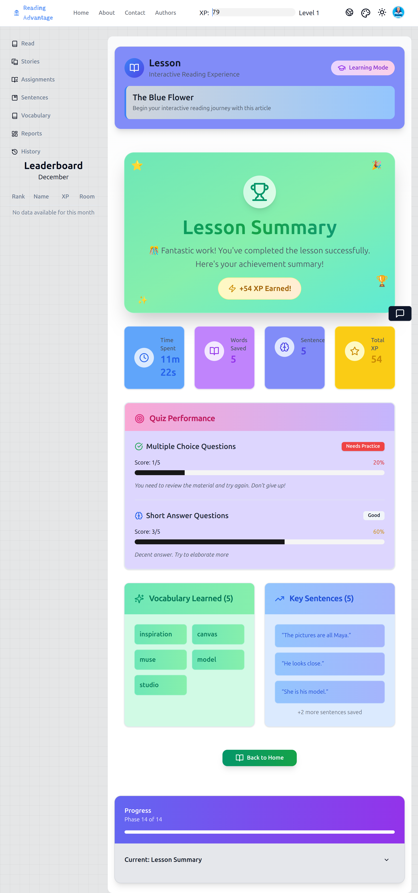

*อินเทอร์เฟซของ AI chatbot ที่ครูใช้เพื่อตอบคำถามของนักเรียนหลังจากที่พวกเขาเขียนคำถามลงใน workbook แล้ว*

---

## 1. สิ่งที่ครูพูด

ครูพูดกับชั้นเรียน**ก่อนเปิด chatbot**

> "Now we will ask questions about language."
>
> *ตอนนี้เราจะถามคำถามเกี่ยวกับภาษา*

> "These are questions about English, not opinions."
>
> *นี่คือคำถามเกี่ยวกับภาษาอังกฤษ ไม่ใช่ความคิดเห็น*

ครูให้ตัวอย่างด้วยวาจา:

> "You can ask about vocabulary."
>
> *คุณสามารถถามเกี่ยวกับคำศัพท์ได้*

> "You can ask about sentence meaning."
>
> *คุณสามารถถามเกี่ยวกับความหมายของประโยคได้*

> "You can ask about grammar."
>
> *คุณสามารถถามเกี่ยวกับไวยากรณ์ได้*

> "You can also ask cultural questions."
>
> *คุณยังสามารถถามคำถามเกี่ยวกับวัฒนธรรมได้*

ครูให้ตัวอย่างที่เป็นรูปธรรม:

> "For example: 'Why is the school day in America so short?'"
>
> *ตัวอย่างเช่น: 'ทำไมวันเรียนในอเมริกาถึงสั้นมาก?'*

จากนั้นครูตั้งขอบเขตที่ชัดเจน:

> "Do **not** talk to the AI yet."
>
> ***อย่า**พูดกับ AI ตอนนี้*

> "First, you must write your question."
>
> *ก่อนอื่น คุณต้องเขียนคำถามของคุณ*

---

## 2. สิ่งที่ครูทำ

* สั่งให้นักเรียนเปิด workbook ไปที่**ขั้นตอนที่ 12: คำถามเกี่ยวกับภาษา**
* ชี้ไปที่บรรทัดสำหรับเขียนคำถามบนหน้ากระดาษ

## สิ่งที่นักเรียนเห็นใน workbook ของพวกเขา:

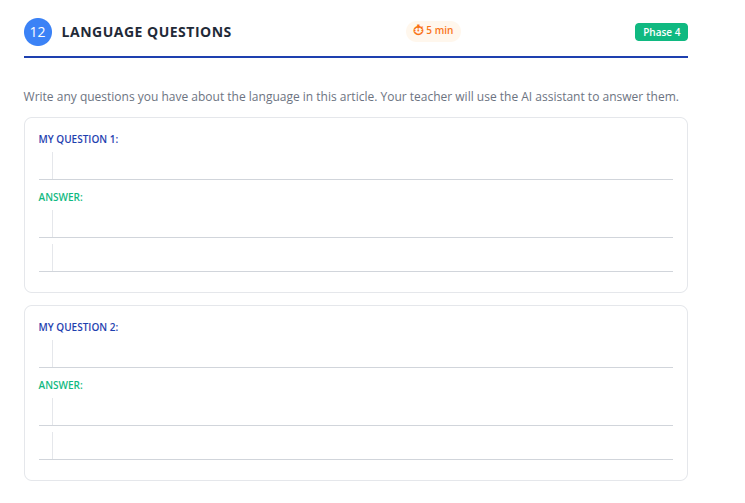

*นักเรียนเขียนคำถามเกี่ยวกับภาษาและวัฒนธรรมที่นี่ก่อนที่ครูจะใช้ AI chatbot*

---

* พูดว่า:

> "Write one good question."
>
> *เขียนคำถามที่ดีหนึ่งข้อ*

> "If you finish quickly, write a second."
>
> *ถ้าคุณเสร็จเร็ว ให้เขียนข้อที่สอง*

ในขณะที่นักเรียนกำลังเขียน ครู:

* เดินไปรอบๆ ห้อง
* อ่านคำถามอย่างเงียบๆ
* ช่วยนักเรียนปรับเปลี่ยนคำถามที่ไม่ชัดเจนโดยถามว่า:

  > "What exactly do you want to know?"
  >
  > *คุณอยากรู้อะไรกันแน่?*
* **ไม่**แก้ไขคำตอบในตอนนี้
* **ไม่**เปิดอินเทอร์เฟซ AI

---

## 3. สิ่งที่นักเรียนทำ

* ทบทวนบทความและงานของตนเอง
* เขียนคำถามเกี่ยวกับภาษาหรือวัฒนธรรมหนึ่งหรือสองข้อลงใน workbook
* ตรวจสอบการสะกดและความชัดเจน
* รอเงียบๆ หลังจากเสร็จ

นักเรียน**ไม่**:

* ตะโกนถามคำถาม
* ใช้ AI ด้วยตนเอง
* คัดลอกคำถามของเพื่อนร่วมชั้น

---

## 4. การใช้ AI (ผ่านการกำกับของครู)

### สิ่งที่ครูพูดและทำ

* เลือก**คำถามของนักเรียนจำนวนน้อย**ตามเวลาและความเกี่ยวข้อง
* พูดว่า:

> "I will type your question exactly as written."
>
> *ฉันจะพิมพ์คำถามของคุณตรงตามที่เขียนไว้*

* พิมพ์คำถามแรกของนักเรียนลงใน AI chatbot
* ฉายคำตอบของ AI
* อ่านคำตอบออกเสียงอย่างช้าๆ
* หยุดพักและถามว่า:

> "What does this answer mean?"
>
> *คำตอบนี้หมายความว่าอย่างไร?*

* ถอดความหรืออธิบายให้ชัดเจนหากจำเป็น
* ชี้กลับไปที่ข้อความหรือตัวอย่างก่อนหน้าเมื่อเกี่ยวข้อง

ครูทำซ้ำกระบวนการนี้สำหรับคำถามจำนวนจำกัด

---

## 5. สิ่งที่นักเรียนทำระหว่างคำตอบของ AI

* ฟังคำตอบของ AI
* เปรียบเทียบกับความเข้าใจของตนเอง
* เขียนบันทึกหรือสรุปสั้นๆ ลงใน workbook
* ถามคำถามติดตามเพื่อขอคำอธิบายเพิ่มเติม**เฉพาะเมื่อได้รับเชิญเท่านั้น**

---

## 6. สิ่งที่ครูตรวจสอบก่อนดำเนินการต่อ

ก่อนจบขั้นตอนนี้ ครูตรวจสอบว่า:

* นักเรียนเข้าใจว่า AI เป็น**เครื่องมือสนับสนุน** ไม่ใช่ทางลัด
* นักเรียนเห็นว่า**คำถามที่ดีนำไปสู่คำตอบที่ดี**
* ชั้นเรียนยังคงมีสมาธิและไม่ตื่นเต้นกับเทคโนโลยีมากเกินไป

ครูปิดขั้นตอนโดยพูดว่า:

> "This is how you use AI to learn language."
>
> *นี่คือวิธีที่คุณใช้ AI เพื่อเรียนรู้ภาษา*

> "You think first. Then you ask."
>
> *คุณคิดก่อน แล้วค่อยถาม*

---

## 7. หมายเหตุสำหรับการโค้ช (ตัวเลือก – สำหรับครูที่มีประสบการณ์)

**ทำไมต้องทำ workbook ก่อน:**
หากไม่มีคำถามที่เขียนไว้ นักเรียนจะถือว่า AI เป็นความบันเทิงหรือเครื่องมือให้คำตอบ การเขียนก่อนช่วยชะลอการคิดและปรับปรุงคุณภาพของคำถาม

ครูที่มีความชำนาญอาจ:

* จัดกลุ่มคำถามที่คล้ายกัน
* เปรียบเทียบคำตอบของ AI สองข้อ
* กลับมาทบทวนคำถามที่ยังไม่ได้ตอบในบทเรียนต่อๆ ไป

แต่ไม่อนุญาต:

* การแชทอย่างอิสระกับ AI
* การถามคำถามโดยไม่มีการเตรียมตัว

---

## ขั้นตอนสุดท้าย: สรุปบทเรียนและการไตร่ตรอง (Workbook)

---

## 1. สิ่งที่ครูพูด

ครูส่งสัญญาณการปิดอย่างชัดเจน

> "We are finishing the lesson."
>
> *เรากำลังจะจบบทเรียน*

ครูเพิ่มว่า:

> "Now you will think about your learning."
>
> *ตอนนี้คุณจะคิดเกี่ยวกับการเรียนรู้ของคุณ*

---

## 2. สิ่งที่ครูทำ

* ฉายหน้าจอ**สรุปบทเรียน**อย่างสั้นๆ
* ชี้ไปที่ตัวบ่งชี้ต่างๆ เช่น:

  * ขั้นตอนที่สำเร็จแล้ว
  * คำศัพท์ที่บันทึกไว้
  * ประโยคที่บันทึกไว้
  * ผลการทดสอบ
* พูดว่า:

> "These show what you practiced today."
>
> *สิ่งเหล่านี้แสดงให้เห็นสิ่งที่คุณฝึกฝนวันนี้*

จากนั้นครูนำความสนใจกลับไปที่ workbook

> "Open to the last page: Lesson Reflection."
>
> *เปิดไปที่หน้าสุดท้าย: การไตร่ตรองบทเรียน*

---

## สิ่งที่นักเรียนเห็นสำหรับการไตร่ตรองบทเรียน:

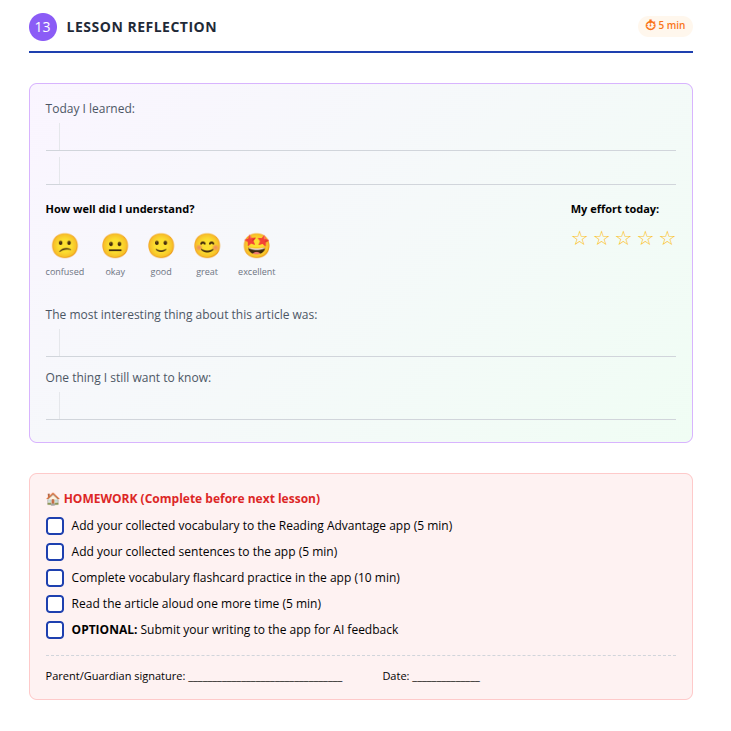

*หน้าไตร่ตรองที่นักเรียนบันทึกสิ่งที่พวกเขาเรียนรู้ ให้คะแนนความเข้าใจและความพยายามของตนเอง และจดคำถาม*

---

## 3. สิ่งที่นักเรียนทำ

นักเรียนทำส่วนการไตร่ตรองใน workbook ให้เสร็จ:

* เขียนสิ่งหนึ่งที่พวกเขาเรียนรู้
* ให้คะแนนความเข้าใจของตนเอง
* ให้คะแนนความพยายามของตนเอง
* จดสิ่งที่น่าสนใจ
* เขียนคำถามที่ยังเหลืออยู่หนึ่งข้อ (เกี่ยวกับภาษาหรือวัฒนธรรม)

นักเรียนทำงานอย่างเงียบๆ และเป็นรายบุคคล

---

## 4. คำอธิบายการบ้าน (ตัวเลือก)

หากครูเลือกที่จะมอบหมายการบ้าน พวกเขาจะพูดอย่างชัดเจนว่า:

> "Your homework is written here."
>
> *การบ้านของคุณเขียนไว้ที่นี่*

ครูชี้ไปที่ส่วนการบ้านและอธิบายว่ารายการใดบ้างที่ต้องทำ

หากโรงเรียนใช้ลายเซ็นผู้ปกครอง ครูพูดว่า:

> "Ask a guardian to sign here."
>
> *ขอให้ผู้ปกครองเซ็นชื่อที่นี่*

หากไม่ใช่ ครูพูดว่า:

> "You do not need a signature."
>
> *คุณไม่จำเป็นต้องมีลายเซ็น*

---

## 5. สิ่งที่ครูตรวจสอบก่อนปล่อยชั้นเรียน

ก่อนจบบทเรียน ครูตรวจสอบว่า:

* นักเรียนได้ทำการไตร่ตรองเสร็จแล้ว
* ความคาดหวังเกี่ยวกับการบ้านชัดเจน
* อุปกรณ์การเรียนได้รับการเก็บเรียบร้อยแล้ว

ครูปิดบทเรียนด้วยการพูดว่า:

> "Next time, you will use the app more independently."
>
> *ครั้งหน้า คุณจะใช้แอปได้อย่างเป็นอิสระมากขึ้น*

---

## หมายเหตุสำหรับการโค้ช (ตัวเลือก – สำหรับครูที่มีประสบการณ์)

**ทำไมการไตร่ตรองจึงสำคัญ:**
ขั้นตอนนี้ฝึกให้นักเรียนเชื่อมโยงความพยายาม กลยุทธ์ และผลลัพธ์ เมื่อเวลาผ่านไป จะช่วยสร้างความเป็นอิสระของผู้เรียน

ครูที่มีความชำนาญอาจ:

* พูดคุยเกี่ยวกับการไตร่ตรองอย่างสั้นๆ
* ติดตามรูปแบบต่างๆ ข้ามบทเรียน

แต่หลีกเลี่ยงการเปลี่ยนการไตร่ตรองให้เป็นการพูดคุยทุกครั้ง
พลังของมันอยู่ที่**กิจวัตรและความซื่อสัตย์** ไม่ใช่การแสดง

---

นี่คือบทเรียน Reading Advantage **ที่มีสคริปต์ครบถ้วนโดยครูเป็นผู้นำ** ที่เขียนขึ้นสำหรับการใช้งานสำหรับผู้เริ่มต้นพร้อมข้อมูลเชิงลึกสำหรับผู้เชี่ยวชาญเป็นตัวเลือก

หากคุณต้องการ ขั้นตอนที่เป็นประโยชน์ต่อไปอาจเป็น:

* **สคริปต์อ้างอิงฉบับย่อสำหรับครู** หรือ
* **คู่มือผู้ฝึกสอนที่อธิบายว่าทำไมแต่ละขั้นตอนจึงมีอยู่** หรือ
* **การปรับใช้สำหรับ Primary Advantage**

บอกฉันว่าคุณต้องการดำเนินการอย่างไรต่อไป
# คู่มือผู้ฝึกอบรม: การนำบทเรียน Reading Advantage แบบครูเป็นผู้นำไปใช้

> **กลุ่มเป้าหมาย:** โค้ชเชิงวิชาการ ผู้ฝึกอบรม ที่ปรึกษา หัวหน้าครู
>
> **วัตถุประสงค์:** คู่มือนี้อธิบาย*วิธีการฝึกอบรมครู*ให้สอนบทเรียน Reading Advantage ตามสคริปต์อย่างมีความแม่นยำสูง และ*เหตุผลที่แต่ละขั้นตอนมีอยู่* คู่มือนี้ไม่ได้แสดงให้นักเรียนดู

---

## 1. แนวคิดของผู้ฝึกอบรม: สิ่งที่คุณกำลังฝึกอบรมจริงๆ

คุณ**ไม่ได้**กำลังฝึกอบรมครูให้:

* ครอบคลุมเนื้อหาเร็วขึ้น
* อธิบายมากขึ้น
* สอนแบบด้นสด

คุณ**กำลัง**ฝึกอบรมครูให้:

* เป็นแบบอย่างพฤติกรรมการอ่านที่มีวินัย
* ปฏิบัติตามกิจวัตรการสอนที่มีเสถียรภาพ
* งดเว้นการสอนมากเกินไป
* ถ่ายโอนความรับผิดชอบไปยังนักเรียนอย่างค่อยเป็นค่อยไป

> **ข้อความสำคัญสำหรับผู้เข้ารับการฝึกอบรม:**
> "This lesson works because you *do less explaining*, not more."
> *บทเรียนนี้ได้ผลเพราะคุณ*อธิบายน้อยลง*ไม่ใช่มากขึ้น*

---

## 2. หลักการที่ไม่อาจต่อรองได้ (ผู้ฝึกอบรมต้องบังคับใช้)

สิ่งเหล่านี้ต้องระบุอย่างชัดเจนระหว่างการฝึกอบรม

1. **แอปถูกสาธิต ไม่ใช่ถูกแทนที่**
   ครูสาธิตวิธีการใช้งาน พวกเขาไม่ข้ามขั้นตอน

2. **การดำเนินการในเวิร์กบุ๊กเป็นสิ่งบังคับ**
   ทุกหน้าจอต้องมีการตอบสนองทางกายภาพจากนักเรียน

3. **คำตอบของชั้นเรียน ≠ คำตอบของครู**
   โดยเฉพาะในขั้นตอน MCQ และคำตอบสั้น

4. **AI ถูกคั่นกลาง ไม่เคยให้ใช้อย่างอิสระ**
   เวิร์กบุ๊กก่อน ครูเลือกคำถาม

หากมีการละเมิดสิ่งใดสิ่งหนึ่ง ความแม่นยำจะแตกหัก

---

## 3. วิธีการฝึกอบรมบทเรียน (ขั้นตอนการฝึกอบรมที่แนะนำ)

### ขั้นตอนที่ 1: การสาธิตสดโดยผู้ฝึกอบรม

* ผู้ฝึกอบรม**สอนหนึ่งขั้นตอนเต็มรูปแบบ** (มักจะเป็นขั้นตอนที่ 7 หรือขั้นตอนที่ 8)
* ครูคนอื่นๆ แสดงเป็นนักเรียน
* ผู้ฝึกอบรมบรรยาย*เหตุผล*ที่เลือกทำบางสิ่ง

ตัวอย่างการบรรยายของผู้ฝึกอบรม:

> "Notice I didn't click the answer yet. I'm waiting for evidence."
> *สังเกตว่าฉันยังไม่ได้คลิกคำตอบ ฉันกำลังรอหลักฐาน*

---

### ขั้นตอนที่ 2: การแยกวิเคราะห์

หลังจากสาธิต หยุดและถาม:

* "สิ่งที่คุณเห็นฉัน*ไม่*ทำคืออะไร?"
* "ฉันชะลอชั้นเรียนลงที่ไหน?"
* "นักเรียนทำงานมากกว่าฉันที่ไหน?"

ใช้บทเรียนที่มีสคริปต์เพื่อชี้ให้เห็น:

* การพูดของครู กับ การพูดของนักเรียน
* ช่วงเวลาควบคุม กับ ช่วงเวลาปล่อยให้เป็นอิสระ

---

### ขั้นตอนที่ 3: การซ้อมแบบมีคำแนะนำ

* ครูฝึกซ้อม**เพียงหนึ่งขั้นตอน**
* พวกเขาต้องปฏิบัติตามสคริปต์อย่างใกล้ชิด
* ผู้ฝึกอบรมขัดจังหวะหากครู:

  * อธิบายคำศัพท์ในขั้นตอนที่ 3
  * ตอบ MCQ ด้วยตัวเอง
  * ข้าม think–pair–share

ภาษาของผู้ฝึกอบรมเพื่อทำให้การขัดจังหวะเป็นเรื่องปกติ:

> "I'm stopping you because this is where fidelity usually breaks."
> *ฉันหยุดคุณเพราะนี่คือจุดที่ความแม่นยำมักจะแตกหัก*

---

## 4. จุดเน้นการฝึกอบรมทีละขั้นตอน (สิ่งที่ผู้ฝึกอบรมเน้นย้ำ)

### ระยะที่ 1 (ขั้นตอนที่ 1–3): วินัยและความเงียบ

ฝึกอบรมครูให้:

* ให้คำสั่งสั้นๆ ชัดเจน
* ทนต่อความเงียบ
* ไว้วางใจการอ่านครั้งแรก

ความล้มเหลวทั่วไป:

> Teachers explain vocabulary during the first audio reading.
> *ครูอธิบายคำศัพท์ในระหว่างการฟังและอ่านครั้งแรก*

การแก้ไขของผู้ฝึกอบรม:

> "Confusion here is productive. Let it happen."
> *ความสับสนตรงนี้เป็นประโยชน์ ปล่อยให้มันเกิดขึ้น*

---

### ระยะที่ 2 (ขั้นตอนที่ 4–6): การรู้คิด ไม่ใช่ความถูกต้อง

ฝึกอบรมครูให้:

* เป็นแบบอย่างการคิดออกเสียง
* หลีกเลี่ยงการแก้ไขตัวเลือกของนักเรียน
* อนุญาตให้มีคำตอบที่แตกต่างกัน

ความล้มเหลวทั่วไป:

> Teachers tell students which words or sentences to choose.
> *ครูบอกนักเรียนว่าควรเลือกคำหรือประโยคไหน*

การแก้ไขของผู้ฝึกอบรม:

> "You are training *decision‑making*, not accuracy."
> *คุณกำลังฝึก*การตัดสินใจ*ไม่ใช่ความแม่นยำ*

---

### ระยะที่ 3 (ขั้นตอนที่ 7–8): หลักฐานเหนือความเร็ว

ฝึกอบรมครูให้:

* ชзамедลить MCQ ลง
* เรียกร้องหลักฐานจากข้อความ
* สร้างคำตอบร่วมกัน

ความล้มเหลวทั่วไป:

> Teachers click correct answers to save time.
> *ครูคลิกคำตอบที่ถูกต้องเพื่อประหยัดเวลา*

การแก้ไขของผู้ฝึกอบรม:

> "Speed kills comprehension here."
> *ความเร็วทำลายความเข้าใจตรงนี้*

---

### ระยะที่ 4 (ขั้นตอนที่ 9–12): การฝึกฝน ไม่ใช่การอธิบาย

ฝึกอบรมครูให้:

* รักษาการฝึกฝนให้รวดเร็ว
* แก้ไขผ่านการทำซ้ำ ไม่ใช่กฎเกณฑ์

ความล้มเหลวทั่วไป:

> Teachers turn sentence practice into grammar lectures.
> *ครูเปลี่ยนการฝึกประโยคให้เป็นการบรรยายไวยากรณ์*

การแก้ไขของผู้ฝึกอบรม:

> "If you're explaining rules, the activity already failed."
> *ถ้าคุณกำลังอธิบายกฎ กิจกรรมล้มเหลวไปแล้ว*

---

### ระยะที่ 5 (ขั้นตอนที่ 13–14): ความเป็นอิสระและความรับผิดชอบ

ฝึกอบรมครูให้:

* ปกป้องเวลาเขียนอย่างเงียบ
* บังคับใช้การใช้ AI แบบเวิร์กบุ๊กก่อน

ความล้มเหลวทั่วไป:

> Teachers allow AI use before student thinking.
> *ครูอนุญาตให้ใช้ AI ก่อนนักเรียนคิด*

การแก้ไขของผู้ฝึกอบรม:

> "No thinking = no AI."
> *ไม่คิด = ไม่มี AI*

---

## 5. รายการตรวจสอบสำหรับผู้ฝึกอบรม

ใช้สิ่งนี้ระหว่างการเยี่ยมชมห้องเรียน:

* □ นักเรียนทำเครื่องหมายการให้คะแนนความสนใจ
* □ คำศัพท์ถูกทำซ้ำแบบพร้อมกัน + เป็นรายบุคคล
* □ การอ่านครั้งแรกไม่ถูกขัดจังหวะ
* □ นักเรียนเลือกคำ/ประโยคของตัวเอง
* □ MCQ ปฏิบัติตาม think–pair–share
* □ ครูป้อนคำตอบของชั้นเรียน
* □ คำตอบสั้นถูกสาธิตก่อนการเขียนเป็นรายบุคคล
* □ การเขียนรวมการวางแผน
* □ คำถาม AI ถูกเขียนก่อนถาม
* □ การสะท้อนคิดเสร็จสมบูรณ์

หากขาดมากกว่าสองรายการ = ต้องมีการโค้ชติดตามผล

---

## 6. ภาษาการโค้ชที่ผู้ฝึกอบรมควรใช้

หลีกเลี่ยงการพูด:

* "You should explain more."
  *คุณควรอธิบายมากขึ้น*
* "That was too slow."
  *นั่นช้าเกินไป*

แนะนำ:

* "Where could students do more work?"
  *นักเรียนสามารถทำงานมากขึ้นได้ที่ไหน?*
* "Which step did you rush?"
  *คุณเร่งรีบขั้นตอนไหน?*
* "What did you model that students can now copy?"
  *คุณสาธิตอะไรที่นักเรียนสามารถลอกแบบได้ตอนนี้?*

---

## 7. ข้อความสุดท้ายของผู้ฝึกอบรม

> "This lesson is not about teacher performance.
> It is about **student habits**.
> If students leave knowing *how* to read, not just *what* they read,
> the lesson succeeded."
>
> *บทเรียนนี้ไม่ได้เกี่ยวกับการแสดงของครู*
> *มันเกี่ยวกับ**นิสัยของนักเรียน***
> *ถ้านักเรียนออกไปโดยรู้*วิธีการ*อ่าน ไม่ใช่แค่*สิ่งที่*พวกเขาอ่าน*
> *บทเรียนก็ประสบความสำเร็จ*

---

**สิ้นสุดคู่มือผู้ฝึกอบรม**
